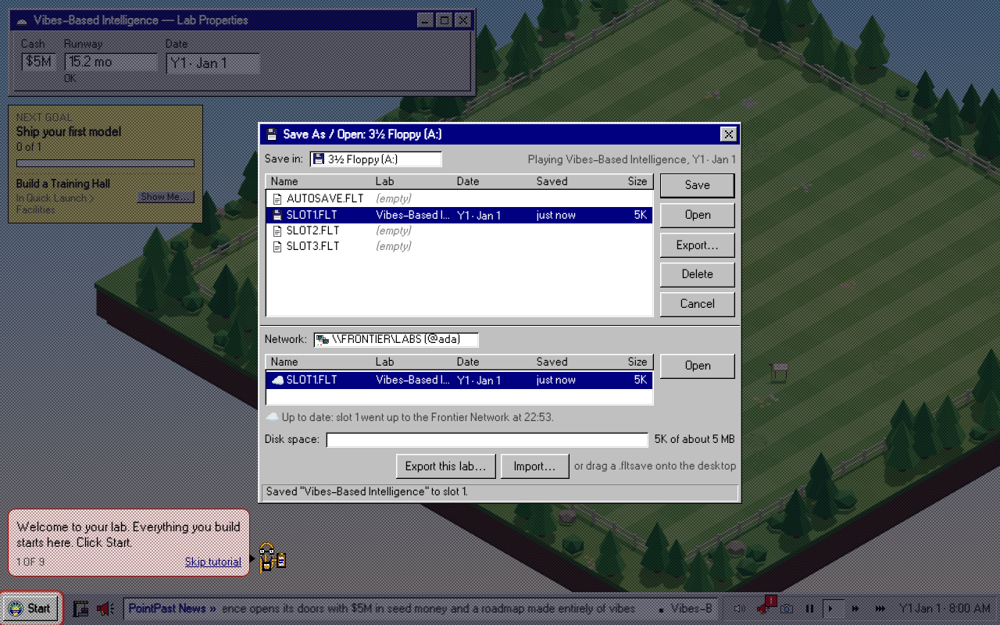
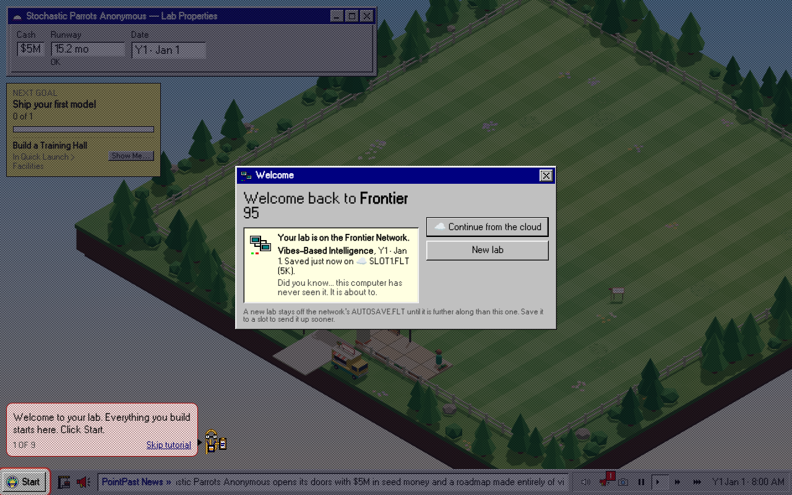
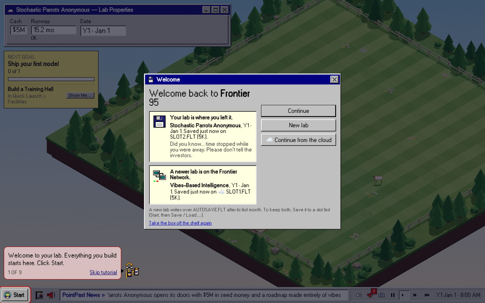

# Accounts and cloud saves (FLT-67)

Players can log on with **Hugging Face** and keep their labs in the cloud. It is built and tested, and **off**: until
the repo variable `FLT_AUTH` is `on`, prod and every PR preview deploy exactly what they deployed before this task,
byte for byte (see [Proof: off is off](#proof-off-is-off)). Guests are never affected either way.

## Switch-on checklist

Do these in order. Nothing here needs a secret's value pasted anywhere new: the three secrets already exist as GitHub
Actions secrets, and the deploy passes them to Cloudflare by name.

1. **The Hugging Face app** (huggingface.co → Settings → Connected Apps → your OAuth app):
   - Redirect URLs, both of them:
     - `https://app.frontierlabtycoon.com/api/auth/callback/huggingface`
     - `https://flt-prod.manzanita.workers.dev/api/auth/callback/huggingface`
   - Scopes: `openid` and `profile` only. We never ask for `email` (Better Auth gets a placeholder,
     `huggingface-<id>@users.invalid`), nor for any repo, inference or write scope.
   - PR Previews need no redirect URL: they never get accounts (`authEnabled` is prod only).
2. **The GitHub Actions secrets** exist (names only; check with `gh secret list --repo Manzanita-Research/frontier-lab-tycoon`):
   - `HF_CLIENT_ID`, `HF_CLIENT_SECRET`: from the HF app.
   - `BETTER_AUTH_SECRET`: 32+ random bytes, used to sign session cookies. Changing it later logs everyone out.
3. **The Cloudflare API token** (`CLOUDFLARE_API_TOKEN`) needs two more account-level permissions on top of the ones in
   [infra/README.md](../infra/README.md): **D1 Edit** and **Workers R2 Storage Edit**. Without them the deploy fails
   at the first new resource and prod stays as it was.
4. **Flip it:** `gh variable set FLT_AUTH --body on --repo Manzanita-Research/frontier-lab-tycoon`, then run the Deploy
   workflow on `main` (or merge anything). The first deploy creates the D1 database `flt-prod-accounts` (migrated from
   `worker/migrations/`) and the R2 bucket `flt-prod-saves`, swaps the edge script for `worker/index.ts` (which
   answers `/api/*` on `app.` and runs `infra/edge.mjs` itself for everything else: the apex/www redirect, link previews,
   cache headers), and rebuilds the site with `VITE_FLT_AUTH=on`, which compiles in the log-on UI.
5. **Check it:** open `https://app.frontierlabtycoon.com/`, then **Start ▸ Log On to Frontier Network…** (Frontier 95;
   other skins show a small "Log on" chip, bottom right). You should come back from Hugging Face logged on, with your
   name, handle and avatar in the Frontier Network window. `curl -s https://app.frontierlabtycoon.com/api/saves` should
   answer `401 {"error":"signed-out"}`. Save to a slot, and **Save / Load…** shows it on `\\FRONTIER\LABS` a few
   seconds later.

**Switching off:** `gh variable set FLT_AUTH --body off` (or delete it) and deploy. The site goes back to the
edge-script Worker and the log-on UI leaves the bundle. The database and bucket are **kept** (`RemovalPolicy.retain()`),
and switching on again adopts them by name, with every account and save still there. To really delete the data, remove
`flt-prod-accounts` and `flt-prod-saves` in the Cloudflare dashboard.

## What is gated, and where

| Piece | Off (today) | On (`FLT_AUTH=on`, prod only) |
|---|---|---|
| `infra/alchemy.run.ts` | `script: EDGE_SCRIPT`, as on main; PR Previews always | `main: worker/index.ts` in its place (it imports `infra/edge.mjs` for non-API requests, `runWorkerFirst` unchanged), + D1 `Accounts`, R2 `Saves`, three secrets |
| `.github/workflows/deploy.yml` | `FLT_AUTH` empty; the three secrets resolve to `''` | secrets passed by name, only on `push` (never to a PR preview) |
| The build | `src/account/` never enters the module graph (`scripts/vite-accounts.mjs`) | `VITE_FLT_AUTH=on` adds a ~10 KB `boot` chunk, loaded after the game |
| `/api/*` | the SPA fallback, as before | `/api/auth/*` (Better Auth), `/api/saves/*`; any other `/api/` path is a JSON 404 |

`infra/auth.ts` holds the switch (`authEnabled(stage, flag)`: only `prod`, only the exact string `on`) and
`infra/auth.test.ts` checks that every account resource, secret and the build flag sit inside that one branch.

## Privacy

What we store per player, all in D1: their Hugging Face id, display name, username (`handle`) and avatar URL, a
session row per logged-on browser, and their cloud saves (R2, listed in D1). That is the whole list.

- No email: we never request the scope; the stored address is a `.invalid` placeholder.
- No IP address or browser string on sessions, and no Hugging Face tokens on the account row: `databaseHooks` in
  `worker/auth.ts` blank them before every write (`worker/worker.test.ts` checks the rows).
- **Delete Account…** removes the user and, by cascade, sessions, accounts and save rows, and deletes their R2
  objects (`deleteUser.beforeDelete`). It needs a log-on from the last day (Better Auth's fresh-session rule); the
  game says so and asks the player to log off and on.
- Profile edits, email change and account linking are switched off (`disabledPaths`).

## Cloud saves API

All routes need the session cookie; writes also refuse a foreign `Origin`.

| Route | Does |
|---|---|
| `GET /api/saves` | `{ saves: [{ slot, size, updatedAt, head }] }`: each slot's envelope head, never its state |
| `GET /api/saves/:slot` | the `.fltsave` exactly as uploaded (`application/x-fltsave+json`) |
| `PUT /api/saves/:slot` | stores a `.fltsave` (≤ 2 MB); 400 if it isn't one, 429 if the slot was written < 10 s ago |
| `DELETE /api/saves/:slot` | removes it |

Slots are FLT-65's: `auto`, `1`, `2`, `3`. The body is FLT-65's `.fltsave` text as `serialize(save)` writes it
([SAVES.md](SAVES.md)); the Worker validates the envelope's head with Effect Schema (`src/account/contract.ts`) and
stores the bytes untouched, so a newer save version uploads without a Worker deploy.

## Cloud saves in the game

All of it is in the flag-on `boot` chunk (`src/account/cloud/`, and `src/account/game.ts`, the one file that reaches
into the game). No game module changed: the cloud listens to FLT-65's save desk and loads through its import.

- **Uploads** (`cloud/sync.ts`): every local save (autosave, slot, the hide autosave) is written to this computer
  first, exactly as before; the cloud hears about it afterwards and uploads that slot's bytes 2 s later, so a burst
  of saves is one upload. The autosave goes up at most once a minute; leaving the page sends it at once (with
  `keepalive`). A failed upload retries quietly (15 s, 30 s, 1, 2, 4 minutes, then every 5) and says so in one line
  in the Save / Load window and the Frontier Network window. A 401 stops uploads (logged off elsewhere); a refused
  save (400/413) is reported and skipped. Nothing ever blocks or delays the local save.
- **Cloud slots:** Frontier 95's Save As / Open shows the network drive `\\FRONTIER\LABS (@handle)` under the
  floppy, with ☁ rows (slot, lab, date, when, size) and Open; other skins get a "☁ In the cloud" list under their slots.
- **Continue from the cloud** (`cloud/offer.ts`): when the newest cloud save is newer than this computer's newest
  local save and isn't already here, "Welcome back" gets a ☁ Continue from the cloud beside Continue. With no local
  saves at all, a Welcome back window of its own offers it (and New lab). Until the player answers, nothing uploads.
  After New lab, a fresh garage can't overwrite the cloud's further-along autosave (it says so); a slot save still
  goes up.
- **The trip to Hugging Face** autosaves the lab on screen as the page hides. The log-on click notes the time
  (sessionStorage), so that autosave doesn't count as "newer than the cloud" when the player comes back.
- **The box intro** (FLT-95): the Worker sends a logged-on visitor at the bare root `/` to `/?member=1` (a 302,
  only with a valid session cookie), so a returning cloud player opens on the game, not the shelf, even on a computer
  with no saves. `member` is removed from the address bar once the account has booted. Strangers and guests see the
  root exactly as before. When the intro is the door, the account boots once the intro has handed over to the game.
- **One autosave slot per player:** two computers share the cloud's `auto`. Each upload is the newest local autosave,
  so the last computer to autosave wins, except that a different lab which is behind (a fresh garage) can't overwrite
it. Slots 1–3 are only ever written by a slot save.

Tests: `src/account/cloud/cloud.test.ts` (the offer rules, debounce, gaps, retries, the kept autosave, a save during
an upload), `worker/cloud-roundtrip.test.ts` (log on with HF mocked against the real Worker, save, lose the local
storage, log on again, the lab comes back byte for byte; and the trip case) and `e2e/accounts.mjs` (the same in a
browser, through the box, with screenshots):

| Cloud slots | Continue from the cloud (no local saves) | Continue from the cloud (in Welcome back) |
|---|---|---|
|  |  |  |

## Adding GitHub (or another provider)

One entry in `socialProviders` in `worker/auth.ts` (GitHub: `scope: ["read:user"]`, the same `mapProfileToUser` with a
placeholder email), two more secrets passed the same way as the HF ones (`infra/auth.ts` `AUTH_SECRETS`,
`deploy.yml`, `alchemy.run.ts`), and a second button in each skin's log-on box.

## Local development

Everything runs locally with no Hugging Face and no Cloudflare account: Miniflare runs the real Worker against local
D1 and R2, and a fake huggingface.co answers the OAuth calls.

```sh
VITE_FLT_AUTH=on pnpm exec vite build --outDir dist-accounts --emptyOutDir
node worker/dev.ts                       # http://localhost:8787/ ; logs you on as "Ada Founder" (@ada)
# http://localhost:8787/?devlogon=1        arrive already logged on (does the OAuth round trip for you)
pnpm shots --scenes accounts --after-url http://localhost:8787/   # the before/after set
pnpm e2e:accounts --out docs/img/flt-67  # (with dev.ts running) log on, save, clear storage, continue from the cloud
```

The data lives in memory and is gone when the server stops. Tests: `pnpm exec vitest run worker infra src/account`
(the mocked HF flow, saves CRUD, validation, privacy, the cloud client and its round trip, and that nothing answers
when the flag is off).

## Proof: off is off

```sh
node scripts/accounts-proof.mjs          # builds origin/main and this checkout with accounts off, compares every file
# IDENTICAL: all 135 files match between origin/main@ab5e232 and … with accounts off, both built as commit 0000000 (…)
# NO ACCOUNT CALLS: none of the 135 files built from … with accounts off mentions /api/auth or /api/saves
```

`dist/deployment.json` is left out: the deploy writes the commit hash into it. The bundle also carries its own commit
(FLT-84's `VITE_FLT_SHA`, for the recovery toast), so the proof builds both sides as the same commit, `0000000`,
through a throwaway config that wraps each tree's `vite.config.ts` and changes only that define.

Two things keep the bundle identical, and `src/account/boundary.test.ts` guards both: `main.tsx` reaches the account
code only through flagged dynamic imports (the boot, and the /box intro's hand-over), and `scripts/vite-accounts.mjs`
resolves those imports to an empty stub when the flag is off. Without the stub, Rollup still walks the dead imports,
and the skin modules the account UI imports reorder a shared chunk. The flag-off build never names `/api/auth` or
`/api/saves`; the proof checks that too.
