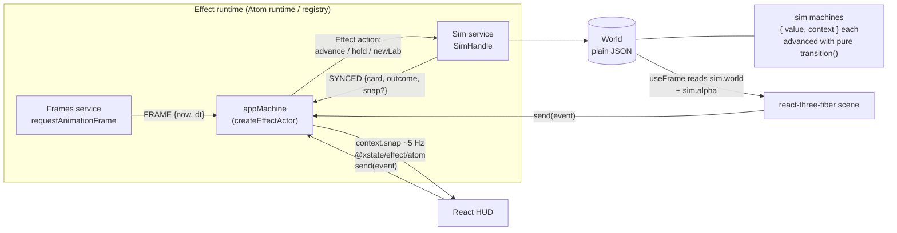
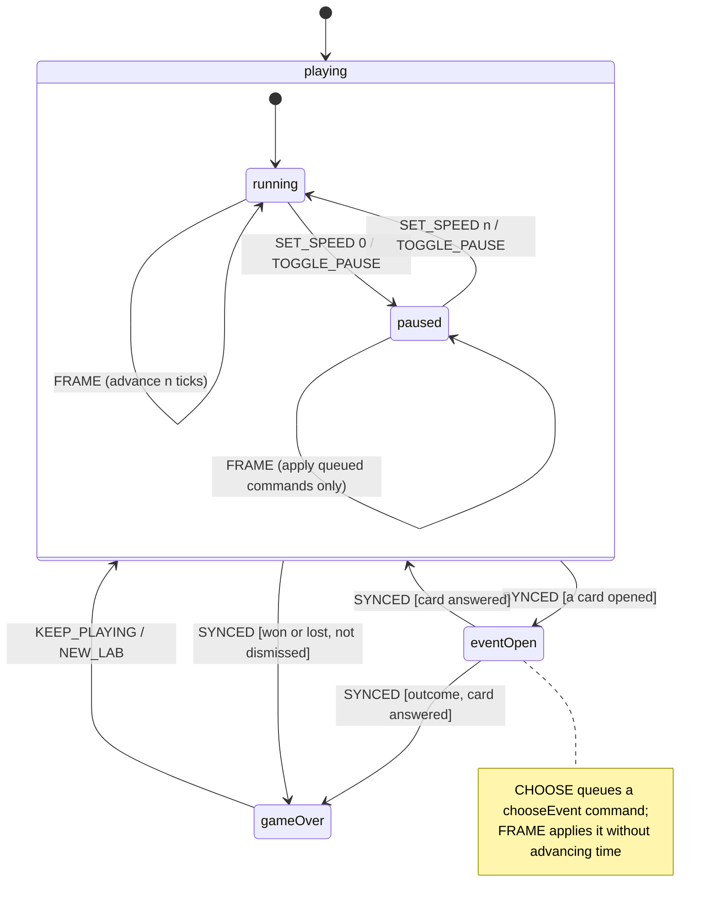
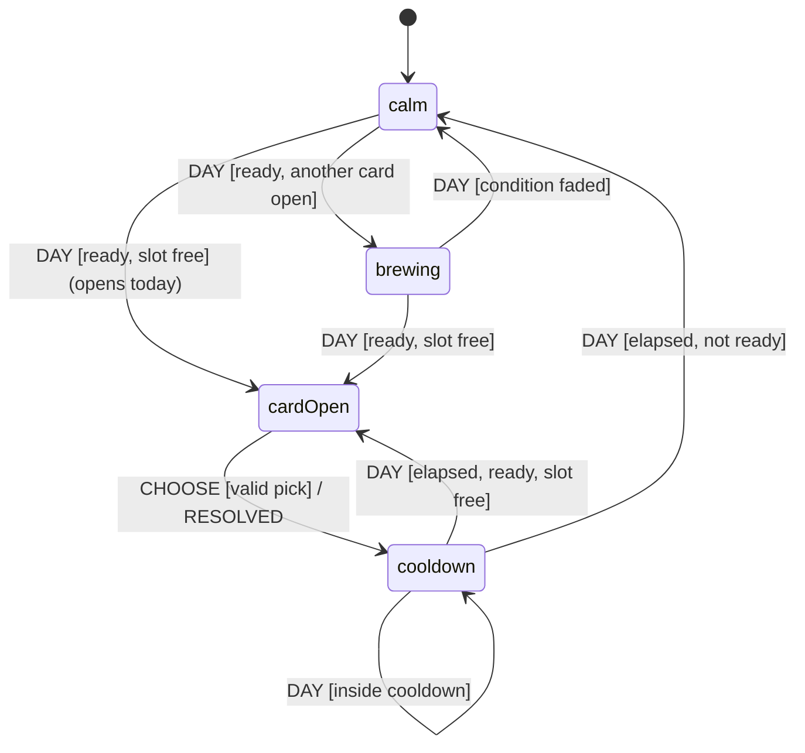
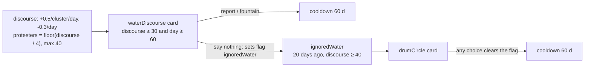
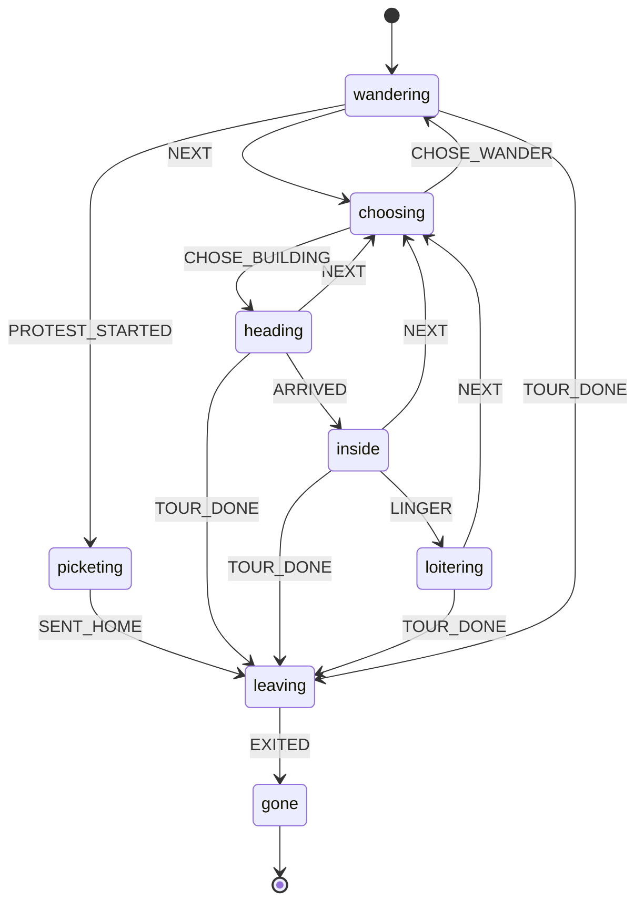
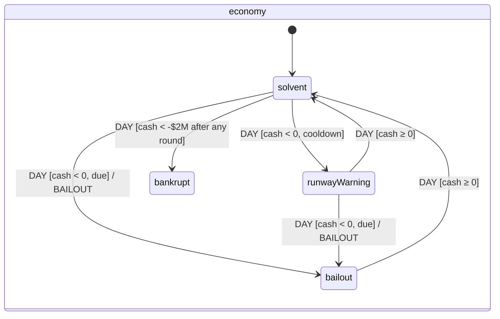
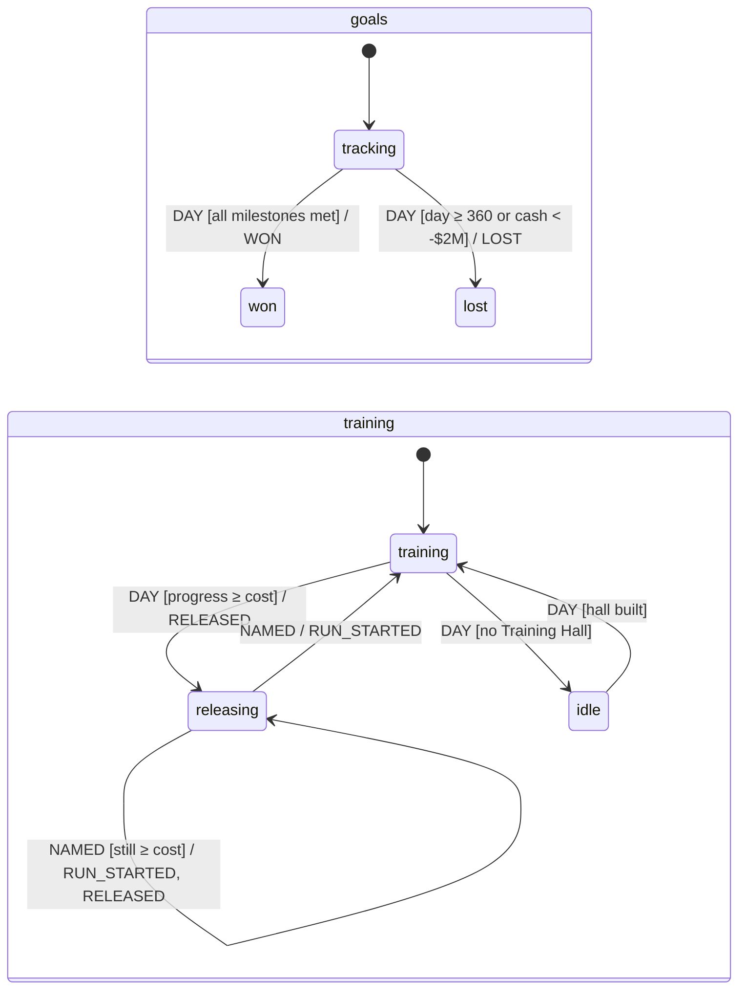
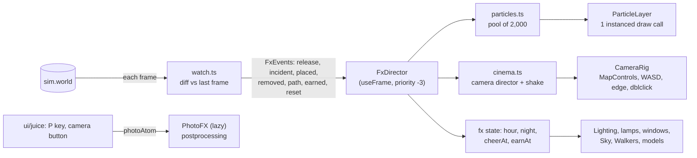

# Architecture: XState machines, run by Effect

All game logic is a statechart. Effect owns the runtime around it. The spec this follows is `docs/specs/architecture-xstate-effect.md`; the six rules are restated in `AGENTS.md`. This page is the map: what each machine is, how they are driven, what the numbers are, and where the alpha stack bit.

Stack (exact pins, no `^`): `xstate@6.0.0-alpha.62`, `effect@4.0.0-rc.118`, `@xstate/effect@0.1.0-alpha.5`, `@effect/atom-react@4.0.0-rc.118`, `@effect/vitest@4.0.0-rc.118`, `vitest@5.0.2`.

## Data flow

- **`src/sim/`** is pure and deterministic. `tick(state, commands)` is the fixed step; machines inside it are advanced with `transition()`, synchronously, and are not actors.
- **`src/app/`** is the shell. `Sim` (the live World plus `step`/`applyNow`/`report`) and `Frames` (one item per animation frame) are `Context.Service`s. `appMachine` is a `setupEffect` machine started by `createEffectActor` inside an Atom runtime; the frame loop is a `fromEffectEventStream` actor that reads `Frames`. React reads selector atoms of that actor (`atoms.snap`, `atoms.tool`, ...) and sends events; the renderer reads `sim.world` and `sim.alpha` imperatively in `useFrame`.
- **Determinism.** Same seed and commands give a deep-equal persisted World, and `src/sim/golden.test.ts` pins that: three seeds, six checkpoints each, digests of every walker, the RNG state, cash, news and toasts, recorded from the hand-written sim *before* the port. The app shell test also replays 60 frames against 60 direct `tick()`s and compares the JSON.

## Machine map

| Machine | File | States | Events in | Emits / effects | Owns (context) |
|---|---|---|---|---|---|
| **app** | `src/app/machine.ts` | `playing.{running,paused}`, `eventOpen`, `gameOver` | `FRAME`, `SYNCED`, `SET_SPEED`, `TOGGLE_PAUSE`, `SET_TOOL`, `SET_HOVER`, `COMMAND`, `CHOOSE`, `KEEP_PLAYING`, `NEW_LAB`, `TOAST*` | Effect actions `advance`, `hold`, `newLab`; delayed `TOAST_EXPIRED` | speed, command queue, frame accumulator, tool, hover, toasts, the 5 Hz HUD snapshot |
| **training** | `src/sim/machines/training.ts` | `idle`, `training`, `releasing` | `DAY {halls, gain}`, `NAMED {name}` | `RELEASED`, `RUN_STARTED` | run, progress, cost, next model name |
| **economy** | `.../economy.ts` | `solvent`, `runwayWarning`, `bailout`, `bankrupt` | `DAY {cash, day}` | `BAILOUT` | day of the last bridge round |
| **goals** | `.../goals.ts` | `tracking`, `won`, `lost` (final) | `DAY {day, cash, values}` | `WON`, `LOST` | the three milestones, the day it ended |
| **arc** (one per event card) | `.../arc.ts` | `calm`, `brewing`, `cardOpen`, `cooldown` | `DAY {day, ready, slotFree}`, `CHOOSE {choiceIndex}` | `RESOLVED` | choices, cooldown days, day last opened |
| **walker** (one per walker) | `.../walker.ts` | `heading`, `inside`, `loitering`, `wandering`, `choosing`, `leaving`, `picketing`, `gone` (final) | `ARRIVED`, `LINGER`, `NEXT`, `TOUR_DONE`, `CHOSE_BUILDING`, `CHOSE_WANDER`, `PROTEST_STARTED`, `SENT_HOME`, `EXITED` | none: the driver acts on the state entered | nothing (`visits`/`step` stay plain walker counters) |

Arithmetic stays in plain functions: money per day, the training gain (`spend * (0.75 + 0.25 * morale)`), movement along a route, routing itself.

## Statecharts

### App

The target after every event that could change it is one function, `phaseFor(context)`: card open wins, then an undismissed outcome, then speed. A machine booted with speed 0 starts `paused` (an `always` transition).

### Water Discourse arc

The arc is two event cards chained through a flag, both instances of one generic arc machine (`content/events.ts` is data; a new arc is a new entry there and never an engine change).

The driver evaluates each card's condition against the World (`ready`) and tells every arc machine, in content order, whether the screen is free; the first arc to open takes it and the rest wait as `brewing`. `state.event` and the old `event:<id>` cooldown flags are derived from the arcs.

### Walker

The walker machine is declarative on purpose (see the numbers below). The dice and facts a decision needs are folded into which event the driver sends, in the original draw order: when a stay ends, the driver rolls `rng.chance(0.55)` and sends `LINGER`, or checks `tourDone(kind, visits)` and sends `TOUR_DONE` or `NEXT`. The world work a state implies runs when the driver sees it entered: `choosing` picks a building and routes to it (then answers `CHOSE_*`), `loitering` steps out, `leaving` routes to the gate. Walkers get events only on discrete changes; movement is a plain function.

### Economy, goals, training

## How a machine is driven

A sim machine never touches the World and never draws random numbers:

1. **State in the World is `{ value, context }`** (JSON). `step(machine, stored, event)` in `src/sim/machines/run.ts` rebuilds a live snapshot with `machine.resolveState`, calls `transition()`, and returns the next `{ value, context }` plus the emitted events in order. The World never holds a live snapshot, so `JSON.parse(JSON.stringify(world))` deep-equals it.
2. **The driver applies effects.** `training.ts` turns `RELEASED` into capability, hype, cash, a toast and a headline; `economy.ts` turns `BAILOUT` into +$2M and a headline; and so on. It applies them in the order they were emitted, which is the order the pre-port code ran them in.
3. **Randomness is pre-rolled.** After a training release the machine waits in `releasing`; the driver rolls the next model name *after* the release effects and *before* the next run's, then sends `NAMED`. That is exactly where the old loop drew, so the RNG stream is unchanged.

## Numbers (measured on the 1-vCPU Modal box, Node 22)

| Measurement | Result |
|---|---|
| 500-walker tick (400 agents + crowd + 160 discourse), best of 3 x 200 ticks | **0.11 - 0.23 ms** over 5 runs (pre-port baseline 0.085 ms; budget 0.3 ms) |
| Discrete walker events at that load | about 12 per tick (7.6 arrivals, 4.1 stay-overs, 4.2 next-stop picks) |
| `transition()` with a plain `{ target }` (resolveState included) | 3 - 5 us |
| `transition()` with a `matches` pattern | about 7 us |
| `transition()` when the transition contains any function (`to`, a `context` mapper) | 14 - 20 us; 22 - 27 us when it also `emit`s |
| `resolveState` + `transition()` + reading `{ value, context }` | 9.6 us on a small function machine |
| `getPersistedSnapshot` + `restoreSnapshot` round trip, same machine | 37 us |

Two design consequences: the World stores `{ value, context }` and rebuilds with `resolveState` (the official persist/restore pair is 4x slower and this runs hundreds of times per tick), and the walker machine contains no functions at all. The first version of it used function transitions to keep `visits`/`step` in context and to decide leave-or-pick inside the machine; it measured 0.45 - 0.54 ms per tick and failed the perf test, so those decisions moved into the driver's choice of event.

## Alpha-stack notes

- **`@xstate/effect@0.1.0-alpha.5/atom` does not load against `effect@4.0.0-rc.118`.** It imports `effect/unstable/reactivity`; rc.118 (and `@effect/atom-react@rc.118`) expose `effect/reactivity`. There is no newer `@xstate/effect`. Workaround, with no version change: an alias in `vite.config.ts` (`effect/unstable/reactivity` to `effect/reactivity`), `server.deps.inline: ["@xstate/effect"]` so vitest applies it, and a matching `paths` entry in `tsconfig.json`. The atom API behaves the same in our use (actor start, `snapshot`, `send`, `select`). Drop all three the day a release fixes the import.
- **`@effect/vitest@rc.118` needs `vitest >=5 <6`**, so the repo moved from vitest 3.2 to 5.0.2 (all pre-existing tests passed unchanged). Vitest 5 hides `console.log` from passing tests.
- **Root-level machine transitions need a leading dot on nested targets** (`.playing.running`), and `guard` objects are gone in v6 alpha: conditions are inline functions or `matches` patterns.
- **Registered Effect actions take the transition's full args**: enqueue with `enq(actions.advance, { ...args, params })`; inside, `args.params` is the payload and `args.self.send(...)` reports back.
- A canary test (`src/machines/effect-smoke.test.ts`) fails first if a pin moves and breaks these assumptions.

## Deliberate differences from the spec

- **No `title` state.** The game has no title screen and this port adds no features; the app machine starts in `playing`.
- **Toasts expire per toast** (a delayed `raise` on the Effect clock, 5.2 s from when each was shown) instead of the old component effect that restarted every timer whenever the list changed. It is the one visible timing difference.
- **Walker machine has no context.** See the numbers above.
- **Machine events use plain data only** (no functions or handles), so `xstate/graph` can explore every machine; `src/sim/machines/graph.test.ts` asserts every state is reachable and only final states are dead ends.

## The juice layer (FLT-6): render and UI only

Everything that makes the campus feel alive lives in `src/render/fx/` and `src/ui/juice/`. It **reads** the World (`sim.world`, `sim.alpha`) and never writes to it, adds no sim events and changes no `src/sim/**` file, so the golden digests and the perf test are untouched.

| Piece | File | What it does |
|---|---|---|
| Campus clock | `fx/clock.ts` | Pure. `hourAt(tick)`: one cycle per 10 game days (200 ticks), the game opens at 8am. `ambience(hour)` gives light colours and intensities, sky gradient, window and lamp glow. `chaseHour` low-passes the shown hour to 3 h/s, so 10x speed drifts through dusk instead of strobing. Tested to stay continuous and never darker than 35% of noon light. |
| Watcher | `fx/watch.ts` | Compares the World with the previous frame and returns `FxEvent`s. The first poll of a World (load, `?warp=`, new lab) only records a baseline. This is how "release" and "event card" reach the juice layer with no sim change. |
| Particles | `fx/particles.ts`, `ParticleLayer.tsx` | One struct-of-arrays pool (cap 2,000; ambient sparkles and dust are dropped when full so a confetti burst always gets in) drawn as camera-facing quads by one `InstancedBufferGeometry`. Kinds: confetti, coins, smoke and dust puffs, water droplets, four-point sparkles. Sparkles are additive, the rest premultiplied alpha. |
| Camera director | `fx/cinema.ts`, `CameraRig.tsx` | `idle -> in -> hold -> out -> idle`. A shot remembers the player's view and eases back to it; any player input cancels it. A release goes to the Training Hall (2.6 s), an event card to the gate (held until the card closes, with the subject aimed above the card). `shake(strength)` adds trauma; the offset is trauma squared. |
| Lights | `fx/Lighting.tsx`, `fx/glow.ts`, `fx/Night.tsx` | One directional light swings from sun to moon; shared window and lantern materials are updated once per frame, so every window and lamp lights together. Path lamps sit on every fourth path tile. |
| Photo mode | `fx/PhotoFX.tsx`, `ui/juice/photo.ts` | `@react-three/postprocessing` (tilt-shift, ACES tone mapping, saturation, contrast, vignette) is a lazy chunk mounted **only** while photo mode is on. The sky becomes the scene background so the blur has something to blur into. The PNG is the composer's frame plus the thought bubbles that were on screen plus the stamp. |

Decisions worth knowing:

- **The camera director is a plain class, not a machine.** It is render code with no game logic in it, driven by frame `dt`; the rules about sim machines and tick-based time are about the sim.
- **Photo mode is an Effect atom** (`photoAtom`), not a field on the app machine, so it adds no events to `appMachine` and can't collide with other UI state. It is mirrored into `fx.photo` for the render side.
- **Night thoughts are client-side** (`content/night.ts`, shown by `ui/juice/NightThoughts.tsx`) because this slice may not touch `src/sim/**`. The file's header says how to make them ordinary sim thoughts later (add a `night` condition to `activeConditions`).
- **Debug knobs:** `?hour=22` pins the clock, `?photo` opens photo mode, and with `?debug=1` `window.__fx` exposes `{ fx, cinema, pool }`. `scripts/juice-shots.mjs` scripts the moments a URL can't (a release, a saved photo, frame times).

Measured on the 1-vCPU Modal box: a full pool of 2,000 particles updates in 0.08 ms per frame, watching a 429-walker World costs 0.0005 ms per frame, and the SwiftShader frame time of the whole game is unchanged against the FLT-4 build (mean 117 ms with juice vs 126 to 132 ms without, both rasteriser-bound).
