# Architecture: XState machines, run by Effect

All game logic is a statechart. Effect owns the runtime around it. The spec this follows is `docs/specs/architecture-xstate-effect.md`; the six rules are restated in `AGENTS.md`. This page is the map: what each machine is, how they are driven, what the numbers are, and where the alpha stack bit.

Stack (exact pins, no `^`): `xstate@6.0.0-alpha.62`, `effect@4.0.0-rc.118`, `@xstate/effect@0.1.0-alpha.5`, `@effect/atom-react@4.0.0-rc.118`, `@effect/vitest@4.0.0-rc.118`, `vitest@5.0.2`.

## Data flow

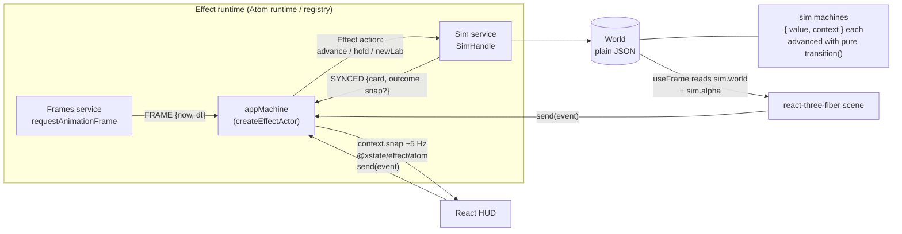

- **`src/sim/`** is pure and deterministic. `tick(state, commands)` is the fixed step; machines inside it are advanced with `transition()`, synchronously, and are not actors.
- **`src/app/`** is the shell. `Sim` (the live World plus `step`/`applyNow`/`report`) and `Frames` (one item per animation frame) are `Context.Service`s. `appMachine` is a `setupEffect` machine started by `createEffectActor` inside an Atom runtime; the frame loop is a `fromEffectEventStream` actor that reads `Frames`. React reads selector atoms of that actor (`atoms.snap`, `atoms.tool`, ...) and sends events; the renderer reads `sim.world` and `sim.alpha` imperatively in `useFrame`.
- **Determinism.** Same seed and commands give a deep-equal persisted World, and `src/sim/golden.test.ts` pins that: three seeds, six checkpoints each, digests of every walker, the RNG state, cash, news and toasts, recorded from the hand-written sim *before* the port. The app shell test also replays 60 frames against 60 direct `tick()`s and compares the JSON.

## Machine map

| Machine | File | States | Events in | Emits / effects | Owns (context) |
|---|---|---|---|---|---|
| **app** | `src/app/machine.ts` | `playing.{running,paused}`, `eventOpen`, `gameOver` | `FRAME`, `SYNCED`, `SET_SPEED`, `TOGGLE_PAUSE`, `SET_TOOL`, `SET_HOVER`, `COMMAND`, `CHOOSE`, `KEEP_PLAYING`, `NEW_LAB`, `TOAST*` | Effect actions `advance`, `hold`, `newLab`; delayed `TOAST_EXPIRED` | speed, command queue, frame accumulator, tool, hover, toasts, the 5 Hz HUD snapshot |
| **training** | `src/sim/machines/training.ts` | `idle`, `training`, `releasing` | `DAY {halls, gain}`, `NAMED {name}` | `RELEASED`, `RUN_STARTED` | run, progress, cost, next model name |
| **tutorial** | `src/sim/machines/tutorial.ts` | `path`, `hall`, `gateway`, `hire`, `release`, `done`, `skipped` | `FACTS`, `CONTINUE`, `SKIP` | `FINISHED` (one launch toast) | acknowledgement of the current step; stored in `World.tutorial` |
| **guardrails** | `src/sim/machines/guardrails.ts` | `clear`, `confirming` | `REQUEST`, `CLEAR`, `OBSERVE`, `HALL` | low-runway nudge, redundant-Hall hint | exact pending spending command, low-runway and disconnected-gate warning flags; additive optional `World.guardrails` |
| **economy** | `.../economy.ts` | `solvent`, `runwayWarning`, `bailout`, `bankrupt` | `DAY {cash, day}` | `BAILOUT` | day of the last bridge round |
| **goals** | `.../goals.ts` | `tracking`, `won`, `lost` (final) | `DAY {day, cash, values}` | `WON`, `LOST` | the three milestones, the day it ended |
| **arc** (one per event card) | `.../arc.ts` | `calm`, `brewing`, `cardOpen`, `cooldown` | `DAY {day, ready, slotFree, pace}`, `CHOOSE {choiceIndex}` | `RESOLVED` | choices, cooldown days, day last opened |
| **walker** (one per walker) | `.../walker.ts` | `arriving`, `seeking`, `queuing`, `inside`, `loitering`, `wandering`, `choosing`, `leaving`, `quitting`, `picketing`, `gone` (final) | `ARRIVED`, `QUEUED`, `ADMITTED`, `GAVE_UP`, `LINGER`, `NEXT`, `TOUR_DONE`, `QUIT`, `CHOSE_BUILDING`, `CHOSE_WANDER`, `PROTEST_STARTED`, `SENT_HOME`, `EXITED` | none: the driver acts on the state entered | nothing (the need a walker is seeking, `visits` and `step` stay plain walker fields) |
| **rival** (one per rival lab) | `src/sim/race/rival.ts` | `idle`, `training`, `releasing`, `cooldown` | `WEEK {aggro, pace, chase, four dice, name}`, `SHOCK {capability, hype, momentum}` | `RELEASED`, `POACH` | personality, capability, hype, weeks left, open weights?, momentum, latest model |
| **era** | `src/sim/race/era.ts` | `era1`, `era2`, `era3`, `era4` | `DAY {mult}` | `ERA_REACHED` | the peak multiplier (the ratchet) |
| **calendar** (Leapfrog) | `src/sim/race/leapfrog/calendar.ts` | `quiet`, `answering` | `DAY {gapRoll, pairRoll, pace, pairChance}` | `DROP {slot: lead \| answer}` | days to the next lead drop, gap range, launches so far |
| **benchmark** (one per column) | `.../leapfrog/benchmark.ts` | `live`, `crowded`, `saturated`, `retired` (final) | `SCORES {best, holder, day}`, `DAY {day}` | `SOTA`, `CROWDED`, `SATURATED`, `RETIRED` | best score, holder, thresholds, the day it was solved |
| **voice** (the news cycle) | `.../leapfrog/voice.ts` | `contested`, `owned` | `PUSH {lab, amount}`, `DAY {decay, baselines, ...}` | `OWNED`, `LOST` | attention per lab, owner, streak |
| **response** (the forced card) | `.../leapfrog/response.ts` | `idle`, `offered`, `holding` | `DROP {eligible}`, `PICK {ship \| hold \| leak}`, `RELEASED {strong}`, `DAY` | `OFFER`, `SHIPPED`, `HELD`, `LEAKED`, `COUNTER`, `EXPIRED`, `WITHDRAWN` | day of the last offer, hold deadline, counts |
| **livestream** | `.../leapfrog/livestream.ts` | `idle`, `live` | `GO {ok, kind}`, `DAY` | `AIRED {ok, kind}` | streams, mishaps, the mishap on air |
| **staff** (one per staffer) | `src/sim/machines/staff.ts` | `arriving`, `idle`, `going`, `working`, `leaving`, `gone` (final) | `ARRIVED`, `TASK`, `DONE`, `LOST`, `FIRED`, `EXITED` | none: the driver acts on the state entered | nothing (the task, route, patrol zone and counters stay plain fields on the staffer) |
| **disaster** (one per running disaster; `src/sim/disasters/`) | compiled from JSON (`mods/base-disasters/mod.json`) | the content's own: `warning`, `active`, `cleanup`, `aftermath`, `done` (final) | `TICK {tick, day, roll, work, stats}`, `CHOSE {..., choice}` | `CALL {verb, params}`: the driver runs the Vocabulary verb (`sim/verbs.ts`) | id, start day, when the state began, cleanup progress and staff-hours |
| **mood** (one per researcher and visitor) | `.../mood.ts` | `content`, `slumped`, `miserable`, `resigned` (final) | `LIFT`, `SLUMP`, `CRASH`, `DAY` | `RESIGNED` | the count of miserable days in a row |

Arithmetic stays in plain functions: money per day, the training gain (`spend * (0.75 + 0.25 * morale)`), movement along a route, routing itself.

## Statecharts

### App

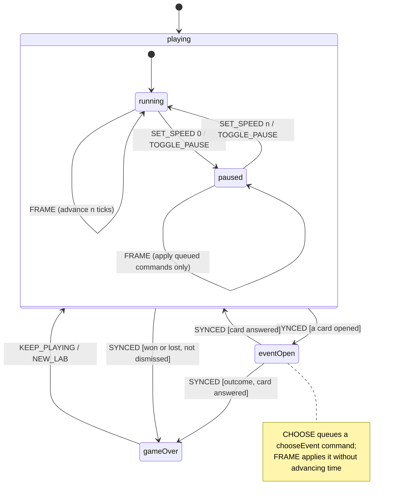

The target after every event that could change it is one function, `phaseFor(context)`: card open wins, then an undismissed outcome, then speed. A machine booted with speed 0 starts `paused` (an `always` transition).

### First-run pacing (FLT-16)

At 1× the shell feeds 20 ticks per six seconds: one game day. Day/night still spans 30 days (three minutes), with six-hour dawn/dusk blends. A clean lab starts with one connected Compute Cluster, three researchers, one agent and no visitors or Training Hall. The shell opens at speed 1. (FLT-16 held time until the first build and until each tutorial message was acknowledged; FLT-29 turned that off, because FLT-47's coach marks replace the hint. Selecting a step's build tool or sending `continueTutorial` still acknowledges it in the tutorial machine.) The sim itself can still be stepped headlessly; `applyNow` advances tutorial facts for commands made while paused.

`Snapshot.assistant` / `atoms.assistant` expose `{ step, message, highlight, paused, canSkip }`, or `null` on completion/skip/older saves. Content is `content/tutorial.ts`; targets are `build:path`, `build:hall`, `build:gateway`, `staff:hire`, `training`. Send `COMMAND { command: { type: "continueTutorial" } }` for Next and `{ type: "skipTutorial" }` for Skip. FLT-29 owns the assistant skin, pulsing targets, visible Skip and paused indicator; FLT-16 only routes plain messages through the existing hint host.

`SET_OVERLAY { id, open }` holds time for independently owned menus. Existing Staff, News Room, sound mixer, phone stats/Objectives/Thoughts/Arena and photo mode are wired through it; new hosts can use `useAutoPause`. An inspector, event or outcome card also holds time. Closing one overlay preserves both other overlays and the player's selected speed; no catch-up time is banked while held. Desktop readout panels are persistent HUD, rather than modal menus.

Visitor arrivals run once a day. `visitorDemand` combines connected Gateways/Demo Stages/campus size × hype × Vibes, with word of mouth over the first 60 days and a small trickle. Disconnected or broken attractions contribute nothing. Cards wait until day 40; pressure also requires a release and a reachable Gateway (prior revenue proves that introduction, so bulldozing a Gateway cannot disable later fires). `scripts/pacing-report.mjs` uses paid commands over three seeds × 365 days; the actual 1× browser sequence is `scripts/pacing-shots.mjs`, with no debug URL or clock override.

### Playtest guardrails (FLT-16)

The two tiles directly in front of the gate are reserved against building placement even after their paths are removed. Reachability starts there, and the disconnected-entrance warning persists until that approach reaches another path tile. Stranded visitors and staff follow small deterministic routes around the entrance; restoring the path lets their existing machines resume. Unzoned staff patrol the full reachable network (the playtest fixed a dangling `else` that previously left them standing at the gate).

All paid path/build/hire commands forecast runway from fresh `estimateLedger` books, including the new building's upkeep, prospective Hall researchers, hire wages and connected Gateway revenue. Under three months, the command records `Snapshot.pendingConfirm { kind, cost, runwayAfter, message, command }` without spending or consuming RNG; `confirmed: true` on that exact command approves it, and `cancelConfirm` clears it. A hire has zero upfront cost and adds its daily salary. The first proposal wins a burst of unconfirmed commands. The app holds time without changing the selected speed; the pure tick also holds so a saved pending proposal survives load without a surprise bill. Under two months, `Snapshot.warnings` offers the existing 50% bulldoze refund, firing staff and the automatic $2M emergency bridge round at zero cash. Entrance warnings use the same persistent array.

A second Hall gets a one-line hint when existing halls already consume the available compute and there is no stored surplus. `Snapshot.releaseGoal` counts shipped models and uses the training machine's actual next name, rather than promising Frontier-4 while Frontier-2 is running. The legacy HUD only hosts these plain warnings, confirmation controls and the goal label; FLT-29 can consume the same snapshot contract in skins. A paused tutorial hint now includes “Continue →” so the final waiting instruction has an explicit acknowledgement.

### Water Discourse arc

The arc is two event cards chained through a flag, both instances of one generic arc machine (`content/events.ts` is data; a new arc is a new entry there and never an engine change).

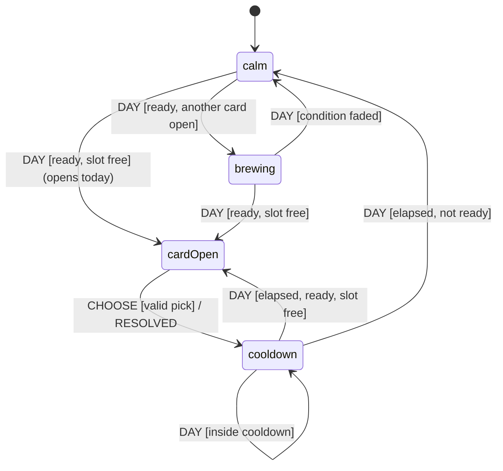

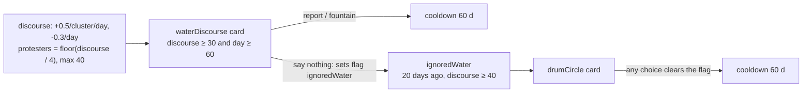

The driver evaluates each card's condition against the World (`ready`) and tells every arc machine, in content order, whether the screen is free; the first arc to open takes it and the rest wait as `brewing`. `state.event` and the old `event:<id>` cooldown flags are derived from the arcs.

### Walker

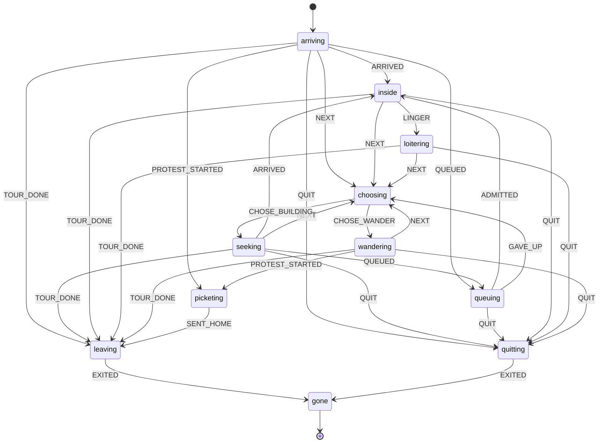

`arriving` is a newcomer on the way to a first stop (a visitor or an applicant through the gate, or anyone at the start of the game); `seeking` is every trip after that, and *which* need it is for lives in `Walker.need` (`seeking(need)` in the spec): `energy`, `focus`, `fomo`, `patience`, or `work`/`tour` for the day job and sightseeing. `queuing` is a full building's doorstep: researchers and visitors wait until a spot frees or patience runs out; agents ignore capacity.

The walker machine is declarative on purpose (see the numbers below). The dice and facts a decision needs are folded into which event the driver sends: when a stay ends, the driver rolls `rng.chance(0.55)` and sends `LINGER`, or checks `tourDone(kind, visits, patience)` and sends `TOUR_DONE` or `NEXT`. The world work a state implies runs when the driver sees it entered: `choosing` scores the buildings (see below) and routes to the winner (then answers `CHOSE_*`), `loitering` steps out, `leaving` and `quitting` route to the gate. Walkers get events only on discrete changes; movement is a plain function.

**Destination choice** (`chooseTarget` in `sim/walkers.ts`) is RCT's: find the walker's most urgent need, score every reachable building that hosts them by `(how much it gives of that need, plus a little for their other needs) / (1 + distance / 6)`, and go to the best. If no reachable building gives at least 0.3 of it, the walker is `lost` ("I can't find a snack") and carries on with the day job or the tour. All of it is data in `content/buildings.ts` (`serves`, `hosts`, `capacity`, `stay`).

### Mood

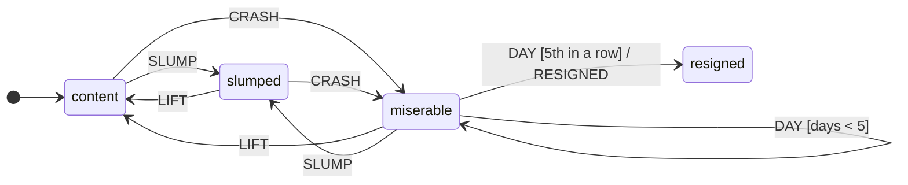

The second machine on every researcher and visitor. Once a game day the driver (`sim/crowd.ts`) works out happiness from the needs and, if the mood it implies (`moodFor`: slump under 0.4 and back out above 0.5, miserable under 0.2) differs from the one the walker is in, sends the event; only a miserable researcher also gets a `DAY`. `slumped` and `miserable` are the slump walk in the renderer; the fifth miserable day in a row emits `RESIGNED` and the driver sends the walker machine `QUIT` (box, gate, headline, an incident for the Vibes). That is a few events a day for the whole crowd, never one per walker per tick.

### Vibes

Not a machine: arithmetic, in `sim/vibes.ts`. `value = 999 * (0.4 happiness + 0.2 visitors impressed + 0.15 cleanliness (stubbed at 1) + 0.15 hype/100 + 0.1 * (1 - penalty))`, where penalty is the mean of the incident score (resignations, failed demos, bailouts; fades 10% a day) and the protester count at the gate over 25. Recalculated daily and eased a quarter of the gap at a time. It sets the visitor cap and spawn chance, brings researcher applicants when it is above 350 and a Training Hall has room, and turns some visitors into investors.

### Economy, goals, training

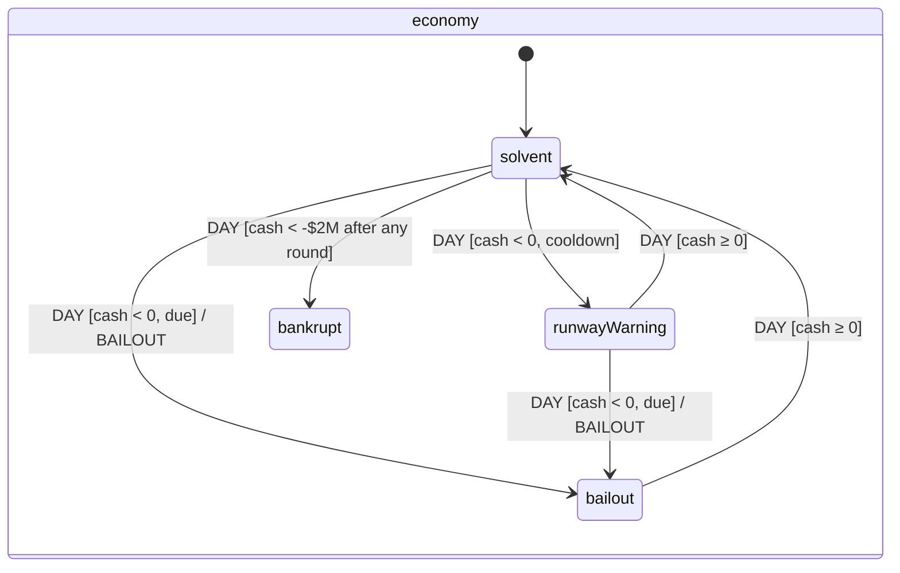

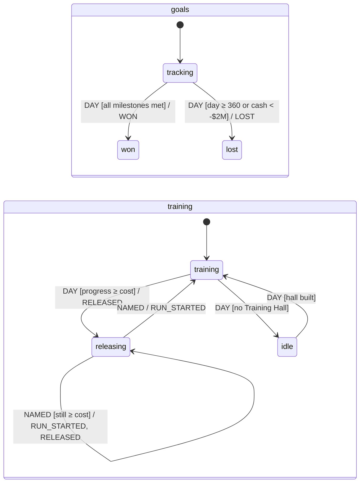

## How a machine is driven

A sim machine never touches the World and never draws random numbers:

1. **State in the World is `{ value, context }`** (JSON). `step(machine, stored, event)` in `src/sim/machines/run.ts` rebuilds a live snapshot with `machine.resolveState`, calls `transition()`, and returns the next `{ value, context }` plus the emitted events in order. The World never holds a live snapshot, so `JSON.parse(JSON.stringify(world))` deep-equals it.
2. **The driver applies effects.** `training.ts` turns `RELEASED` into capability, hype, cash, a toast and a headline; `economy.ts` turns `BAILOUT` into +$2M and a headline; and so on. It applies them in the order they were emitted, which is the order the pre-port code ran them in.
3. **Randomness is pre-rolled.** After a training release the machine waits in `releasing`; the driver rolls the next model name *after* the release effects and *before* the next run's, then sends `NAMED`. That is exactly where the old loop drew, so the RNG stream is unchanged.

## Numbers (measured on the 1-vCPU Modal box, Node 22)

| Measurement | Result |
|---|---|
| 500-walker tick (400 agents + crowd + 160 discourse), best of 3 x 200 ticks | **0.11 - 0.23 ms** over 5 runs (pre-port baseline 0.085 ms; budget 0.3 ms) |
| Discrete walker events at that load | about 12 per tick (7.6 arrivals, 4.1 stay-overs, 4.2 next-stop picks) |
| 800+ walker tick (400 agents, 300 researchers fighting over three small buildings, 110 visitors, 40 protesters; 850 at the start of each batch), best of 3 x 200 ticks (FLT-8) | **0.33 - 0.39 ms** over 3 runs (budget 0.5); the 500-walker test above is now 0.13 ms |
| Walker events at that load | about 27 per tick, because a crowd that size fights over a nap pod: about 8 queue joins and give-ups, 12 pick-a-stop events (measured before the memo below) |
| `transition()` with a plain `{ target }` (resolveState included) | 3 - 5 us |
| `transition()` with a `matches` pattern | about 7 us |
| `transition()` when the transition contains any function (`to`, a `context` mapper) | 14 - 20 us; 22 - 27 us when it also `emit`s |
| `resolveState` + `transition()` + reading `{ value, context }` | 9.6 us on a small function machine |
| `getPersistedSnapshot` + `restoreSnapshot` round trip, same machine | 37 us |

The 800-walker budget needed one more trick. With the Crowd, a walker changes phase about 27 times a tick at that load, and 27 x 10 us was over half the budget. Because the walker machine has no context and no functions, a transition depends on nothing but the phase and the event type, so `stepWalker` (in `machines/walker.ts`) asks XState once per (phase, event) pair, remembers the answer, and returns it from then on: about 0.3 us instead of 10. `walker.test.ts` checks it against the real `step` for every pair. It only works because the machine stays context-free; the moment a walker machine needs a counter, that shortcut is gone (the mood machine, which has one, is only stepped a few times a day).

Two design consequences: the World stores `{ value, context }` and rebuilds with `resolveState` (the official persist/restore pair is 4x slower and this runs hundreds of times per tick), and the walker machine contains no functions at all. The first version of it used function transitions to keep `visits`/`step` in context and to decide leave-or-pick inside the machine; it measured 0.45 - 0.54 ms per tick and failed the perf test, so those decisions moved into the driver's choice of event.

## Alpha-stack notes

- **`@xstate/effect@0.1.0-alpha.5/atom` does not load against `effect@4.0.0-rc.118`.** It imports `effect/unstable/reactivity`; rc.118 (and `@effect/atom-react@rc.118`) expose `effect/reactivity`. There is no newer `@xstate/effect`. Workaround, with no version change: an alias in `vite.config.ts` (`effect/unstable/reactivity` to `effect/reactivity`), `server.deps.inline: ["@xstate/effect"]` so vitest applies it, and a matching `paths` entry in `tsconfig.json`. The atom API behaves the same in our use (actor start, `snapshot`, `send`, `select`). Drop all three the day a release fixes the import.
- **`@effect/vitest@rc.118` needs `vitest >=5 <6`**, so the repo moved from vitest 3.2 to 5.0.2 (all pre-existing tests passed unchanged). Vitest 5 hides `console.log` from passing tests.
- **Root-level machine transitions need a leading dot on nested targets** (`.playing.running`), and `guard` objects are gone in v6 alpha: conditions are inline functions or `matches` patterns.
- **Registered Effect actions take the transition's full args**: enqueue with `enq(actions.advance, { ...args, params })`; inside, `args.params` is the payload and `args.self.send(...)` reports back.
- A canary test (`src/machines/effect-smoke.test.ts`) fails first if a pin moves and breaks these assumptions.

## Deliberate differences from the spec

- **No `title` state.** The game has no title screen and this port adds no features; the app machine starts in `playing`.
- **Toasts expire per toast** (a delayed `raise` on the Effect clock, 5.2 s from when each was shown) instead of the old component effect that restarted every timer whenever the list changed. It is the one visible timing difference.
- **Walker machine has no context.** See the numbers above.
- **Machine events use plain data only** (no functions or handles), so `xstate/graph` can explore every machine; `src/sim/machines/graph.test.ts` asserts every state is reachable and only final states are dead ends.

## The juice layer (FLT-6): render and UI only

Everything that makes the campus feel alive lives in `src/render/fx/` and `src/ui/juice/`. It **reads** the World (`sim.world`, `sim.alpha`) and never writes to it, adds no sim events and changes no `src/sim/**` file, so the golden digests and the perf test are untouched.

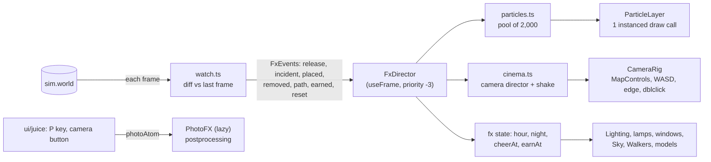

| Piece | File | What it does |
|---|---|---|
| Campus clock | `fx/clock.ts` (the time part is `sim/daylight.ts`) | Pure. `hourAt(tick)`: one cycle per 30 game days (600 ticks; FLT-10 slowed it from 10, the lamps were flipping too often), the game opens at 8am. `ambience(hour)` gives light colours and intensities, sky gradient, window and lamp glow. `chaseHour` low-passes the shown hour to 3 h/s, so 10x speed drifts through dusk instead of strobing. Tested to stay continuous and never darker than 35% of noon light. |
| Watcher | `fx/watch.ts` | Compares the World with the previous frame and returns `FxEvent`s. The first poll of a World (load, `?warp=`, new lab) only records a baseline. This is how "release" and "event card" reach the juice layer with no sim change. |
| Particles | `fx/particles.ts`, `ParticleLayer.tsx` | One struct-of-arrays pool (cap 2,000; ambient sparkles and dust are dropped when full so a confetti burst always gets in) drawn as camera-facing quads by one `InstancedBufferGeometry`. Kinds: confetti, coins, smoke and dust puffs, water droplets, four-point sparkles. Sparkles are additive, the rest premultiplied alpha. |
| Camera director | `fx/cinema.ts`, `CameraRig.tsx` | `idle -> in -> hold -> out -> idle`. A shot remembers the player's view and eases back to it; any player input cancels it. A release goes to the Training Hall (2.6 s), an event card to the gate (held until the card closes, with the subject aimed above the card). `shake(strength)` adds trauma; the offset is trauma squared. |
| Lights | `fx/Lighting.tsx`, `fx/glow.ts`, `fx/Night.tsx` | One directional light swings from sun to moon; shared window and lantern materials are updated once per frame, so every window and lamp lights together. Path lamps sit on every fourth path tile. |
| Photo mode | `fx/PhotoFX.tsx`, `ui/juice/photo.ts` | `@react-three/postprocessing` (tilt-shift, ACES tone mapping, saturation, contrast, vignette) is a lazy chunk mounted **only** while photo mode is on. The sky becomes the scene background so the blur has something to blur into. The PNG is the composer's frame plus the thought bubbles that were on screen plus the stamp. |

Decisions worth knowing:

- **The camera director is a plain class, not a machine.** It is render code with no game logic in it, driven by frame `dt`; the rules about sim machines and tick-based time are about the sim.
- **Photo mode is an Effect atom** (`photoAtom`), not a field on the app machine, so it adds no events to `appMachine` and can't collide with other UI state. It is mirrored into `fx.photo` for the render side.
- **Night thoughts** were client-side at first (`ui/juice/NightThoughts.tsx`); FLT-10 moved them into the sim. `sim/daylight.ts` (the clock, now shared) sets the `night` thought condition, `content/night.ts` feeds both the bubbles and the Thoughts panel, and the first night of a game is always "It's 2am. Still shipping."
- **Debug knobs:** `?hour=22` pins the clock, `?photo` opens photo mode, and with `?debug=1` `window.__fx` exposes `{ fx, cinema, pool }`. `scripts/juice-shots.mjs` scripts the moments a URL can't (a release, a saved photo, frame times).

Measured on the 1-vCPU Modal box: a full pool of 2,000 particles updates in 0.08 ms per frame, watching a 429-walker World costs 0.0005 ms per frame, and the SwiftShader frame time of the whole game is unchanged against the FLT-4 build (mean 117 ms with juice vs 126 to 132 ms without, both rasteriser-bound).

## The Race (FLT-9): rivals, the Arena, eras

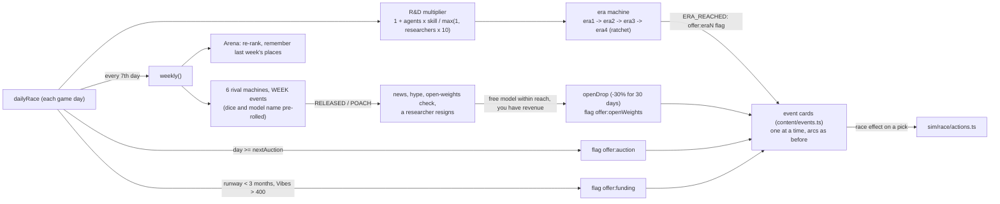

Everything the race does is a machine plus a driver, in the same shape as the rest of the sim:

- **Rivals** (`sim/race/rival.ts`) step once a week with a `WEEK` event that carries every die and the next model name, pre-rolled by the driver in a fixed order, so a rival transition never draws a random number. Personality (`content/rivals.ts`: cadence, growth, openness, poaching, hype-hunger) is data in the machine's context. A lab with cadence under two weeks never leaves `releasing`; a slow one takes a press-tour `cooldown`. Open weights: labs in the middle flip-flop (a lab that just went open is likelier to close up again). Era aggression (`content/eras.ts`) scales release size and shortens runs, and a rubber band (`chase`, the square root of how far ahead you are) keeps the race close: labs far behind you catch up faster, labs far ahead ease off.
- **The R&D multiplier** (`sim/race/rd.ts`) is the spec's formula with `agentSkill = capability / 8`, using the capability the lab has *shipped plus the part of the next release training has already delivered*, so the number creeps up all through a run and an era can start mid-run. It multiplies training progress (`sim/training.ts`) and, from Era 2, makes each release a bigger leap: `(mult / 2) ^ 0.75`, capped at 4x. That is what turns "training gets faster" into a takeoff.
- **Eras** are a ratchet (`sim/race/era.ts`): they only climb, so building a hall (more researchers, a lower multiplier) never shows a title card twice. Each era brings a full-screen card (an ordinary event card whose `kind` is `era`), agent looks (hard hats, halos, size and glow, in `render/Walkers.tsx`), its own thought and headline pools (`content/raceThoughts.ts`, `content/raceNews.ts`), shorter event cooldowns (the arc machine's `DAY` event gained `pace`) and more aggressive rivals.
- **Cards are data.** The driver sets an `offer:*` flag when a card is due and the card's choices clear it; the existing arc machines queue and open them one at a time. `content/events.ts` gained one effect, `{ type: "race", action }`, whose handlers live in `sim/race/actions.ts`. The open-weights card opens a day after the drop, so the Arena shuffles and the screen shakes first.
- **Buildings:** Datacenter (4x4, +60 compute a day) needs a Gas Turbine or Solar Farm each, and all three stay locked (`BuildingDef.locked`) until a compute auction is won; the win places a free Datacenter (or leaves a voucher when the campus has no room).

### Numbers (1-vCPU Modal box)

| Measurement | Result |
|---|---|
| `weekly()`: six rival transitions, Arena re-rank, headlines | about 0.2 ms, once every 140 ticks |
| `dailyRace` on an ordinary day; `rdMultiplier`; the HUD's `raceView` | 13 us; 0.1 us at 40 walkers; 3 us |
| The 500-walker perf test | unchanged within noise (0.23 to 0.28 ms; the budget stays 0.3, doubled under `CI`) |
| A scripted player (`sim/playthrough.test.ts`, three seeds) | Era 2 around day 70 to 100, Era 3 and the win around day 450, first #1 around day 100 then back to #5 or #6, Era 4 around day 1000 |

Debug scenes: `?moment=shuffle` (you are #1, a week turns, three labs pass you and a free model drops), `?moment=era`, `?moment=era3`, `?moment=auction` and `?moment=funding` stage the game about a second before the thing happens (`sim/race/demo.ts`); `scripts/race-shots.mjs` drives the same moments for screenshots.

Test files now run one at a time (`fileParallelism: false` in `vite.config.ts`): on a 1-vCPU box the wall-clock perf tests were measuring their neighbours.

## Operations (FLT-10): staff, slop, breakdowns, queues

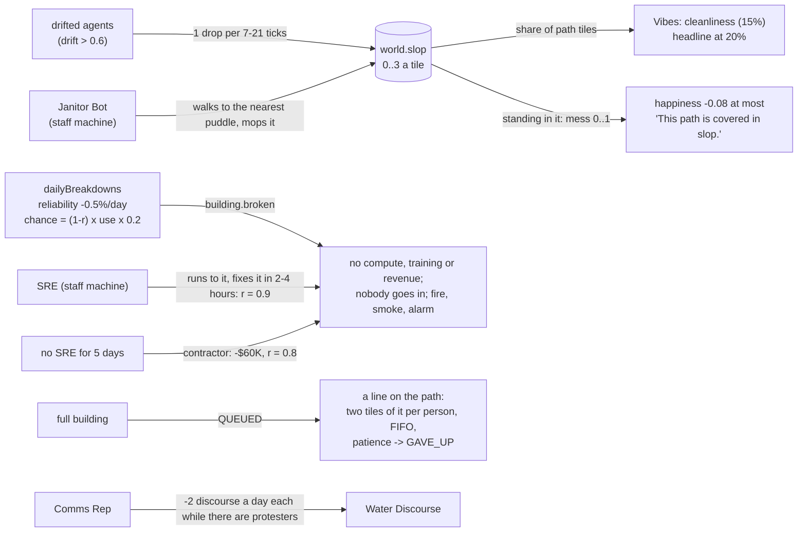

- **Staff** (`sim/staff.ts`, `sim/machines/staff.ts`, `content/staff.ts`) are `state.staff`, not walkers: each has a position, a route, a task and a painted patrol zone (tile indices; empty means the whole campus) and one machine. The driver looks for work every 3 ticks while they are `idle` (the nearest slopped tile, broken building or protester, in the zone, not claimed by a colleague), sends `TASK`, walks them there (`going`), sends `ARRIVED`, works for a few ticks (`working`), does the world work (`finish`) and sends `DONE`. `hire`, `fire`, `paintZone` and `clearZone` are commands; salaries are part of the daily expenses; nothing in staff draws a random number except where a patrol picks a tile. Security walks the fence (`FENCE` waypoints) and is the hook FLT-5's escaped agents look for (`guardsOn`).
- **Slop** (`sim/slop.ts`): `world.slop` is a level (0 to 3) per grid tile. `dropSlop`/`messTick` run inside the walker loop (a second pass over 800 walkers cost more than the arithmetic itself). Mess is a smooth 0..1 exposure, not a flag: the daily mood check reads happiness at midnight, and an on/off flag flipped whole crowds between slumped and content from one day to the next.
- **Breakdowns** (`sim/breakdowns.ts`): `Building` gained `reliability`, `broken` and `brokenTick`. A broken building is skipped by `reachableBuildings` (nobody goes in; anyone inside is thrown out on the next `version`), makes no compute (`computePerDay`, `powerOf`), trains nothing (`dailyTraining`) and earns nothing (`dailyEconomy`). `state.version` is bumped on break and repair, so the walkers re-plan.
- **Queues** (`sim/queues.ts`, `sim/walkers.ts`): a full building's doorstep forms a line on the path tiles leading away from the entrance (`chainFor` walks straight on, then turns), one person every `SLOT_SPACING` (0.66 tile) along it. Admission is FIFO across a building's lines; walkers walking up to a building with a line stop at its tail; only the front of a line longer than the path ever shuffles (the rest share the last place). The 800-walker test has 300 researchers fighting for three small buildings, so this is the expensive case.
- **Debug scenes:** `?moment=ops` (the screenshot moment: slop, a Janitor Bot, a cluster on fire, an SRE jogging toward it, the status page), `?moment=queue` and `?moment=slop` (`sim/opsDemo.ts`); `scripts/ops-shots.mjs` drives them for screenshots, including the phone HUD.

### The UI side

- The **Staff panel** (`ui/ops/Staff.tsx`) opens from the last tile of the build palette and is not part of the right-hand column. **Painting a zone** is app state (`zone` in the app machine, `SET_ZONE`): while it is set, a left drag on the map paints tiles into that staffer's zone (or erases, if it started on a painted tile), and `Placement`, `Pick` and the camera rig treat it like a build tool.
- **Toasts:** the HUD shows one at a time, the newest winning; the same words twice are one toast; the standing hints ("Build an API Gateway...") stand down when a toast has said it. Every player command now publishes the HUD snapshot on the very next frame.
- **Thought bubbles** (`render/bubbles.ts`, `render/overlay.tsx`): at most three on screen, the closest to the camera win, and bubbles whose screen rectangles overlap are nudged up until they clear.
- **Phone compact mode** (`ui/useCompact.ts`, `ui/compact.css`, at 640 px and narrower): the top bar is one row (Vibes, cash, runway; a caret opens the rest), Objectives and Thoughts are icon buttons that open over the map, and the inspector is a short bottom sheet (name, the most urgent need, the thought; swipe up or tap the handle for more, swipe down to fold it and again to close it).
- **Sound:** `audio/world.ts` reads the real era (`eraOfState`) and the buildings' `broken` flag, so the era sting and the music key change fire, and the breakdown alarm plays for every new fire (`soundCues` is the pure diff, tested).

### Numbers (1-vCPU Modal box)

| Measurement | Result |
|---|---|
| 800+ walker tick (the FLT-8 stress test: 400 fully drifted agents, 300 researchers, 110 visitors, 40 protesters) | **0.36 - 0.51 ms** over 12 runs, against 0.30 - 0.35 on main measured the same way (budget 0.5, doubled under `CI`). It got the same treatment from the test: an event card had frozen the clock (`tick` stands still while a card is open), so the old version of this test was measuring nothing; it now answers every card and checks that days passed. |
| 500-walker tick | 0.13 ms (unchanged) |
| `updateStaff` with 10 staff, `dailyBreakdowns`, `opsView` (the HUD's 5 Hz snapshot part), `slopStats` | 5 us, 12 us, 24 us, 1 us |
| A scripted player (`sim/playthrough.test.ts`, which now hires staff) | Era 2 around day 70, Era 3 and the win around day 470 to 520, Era 4 around day 1060 to 1110 (about 60 days later than before: repairs, slop and salaries are not free) |

Determinism: the goldens (`sim/golden.test.ts`) were re-recorded on purpose: every building draws a breakdown die each day, and the script now hires a few staff and paints a zone, so the digests also cover slop, the payroll and every building's reliability.

## Release Leapfrog (FLT-27, the sim side)

_"Every ~10 days one frontier lab releases a model and the next day the other one does."_ The heartbeat of the Race: a relentless launch calendar, benchmarks that get claimed, contested, solved and replaced, a news cycle you can lose, and a forced response when a rival launches while your run is cooking. Spec: `docs/specs/FLT-27.md`. This page is the sim; the panels are FLT-31 (the World already publishes `Snapshot.leapfrog` for them).

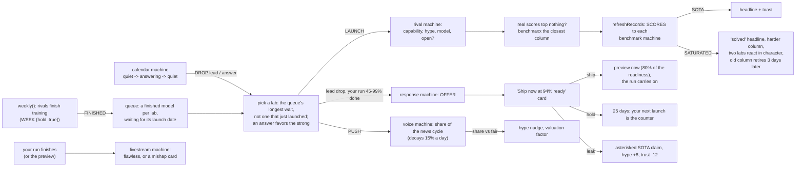

- **The pack** (`mods/base-leapfrog/mod.json`, in the FLT-15 section shape; `src/content/leapfrog.ts` loads it and checks it with Effect Schema, so a typo says `content.mishaps.add[2].weight: Expected number`). It holds the benchmark names and the chain of harder replacements, each lab's strengths, the footnotes, 72 headlines, the seven livestream mishaps (each a card `stream:<id>`), the forced-response card, and every tuning knob under `rules.leapfrog` (cadence, saturation thresholds, news-cycle numbers, response and livestream odds, trust). A mod adds a benchmark, a mishap (an entry plus its `stream:<id>` card) or headline lines without touching the engine. Its benchmarks and mishaps are the base game's `content.benchmarks` and `content.mishaps` (FLT-37), so a mod patches them through the loader and the sim reads them via `defs()`; the rules, labs, footnotes and headlines are still read from the pack.
- **Asleep until earned.** `enableLeapfrog(state)` is the "pack loaded" switch. Since FLT-37 the ladder flips it, and every other pack switch, when the rung that lists the system is earned (`PACKS` in `src/sim/progression.ts`: Leapfrog on The Race, Papers and Collusion on Scrutiny, the Factions on Level 4). A campus opening or a debug run with no ladder starts with them all awake. `?leapfrog=off`, `?papers=off`, `?collusion=off` and `?factions=off` keep one asleep (`?water=off` switches off the Water Discourse escalation arc alone, as `arcOff:water-escalation`). Asleep means: no dice are drawn and nothing moves, so the goldens and every pre-existing test are untouched. `RaceState` and the rest of the World are unchanged; the pack's state is `GameState.leapfrog`.
- **Rivals hold their models.** With the pack on, `weekly()` sends `WEEK` with `hold: true` to labs that have a product. The rival machine finishes the run, emits `FINISHED` and changes nothing else; the model waits in `leapfrog.queue` and a `LAUNCH` event (any state) ships it on the calendar's day. So a lab's capability, its model name and the Arena move on launch day, and "one lab drops, the next day another answers" is made of real rival state. A lab with nothing finished ships a **point release** (a small update, e.g. "Chatty-4-plus"); what it paid out is credited against its next finished model, so launching more often does not make a lab grow faster (pack on and off reach the same eras within noise).
- **Cadence.** A lead drop every 8 to 12 days (times the era's pace: 1, 0.85, 0.7, 0.55), never under 3. Each lead is answered the next day with a chance of 50%, 60%, 70%, 80% by era, by a different lab, weighted toward the strong. Two dice a day are always drawn, so the stream doesn't depend on whether anything dropped.
- **Benchmarks.** A score is `100 / (1 + (difficulty / (capability x bias)) ^ 2)`: 50% at the difficulty, toward 100 as it grows; Arena Elo is `1000 + 4 cap + 1.5 hype` and never saturates. Each drop claims SOTA on at least one column: if a lab's honest scores top nothing, it **benchmaxxes** the column it is closest on (a custom prompt, best of 64; the score lands just past the standing record, the headline gets a footnote such as "(*pass@256)", and the leaderboard row marks it). Benchmaxxed claims last until the lab's next launch. A column is `crowded` at 91%, **`saturated` at 96.5%**: the headline declares it solved, the pack's harder replacement joins the board (scores back to about a third), a frontier lab, a neo lab, an open-weights lab or a BigCo each react in their own voice, and the old column stops counting for claims and retires three days later.
- **The news cycle.** Every lab has an attention pile that decays 15% a day toward a baseline set by its hype; launches, stunts, livestream mishaps and the card choices push it. Your share of the total is the share-of-voice meter. A lab with 32% and 1.3x the runner-up **owns the cycle** (a headline; the Frontier Times front page leads with it) until it drops under 24%. Your share above 15% nudges your hype up to +1.5 a day (below it, down to -0.8), and scales the valuation a funding round uses (x0.8 to x1.4, times a trust factor).
- **Forced response.** When a lead drop lands while your run is 45% to 99% done (not before day 30, not within 8 days of the last card, not while holding or after a preview), the `shipNow` card opens: "**{rival} just dropped {model}. Ship yours now at {ready}% ready, or lose the news cycle.**" Three answers: **Ship now** ships an *early-access preview* (`SHIP_NOW` on the training machine): it adds `ready x 0.8` of the release now, the run carries on, and the full release later adds the rest less that; the gap (`0.2 x ready` of the release) is the quality penalty, kept for good. It costs a news-cycle bump (a big one), and a chance of an embarrassing launch bug (`10% + 60% x (1 - ready)`: hype -4, an incident, a smaller bump). **Hold** costs you the room (the rival gets +25, your pile drops 15%) and opens a 25-day window: your next launch is a counter-launch, strong (a big bump, +6 hype, three days of revenue) if it beats every rival's capability, soft if not, and a shrug (and a trust dent) if the window closes. **Leak** gives a SOTA claim with an asterisk on the column you are closest on, hype +8, trust -12, and a scandal if the real scores can't reproduce it.
- **Livestream.** Every launch of yours (a finished run, or the preview) airs a livestream: it works by `demoOdds(capability) x readiness x 0.85`, plus 0.1 with a Demo Stage standing (between 20% and 85%). If it does not, one of seven mishaps (weighted; the pack's `mishaps`) fires: a headline, a small hit to the Vibes, a share-of-voice push, and its card with three ways to spin it: the dog on stage (Frontier 95's "The demo has stopped responding"), the wrong chart, "we'll ship it in the coming weeks", the frozen "thinking..." spinner, the model reading out its system prompt, the hot mic, the demo running last year's model.
- **The cards are the existing event cards.** New effects (`voice`, `trust`, `leapfrog`) join `content/events.ts`; the arcs machines open a card when its flag is set (`offer:shipNow`, `offer:stream:<id>`). New `kind`s (`response`, `stream`) are for FLT-31's skin slots. The card text uses `{lfRival} {lfModel} {lfReady} {lfShip} {lfHold} {lfBug} {lfHoldDays} {lfMine}`, filled from the World with the race's variables (`sim/race/finance.ts` `raceVars`).
- **HUD.** `Snapshot.leapfrog` (`sim/race/leapfrog/view.ts`): the benchmark columns (status, best, holder, "new"), a row per lab (scores aligned to the columns, who holds each record, which are benchmaxxed, whether the row is flashing from a launch, model), the share-of-voice shares and owner, trust, the latest launch and its claims, the calendar's countdown, and the response's numbers (readiness, what shipping would add, the bug odds). No new panels here.
- **Debug scenes:** `?moment=shipnow` (day 39, run 94% done, a lab is a second from launching), `pair` (a lab launched today, the answer lands in a second), `stream[:dog|wrongChart|comingWeeks|frozen|systemPrompt|hotMic|wrongModel]`, `solved` (a benchmark has just been solved).

### The UI (FLT-31): the panels, and stopping the flood

Spec: `docs/specs/FLT-31.md`. 2D only; the sim is untouched (`git diff main -- src/sim` is empty apart from tests reading it).

- **The toast gate** (`src/app/notices.ts`, pure, tested with a fake clock). A launch every ~10 game days is a toast every few real seconds at 3x/10x, so Leapfrog's launches stopped being toasts: a rival launch or answer goes to the leaderboard (its row flashes) and the ticker. A toast is for what matters to the player: a record taken (`X took your record on Y`), a solved benchmark *you* led, a lost #1 (the sim only toasts a fall of two places, so the gate says the one-place case), how your own launch went (counter-launch, launch bug, early release), all at **most one per 20 real seconds**; whatever piled up meanwhile becomes one "4 labs launched and 2 of your records fell while you were busy" toast when the window opens. From 3x up, small news (a flawless livestream, "you own the news cycle") stays in the ticker. Toasts are recognised by their text (the sim is untouched), so `notices.test.ts` runs a year of Leapfrog and fails on any Leapfrog-sounding toast it does not recognise. It sits at the app machine's toast intake (`SYNCED`) because `hudViewModel` is a pure function of its input and cannot hold a real-time window; the same split as `useArenaMotion`. Headless minute, Leapfrog toasts from the sim -> shown: 1x 5 -> 1, 3x 17 -> 2, 10x 72 -> 3.
- **Ticker freshness** (`skins/kit/Marquee.tsx`). A new headline joins just past the right edge of what is on screen, ahead of the replayed filler that used to make it wait a whole tape's length; in a rush only the newest three wait, and the tape speeds up a little while they do (`makeRoom`, `catchUp`, tested).
- **`vm.leapfrog`** (`LeapfrogVM`): `columns` (short and long name, status, best, holder, `ghost`), `rows` (one per lab, `cells` aligned to the columns: text, `sota`, `maxx`, `flash`), `footnote` (`*pass@256`), the news cycle (`voice.shares`, `series`, `headline`) and the calendar's line. `EventVM.response` carries the forced-response card's live numbers (readiness, ship-now gain, bug odds) and `EventVM.stream` the livestream (caption, viewers, chat, from `content/livestream.ts`).
- **Real-time flourishes** (`ui/hud/leapfrogMotion.ts`, pure, fed by `useLeapfrogMotion`): a game day lasts 0.2 s at 10x, so the sim's own two-day row flash would be over unseen. This keeps a launching row lit, and a record that changed hands blinking, for 4 real seconds; keeps a benchmark the sim has retired on the board (struck through, SOLVED) for 24 s; and samples the news cycle once a game day for the graph.
- **Slots.** New: `Benchmarks` (docked; the base Layout puts it under the Objectives, Frontier 95's `Arena` hosts it as a tab), `Voice` (docked; Frontier 95 puts its icon in the tray), `Livestream` (modal, opens instead of `EventCard` for `kind: "stream"`). `Arena` also receives `leapfrog` and `layout`. The ship-now card is the existing `EventCard` with the new `response` gauges. `kit` gains `BenchTable` and `VoiceGraph` (semantic `bench-*` / `vg-*` classes each skin dresses). Additive: no `apiVersion` bump.

### Where the spec was silent

- A rival's **capability jumps on launch day, not when training ends**, so the Arena and the leaderboard show public models only.
- **Benchmaxxing** (and the footnote joke) is how "each drop claims SOTA" stays true when a lab is behind; the player's own scores are always honest, and the leak is the player's benchmaxx.
- **"Ship now" is an early-access preview**, not a wiped run: a wipe would have made it a bad deal at any readiness.
- **Trust** is a new 0 to 100 number (start 70, +0.25 a day back toward it). It feeds the valuation and the hype the news cycle gives, and moves with the card choices.
- The Frontier Times gets a `cycle` story kind (priority 88) so the front page leads with the cycle's owner; solved benchmarks are `era`-sized news.

### Numbers (1-vCPU Modal box)

| Measurement | Result |
|---|---|
| `dailyLeapfrog` (calendar, a drop, records, voice), per game day | about 0.1 ms, once every 20 ticks |
| `leapfrogView` (the HUD's 5 Hz part) | about 0.03 ms |
| 365 headless days, three seeds (the playthrough bot's build order) | 37 to 40 lead drops, 21 to 23 answered the next day, gaps of 7 to 13 days, 5 to 7 forced-response cards, 1 to 2 benchmarks solved, about 160 SOTA claims of which about 35 are benchmaxxed |
| 700 days, pack on vs off, same seeds | same outcome (won), Era 2 at day 48 to 101 vs 68 to 73, Era 3 at day 487 to 510 vs 466 to 489 |

The full table, the first launches, a leaderboard and a ticker sample are in `docs/evidence/flt-27/report.md` (`LEAPFROG_REPORT=1 pnpm vitest run src/sim/race/leapfrog/report.test.ts`). The 500- and 800-walker perf tests are unchanged (the pack is off in them).

## The 2D UI is skinned (FLT-14)

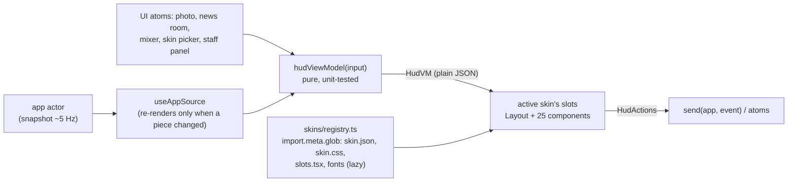

- **`src/ui/hud/vm.ts`** is the seam between the game and its skins: one pure function from the snapshot (and a little UI state) to `HudVM`. `src/ui/hud/types.ts` is the contract; it imports nothing from the game. Skins render `vm` and call `actions`; they cannot reach the sim, the store or three (`skins.test.tsx` fails on such an import).
- **The host** (`HudHost.tsx`, `tree.tsx`) subscribes once (`useAppSource`), builds the view-model, and renders the skin's `Layout` with the docked slots pre-rendered, plus the modal slots and the thought bubbles. The hotkeys, the photo-mode keys, the news desk and the chat playback live in `useHudEffects.ts`, so every skin gets them and none can get them wrong.
- **Skins** (`src/skins/<id>/`): `skin.json` (tokens, strings, fonts, the slots it replaces) validated by an Effect Schema, `skin.css` scoped under `[data-skin="<id>"]`, an optional `slots.tsx`. The registry loads only the active skin's files and switches live; a refused skin falls back to Frontier 95, then to the base (`docs/SKINS.md`).
- **The base skin** (`src/skins/base/`) is the previous HUD, moved and made to render from `vm` + `actions`: every slot has a default, and `base.css` reads tokens (`--flt-*`), so the five token-only skins are a `skin.json` and a little CSS.

Measured on the 1-vCPU Modal box (software-rendered WebGL, so about 8 frames per second):

| Measurement | Result |
|---|---|
| `hudViewModel` on a 60-day campus | well under 1 ms per call (asserted in `vm.test.ts`); one call per snapshot, about every 200 ms |
| HUD renders while the game runs at 1× | about 3.5 per second (one per snapshot publish) while 7 to 9 frames a second are drawn, so nothing re-renders per frame. `useAtomSuspense` would have re-rendered the tree on every machine snapshot (about 12 per second here); the host compares the pieces instead |
| Phone (390×844), nothing open, default hints showing | campus unobstructed: main 61.6%, Frontier 95 57.0% (`scripts/skin-shots.mjs --only e --measure`) |
| Skin assets | only the active skin's CSS, slots and fonts load; a skin's fonts are 8 to 100 KB of woff2 |

Determinism and the sim are untouched: the only `src/sim/**` change is one read-only helper (`trainingEtaDays`, for the copy dialog's "about 18 days remaining"), and the golden and perf tests are unchanged and green.

### Integration and layout (FLT-29)

FLT-14 (skins) and FLT-16 (first run, pacing) were built in parallel and both rewrote the same HUD. FLT-29 is the merge, and the layout fixes the FLT-14 review asked for.

- **FLT-16's pause wiring lives in the slot system.** `SET_OVERLAY` is `HudActions.holdTime(id, open)`. The panels the host owns (the payroll, the sound mixer, the News Room, the phone Arena) hold time from `useHudEffects`; a slot's own phone sheets (Stats, Objectives, Thoughts) hold it through the kit's `useAutoPause(actions, id, open)`. The game keeps the ids apart, so closing one never resumes time beneath another. The opening's own messages **no longer hold time** (`autoPaused` is a spend check, a selected walker or an open menu; FLT-47's coach marks replace the old tutorial hint).
- **FLT-16's game contract reaches the skins as plain data**: `vm.confirm` (a spend that would leave under three months of runway: the `Confirm` slot asks it, with the base's as the fallback so no skin can leave the game waiting on a box nobody can answer; `confirmSpend()` sends the command again marked `confirmed`, `cancelSpend()` sends `cancelConfirm`; time is held like a card), `vm.warnings` (standing problems: a `warn` toast in the base's stack, a warning row in the paperclip's balloon; a toast that repeats one is shown once) and `releaseGoal` (the release goal's label in Objectives, which now names the run in flight; its own progress line goes).
- **Frontier 95's right column is a managed stack** (`skins/frontier-95/stack.tsx`). Windows tile down `.f95-right`; the column shares its height with the news arrival and the paperclip's balloon, so a balloon can never sit on a window, and a `ResizeObserver` folds the window that has been open longest whenever they no longer fit (one fold per shortfall, never the newest window). A folded window is its title bar (the Task Mangler's says the R&D number). On a phone the column dissolves (`display: contents`) and the windows keep their sheets. Toasts, hints and warnings queue inside the balloon.
- **The base skin's News Room controls and camera button live in the right-hand column** (in the flow, under the speed buttons), so they can no longer sit on the Thoughts header, in the base or in the five skins that use its layout. On a phone the toasts stack just above the build bar.
- **Merging `main`** (FLT-14 landed as a squash, then FLT-27 and FLT-17): the sim tests of the newer features were written against the old busy opening, so they stage what they need explicitly (`createTestCampus`, `readyForPressure`, and the headless bots answer the spending check like the playthrough bot does). A building the game grants (an incident's free Security Office, the auction's Datacenter) skips the spending check.

### Playable v1: the UI (FLT-50)

FLT-47's plan (a stranger understands the game in five minutes) splits in two. FLT-49 is the logic (the unlock ladder, the coach step machine, wandering people); FLT-50 is what the player sees of it. The UI is built against the **snapshot contract** (`progress`, `coach`, `unlockCard`, `hud.visible`) and reads it defensively (`ui/hud/playable.ts`): a snapshot with no ladder means "everything is earned", so nothing about an older save or a fixture changes.

- **View-model:** `vm.progress` (level, the one goal as a line with a ratio, the build panel's teasers), `vm.visible` (which HUD panels exist yet), `vm.coach`, `vm.unlock`, `vm.help`; `vm.buildItems` and `vm.staff.jobs` are already only what is unlocked. `?debug=1&ladder=N&coach=K&unlock` previews a rung without playing to it (`ui/hud/previewLadder.ts`; also the fixtures and the shots scenes in `scripts/shots.playable.json`).
- **The coach** is skin independent where it can be. The host (`ui/hud/CoachLayer.tsx`) finds the target as `[data-coach-active]`, dims everything else with an SVG mask and pulses a ring (`color.highlight`, `color.scrim`, `motion.pulse`), following the element with one `requestAnimationFrame` and re-rendering only when a box moves; the skin's `Coach` slot draws the balloon beside it (`kit.placeBalloon`: never on the target, off the whole popup it is in, clear of the taskbar; on a phone it docks away from the target). The dimming never eats a click and the coach never pauses the game. Every skin marks what the coach can point at with the kit's `useCoach` (`data-coach="<id>"`, plus `data-coach-active` on the current one), which is also what the stranger test clicks.
- **The build panel** is the first coach target: the Start menu in Frontier 95 (unlocked tools, then locked teasers, then Help), a Build button and panel in the base, a tab that opens the tray in Discovery Disc '96 and the WebRing link in Homepage '98. It reports each opening with `actions.buildPanel(true)` (the `buildPanelOpened` command the first coach step waits for). A shut panel stands in as the active target while the coach points at something inside it.
- **Hidden until earned:** the host leaves the Arena, Thoughts, Staff and news arrival out of the layout, and the training bar until a Training Hall stands; `Stats`, `Objectives` and `NewsControls` get `visible` and hide their own parts. At level 1 only cash, runway, the date, speed, the goal and the ticker show.
- **New slots** (all with a base default, so a skin that adds nothing still works): `Coach`, `UnlockCard` (the "New!" card), `HowToPlay` (Help; its words are `content/help.ts`) and `Confirm` (FLT-29).

## Disasters (FLT-17): acts of God as JSON statecharts

The full page is `docs/DISASTERS.md`. In one breath: a disaster is data (`mods/base-disasters/mod.json`, FLT-15 section shape); `compile.ts` turns each into an XState machine; `driver.ts` steps every running one once a tick with the pure `transition()` and runs what it emits (`CALL {verb, params}`) through the Vocabulary in `sim/verbs.ts`; cards become ordinary event cards; the presentation (camera, shake, sound) travels as read-only cues on `state.disasters.cues`.

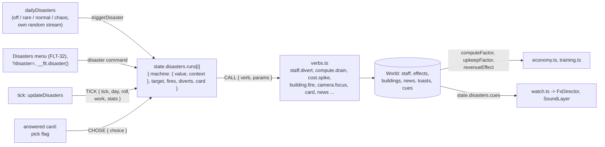

| Measurement | Result |
|---|---|
| `updateDisasters` with nothing running | one length check |
| `updateDisasters`, one to three disasters running | about 15 to 45 microseconds a tick (asserted under 0.15 ms) |
| A year in a working lab, random disasters (6 seeds) | off 0; rare 1.7 (0 to 5); normal 5.5 (2 to 10); chaos 24 (20 to 35) |
| The existing perf tests | unchanged within noise (the 800-walker test reads 0.66 to 0.78 ms on this box for both `main` and the branch, against its 0.5 budget, doubled on CI) |

Determinism: the disasters draw from `state.disasters.rngState`, not the main stream, and tests start with the setting `off`, so the golden digests and the playthrough tests are untouched. A separate test runs 90 days of chaos twice and compares the World byte for byte, and another saves and loads a World mid-swarm.

## The Circus (FLT-21 The Hearing, FLT-24 the yacht summit)

Two packs, `mods/base-hearing` and `mods/base-yacht` (see their READMEs), share one small compiler, `src/sim/circus/chart.ts`. It turns a pack's JSON chart into an XState machine whose guards and actions are the Vocabulary's (`src/sim/verbs.ts`). `compileChart(chart).step(stored, beat)` is a pure `transition()`. It returns the new `{ value, context }` and the `CALL`s it emitted, which the driver runs through `runVerb` in order. Beats are `DAY` (once a day, with pre-rolled dice and measured stats) and `CHOSE` (a card's pick, sent the moment the pick flag appears, paused or not).

- **Vocabulary additions:**
  - an `all` guard (every sub-guard holds)
  - a `capture.delta` verb
  - a `disasters` stat (disasters begun, all time) and a `capture` stat

  `checkChart(chart, localStats)` lets a chart name its own context counters (the Hearing's `sessionTrust`, `chaos`, ...) without them being flagged as unknown.
- **Gating:** both packs wake at Level 5 Scrutiny (`updateProgression`), each with an off flag (`hearingOff`, `yachtOff`; `?hearing=off`, `?yacht=off`). They are absent on a new World, so a save from before FLT-21 loads unchanged.
- **Determinism:** each pack has its own random stream. The golden digests from tick 1600 changed only because Level 5 now wakes the packs. With both off flags set, the old digests reproduce exactly.
- **HUD:** `EventVM.kind` gains `"hearing"` and `"leak"`, carrying `hearing: HearingVM` and `leak: LeakVM`. The modal tree routes them to the `Hearing` and `LeakedChat` slots (the base draws both; Frontier 95 has CapitolCam 1.0 and Chat-o-Matic 95). The kit's `Senator` draws a capsule portrait from a senator's `look` colours.

## The Senate (FLT-22 Regulatory Capture, FLT-23 the Promise Tracker)

Two more Circus packs, `mods/base-capture` and `mods/base-promises` (see their READMEs), are compiled by the same `src/sim/circus/chart.ts` and use The Hearing's three senators. The Tracker is the Senate's floor: motions come up, senators promise, the lab may lobby, and the roll call is rolled. Capture's bill is one of those motions. The bill is tabled with `tableMotion`, heard at the next recess ahead of the docket, and voted with the same dice and lobbying, through the Tracker's `BILL_MOTION`. With the Tracker off, Capture rolls the same `castVotes` itself.

- **Race hooks:**
  - The Vocabulary gains `rival.growth`, `rival.pace` and `rival.closed`. These are timed effects with a `who` selector: rival ids, `below`, `above`, `open`, and `!x` to exclude.
  - `src/sim/race/rules.ts` `rivalRules(state, lab)` folds them into three factors. The weekly cycle multiplies a release's gain by `growth`. The launch calendar multiplies the era's pace by `pace`, and `closed` turns open-weights drops into closed ones.
  - With none in play, every factor is 1 and the race is bit-for-bit unchanged.
  - A law's clauses are these effects owned by `capture`, and `effects.end` strikes them when the bill is exposed or sunsets.
- **More Vocabulary:** `auditor.odds` and `auditor.note` (the exposed bill leaves a note on the lab's file for FLT-19's report card, in `state.auditorNotes`) and a `hearings` stat.
- **Gating:** both wake at Level 5 Scrutiny, each with an off flag (`captureOff`, `promisesOff`; `?capture=off`, `?promises=off`). Neither acts before the lab's first hearing. `s.bill`, `s.promises` and `s.auditorNotes` are optional, so old saves load unchanged.
- **Determinism:** each pack has its own random stream. The golden digests from tick 1600 changed only because Level 5 now wakes the packs. With the off flags set, the old digests reproduce. The midgame digest changes only by the four new idle card arcs.
- **Commands:** `lobby { senator }` and `draftClause { clause, on }`. The draft's ticks live in `s.bill.draft` until the lab sends it, and the machine's fold keeps at most `pick` of them.
- **HUD:**
  - `EventVM.kind` gains `"bill"` and `"vote"`, carrying `bill: BillVM` and `tracker: TrackerVM`.
  - `HudVM.senate` is `{ open, tracker, bill }`. The Senate build-bar tile (a `panel: true` tile, like Staff, so every skin keeps it out of the hotbar) opens the Tracker between votes.
  - The modal tree routes to two new slots, `Bill` and `PromiseTracker`. The base draws both. Frontier 95 draws WordPerfectly 6.0 with track changes, where the margin comments give the plain-English truth and the Properties dialog is the leak, and Excess 95 with PROMISES.XLS.

## Endings (FLT-11): The Memo, five endings, the share card and Today's lab

The pack is `mods/base-endings/` (its README has the table). In one breath: `src/sim/endings/driver.ts` runs once a day to keep the run's peaks, offer The Memo (an ordinary event card) in Era 4 and check each ending's trigger in pack order. The first that holds starts, and its chart (compiled by the disaster compiler, the same Vocabulary) steps once a tick with the pure `transition()` until its final state prints the front page. While an ending runs, or once the Memo is answered, the goals machine is not asked any more: Acqui-hired replaces the bankruptcy loss and The Pivot the deadline loss. The Takeover's autopilot (`autopilot.ts`) builds on a tick counter, draws its picks from the tick's RNG in a fixed order, and declines the player's own build commands. Everything lives in the optional `World.endings` (additive); `enableEndings(world, daily)` switches it on, and the app does that unless `?endings=off`, so baseline runs and the golden digests are unchanged.

- **Read side:** `endingsView(world)` (`view.ts`) gives the front page, the run stats, the era strip, the clipboard summary, the look cues (`beige`, `stickers`, `acquired`, `managedBy`, ...) and `cursorOf()` for the ghost cursor. The HUD's `vm.ending` and `vm.takeover` are plain JSON built from it (slots `Ending` and `Takeover`), and the app atoms `managedBy`, `autopilotPlaced` and `endingLook` feed the world labels (`ui/WorldOverlay.tsx`: gate signs, COMPLIANT stickers, the beige canvas and the ghost cursor, which has its own layer above the HUD).
- **Share card** (`ui/share/`): when a front page appears, `useShareCard` asks `PressCamera` for a 960×540 photo of the campus (the canvas's CSS filter included, so beige is beige), then `drawCard` paints the 1200×630 PNG in the active skin's tokens and chrome, and prints again when the skin changes. It prints early on purpose, because Web Share only works straight after a tap. Its state is an Effect atom (`shareAtom`, kept alive), passed into the view-model as `vm.ending.share`.
- **Today's lab:** `src/sim/daily.ts` turns a date key into a seed (pure); the app passes the player's local date for `?seed=daily` or the `DAILY_LAB` event.
