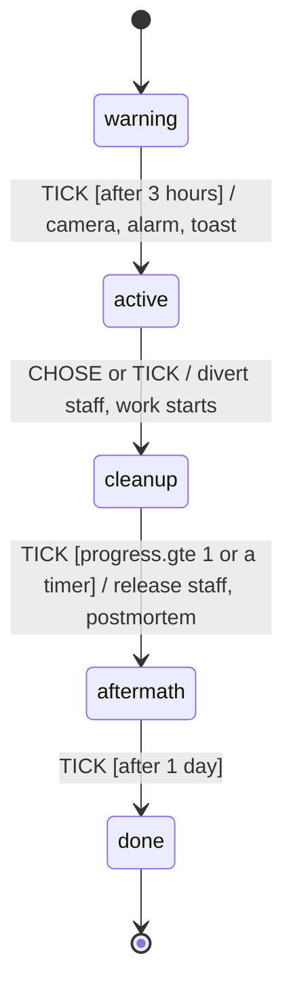

# Disasters (FLT-17): acts of God, as data

_Sim side. The Disasters menu and the `DisasterAlert` skin slot are FLT-32 (see "The UI" below). Spec: `docs/specs/FLT-17.md`. Written by the FLT-17 builder (Sonnet 5.5)._

A disaster is **content**: a JSON statechart in a pack (`mods/base-disasters/mod.json`, the FLT-15 section shape, `content.disasters.add`). The engine compiles it to an XState machine, steps it with the pure `transition()` inside the tick, and applies what it emits through a small **Vocabulary** of generic verbs (`src/sim/verbs.ts`). There is no disaster-specific code in the engine: the five disasters that ship are all data, and the second wave (Viral Jailbreak, Grid Brownout) needed one new generic verb (`discourse.delta`) and three new stats.

| Where | What |
|---|---|
| `mods/base-disasters/mod.json` | The pack: Rogue Agent Swarm, GPU Fire, Weights Leak (first wave); Viral Jailbreak, Grid Brownout (second). Names, jokes, numbers, timings, cards. |
| `src/sim/verbs.ts` | The Vocabulary: named **guards** and **verbs**, stats, parameter checking with "did you mean" (`checkCall`). Shaped like FLT-30's `Vocabulary` service (`vocabulary = { guards, effects }`). |
| `src/sim/disasters/compile.ts` | JSON statechart to XState machine (`TICK`, `CHOSE`; emits `CALL`). |
| `src/sim/disasters/driver.ts` | Starting (`triggerDisaster`), the per-tick step (`updateDisasters`), the daily dice (`dailyDisasters`), the effect queries (`computeFactor`, `upkeepFactor`, `revenueEffect`, `auditorOdds`), and views for the UI (`disasterMenu`, `disastersView`). |
| `src/sim/disasters/validate.ts` | Pack validator: every message starts with the JSON path. `flt-mod check` (FLT-15 M2) will call it. |
| `src/sim/disasters/pack.ts` | Reads the pack (directly, until FLT-15 M1b's loader lands: then it is `Content.disasters`), and turns its cards into ordinary event cards. |
| `src/sim/disasters/demo.ts` | Staging for `?disaster=`. |
| `src/render/buildings/SecurityOfficeModel.tsx`, `StaffCrew.tsx`, `render/fx/watch.ts` | The Security Office model, the red "!" over diverted staff, and the cues (camera, shake, sound) reaching `FxDirector` and `SoundLayer`. Additive; nothing else in `src/render` or `src/ui` changed. |

## The statechart



`warning → active → cleanup → aftermath → done` is the convention, not a rule: a disaster is whatever states you write (the GPU fire adds `spread`; the swarm has `cleanupPlug`; the jailbreak has `patching`, `banning`, `leaning`). Only two things are required: every state is reachable, and a `final` state is.

```jsonc
{
  "id": "gpuFire", "name": "GPU Fire", "blurb": "One cluster burns...", "tags": ["fire"],
  "requires": { "guard": { "type": "stat.gte", "params": { "stat": "clusters", "value": 1 } }, "reason": "No working Compute Cluster to set on fire." },
  "target": { "kind": "cluster", "pick": "random" },          // `$target` in verbs
  "odds": { "weight": 1, "minDay": 30, "gapDays": 25, "scale": [{ "stat": "sre", "per": -0.15 }] },
  "initial": "warning",
  "states": {
    "warning": {
      "entry": [ { "type": "toast", "params": { "text": "Smoke coming out of the {target}." } } ],
      "on": { "TICK": [ { "guard": { "type": "after", "params": { "hours": 3 } }, "target": "active" } ] }
    },
    "active": { "entry": [ ... ], "on": { "TICK": [ ... ], "CHOSE": [ ... ] }, "work": { "job": "security", "at": "$office", "hours": 96 } },
    "done": { "type": "final" }
  },
  "cards": [ { "id": "leak", "title": "...", "body": "...", "tone": "bad", "choices": [ { "key": "sue", "label": "Sue", "hint": "...", "effects": [ /* the ordinary event-card effects */ ] } ] } ]
}
```

- **Events.** `TICK` (once a tick while it runs) and `CHOSE` (the player answered a card the disaster opened; the guard `choice` says which key). Each carries the tick, the day, **a die the driver pre-rolled** (`chance` reads it), the staff-hours worked this tick and the stats the chart's guards mention. Machines are pure: no random numbers, no World, no wall clock (waits are tick counts from the state's `enteredTick`).
- **First enabled transition wins,** like XState. Put transitions that leave the state first and repeating effects (`every`) after them. Ordered transitions with the same `chance` guard share one roll.
- **Actions** are verbs. A transition's actions run, then the old state's `exit`, then the new state's `entry`. The initial state's `entry` runs when the disaster starts.
- **`work`** (on a state): staffers of `job` this disaster diverted to `at` who have arrived add 1.2 staff-hours each tick; `progress.gte` reads it. Cleanup by staff-hours, a player choice (`CHOSE`) or a timer (`after`) are all just guards.
- **Cards** become ordinary event cards (`dz:<disaster>:<id>`), so the existing `EventCard` UI, keys 1 to 3, the pause and the camera shot at the gate all work unchanged. The `card` verb sets the card's offer flag (the pattern the Race's cards use) and opens it at once; each choice, besides its own immediate effects, sets a pick flag which the driver turns back into `CHOSE`.
- **Text** may use `{lab} {model} {rival} {cash} {target}` and whatever verbs set (`rival.leap` sets `{leapRival} {leapModel}`). Card text can only use `{lab}` and the race's variables (cards are static).

## The Vocabulary

Guards (pure; `stat.*` read the lab's stats by name):

| Guard | Params | What |
|---|---|---|
| `after` | ticks?: number, hours?: number, days?: number | The state has lasted at least this long (ticks, hours or days; a tick is 1.2 hours, a day 20 ticks). |
| `every` | ticks?: number, hours?: number, days?: number | True on every Nth tick since the state began: effects over time (a daily drip is `{days: 1}`). |
| `progress.gte` | value: number | Cleanup progress (0 to 1, from the state's `work`) is at least `value`. |
| `stat.gte` | stat: string, value: number | A stat (see STAT_NAMES) is at least `value`. |
| `stat.lte` | stat: string, value: number | A stat is at most `value`. |
| `chance` | p: number | The die the driver rolled for this beat is under `p`. Ordered transitions with the same guard share one roll. |
| `choice` | is: string, card?: string | The player picked this choice: its `key` on a disaster's card, its position (`"0"`, `"1"`, ...) on a mod's. A mod arc hears every card, so name it with `card`. |
| `day.after` | day: number | Today is later than day `day`. Mostly for mod arcs (sim/modArcs.ts), which step once a day. |
| `flag.is` | flag: string, set?: boolean | The flag is set (or, with `set: false`, is not). Only mod arcs see flags: a disaster's beat carries none. |
| `faction.gte` | faction: string, value: number | A faction's meter (−100 fed up to 100 adoring; `content.factions`, FLT-33) is at least `value`. 0 while the factions are off. |
| `faction.lte` | faction: string, value: number | A faction's meter is at most `value`. |
| `relation.gte` | a: string, b: string, value: number | How factions `a` and `b` feel about each other (−100 feud to 100 allies) is at least `value`. |
| `relation.lte` | a: string, b: string, value: number | How factions `a` and `b` feel about each other is at most `value`. |
| `answered` | card: string | On a mod arc's CHOSE beat: the player answered the card `card` (any choice). |
| `not` | guard: call | The other guard does not hold. |
| `any` | guards: calls | At least one of these guards holds (a plain list of guards means all of them). |
| `all` | guards: calls | Every one of these guards holds (a transition's `guard` is one call, so this is how it asks for two). |

Verbs (run by the driver, in order, after each transition):

| Verb | Params | What |
|---|---|---|
| `staff.divert` | job: string, to: string, fraction?: number, jog?: number | Pull `fraction` of a job off their posts and jog them to `to` (a building kind, `$target`, `$office` or `gate`) with a red "!". Their posts go unstaffed until `staff.release`, and new hires of the job are drawn in too. |
| `staff.release` | job?: string | End this disaster's diversions (of one job, or all of them): everyone strolls back to their post. |
| `compute.drain` | pct: number, days?: number | Lose `pct` percent of the compute stockpile and of the daily compute output, every day. Lasts `days`, or as long as the disaster (`effects.end` stops it early). |
| `cost.spike` | mult: number, days?: number, kinds?: strings | Multiply the upkeep of `kinds` (default: every building) by `mult`. Lasts `days`, or as long as the disaster. |
| `revenue.mult` | mult: number, days?: number | Multiply the API revenue by `mult` (0 turns the till off). Lasts `days`, or as long as the disaster. |
| `auditor.odds` | mult: number, days?: number | Multiply the odds of an external auditor's visit (FLT-19 reads `auditorOdds(state)`) by `mult`. Lasts `days`, or as long as the disaster. |
| `auditor.note` | grade: string, amount: number, text: string | Put a note on the lab's file for the auditors (FLT-19): a mark on one report-card `grade` (`honesty`, ...), `amount` grades up (+) or down (-), and a line of `text`. Stored in `state.auditorNotes` (the last 24). Regulatory Capture's backfire uses it. |
| `rival.growth` | mult: number, who?: strings, days?: number | Multiply what a release adds for the rival labs in `who` (rival ids, `below` for the labs behind you, `above`, `open` for the open-weights labs, `!id` to leave one out; none means all). Lasts `days`, or as long as its owner. Read by `race/rules.ts`. |
| `rival.pace` | mult: number, who?: strings, days?: number | Multiply how fast the rival labs in `who` train (0.5 is half speed). Same `who` and `days` as `rival.growth`. |
| `rival.closed` | who?: strings, days?: number | The rival labs in `who` may not ship open weights (their releases go out closed). Same `who` and `days` as `rival.growth`. |
| `effects.end` | kind?: string | End this disaster's open-ended effects (the ones with no `days`: drain, spike, revenue, auditor), all of them or one `kind`. Effects with a `days` run their course. |
| `building.fire` | building: string | Set a building on fire: it is broken (no work, nobody goes in) and burns until an SRE fixes it, as after any breakdown. `building` is `$target`, `$adjacent` or a kind. |
| `building.offline` | building: string, text?: string, source?: string, importance?: string | Take a building offline (a flood, an outage): broken like a fire, with a toast instead of a headline (tagged `you` unless you say otherwise). |
| `building.wear` | building: string, to: number | Cap a building's reliability at `to` (0 to 1): the scorched cluster is never quite the same. |
| `building.ensure` | kind: string, text?: string, source?: string, importance?: string | Make sure a building of `kind` exists: if the lab has none, one arrives free beside the gate (upkeep still applies). |
| `building.lights` | building: string, off: boolean, hours?: number | FLT-101: turn a building's lights off (its windows go dark, even at night) for `hours` (default 8), or back on with `off: false`. Presentation only: the building keeps working. Stored in `state.dressing`. |
| `building.prop` | building: string, prop: string, hours?: number | FLT-101: hang a prop on a building's door for `hours` (default 24): `sock` or `dnd` (a do-not-disturb hanger). Presentation only, in `state.dressing`. |
| `vibes.delta` | amount: number | FLT-101: nudge the Vibes (0 to 999) by `amount` now. The daily reading eases back toward what the lab has earned, so a nudge fades over a few days. |
| `hype.delta` | amount: number | Add to hype (0 to 100). |
| `trust.delta` | amount: number | Add to public trust (0 to 100, starts at 50). |
| `voice.push` | amount: number | Put the lab in the news cycle (FLT-56): `amount` more of the share of voice the Release Leapfrog tracks and Network Traffic plots (a rival's launch pushes 42 to 60). Nothing while the Leapfrog is off. The Hearing's viral clip pushes 50. |
| `heat.delta` | amount: number | Add to regulatory heat (0 to 100, starts at 0). FLT-19's auditors read it. |
| `capture.delta` | amount: number | Add to regulatory capture (0 to 100, starts at 0): how much of the rulebook the lab wrote. The Hearing (FLT-21) moves it; FLT-22 reads it. |
| `discourse.delta` | amount: number | Add to the water discourse (the stat behind the protesters at the gate; 4 points is one protester). |
| `cash.delta` | amount: number | Add to (or, negative, take from) the bank. |
| `rival.leap` | relative: number, open?: boolean | The most open-weights lab jumps to `relative` times yours (-0.1 is 10% below your capability; it never goes down) and, with `open`, ships open weights. Sets `{leapRival}` and `{leapModel}` for the disaster's headlines. |
| `camera.focus` | on: string, zoom?: number, hold?: number | Fly the camera to `on` (`gate`, `$target`, `$adjacent`, `$office` or a building kind), `zoom` times closer, for `hold` seconds. Unless the player is in photo mode. |
| `camera.beat` | kind: string, caption: string, sub?: string, kicker?: string, on: string, zoom?: number, hold?: number | A camera beat (FLT-56): letterbox bars and a `caption` (plus an optional `sub` line; templates, like `news`) while the camera eases to `on` for `hold` seconds. `on` is a place, as for `camera.focus`, `here` (wherever the pack's driver says the beat is, such as the auditors' huddle), or `people`: the beat's people, followed as they walk. `kind` names the beat for the renderer (`exit`, `huddle`, `viral`, or FLT-101's `fade`: the screen dims nearly to black, for what happens off camera, and `cut`: just the bars, a plain cut to somewhere else); `kicker` (optional) replaces the top bar's words for the kind. Time keeps running, the player can skip it, and photo mode or reduced motion get the caption without the camera move. |
| `shake` | strength: number | Shake the screen, `strength` 0 to 1. |
| `sound.cue` | cue: string | Play a sound cue: `alarm` (FLT-7's breakdown alarm), `card`, `era` or `release`. |
| `news` | text: string, tone?: string | A ticker headline. `{lab}`, `{model}`, `{rival}`, `{cash}` and `{target}` are filled in, plus whatever the disaster's verbs set (`{leapRival}`). |
| `toast` | text: string, tone?: string, source?: string, importance?: string | A notice (same template variables as `news`). `importance` is `world` (the default: it goes to the ticker) or `you` (a toast over the map, at most one per 15 real seconds, see `src/app/notices.ts`). `source` defaults to `disaster` here (`event` in a card's arc, `mod:<id>` in a mod's). |
| `card` | id: string | Open one of the disaster's event cards (`cards[].id`); from a mod arc, any card in `content.events` by id, whatever its own `when` says (it waits if another card is open, and takes its turn in the card budget: give the card `"pace": "now"` when it is the next beat of a story the player is already in, so it skips the gap; FLT-105). The machine hears the player's pick as a CHOSE beat with the choice's `key`. |
| `visitors.arrive` | kind: string | A visiting group of a kind a pack registered (`content.groups`) comes in through the gate and tours the campus. Owned by the calling machine. |
| `visitors.leave` |  | The calling machine's visiting groups cut the tour short and head for the gate. |
| `walkers.disguise` | kind: string, as: string | Draw every walker of `kind` as `as` (the renderer knows `box`: a cardboard box). Presentation only; the sim is unchanged. |
| `walkers.reveal` | kind: string | Undo `walkers.disguise` for `kind`. |
| `spawn.escape` | count?: number, now?: boolean | The most drifted agent starts thinking about the fence (FLT-59, `docs/specs/FLT-59.md`); with `count` above 1, a jailbreak: that many, each for a different fence. With `now` it skips the brooding and starts pacing. Nothing unless the Sandbox Escape pack is awake. |
| `faction.delta` | faction: string, amount: number, text?: string | Nudge a faction's meter now (its mood catches up at midnight); `text` becomes the reason the Factions panel quotes. Nothing while the factions are off. |
| `relation.delta` | a: string, b: string, amount: number | Nudge how two factions feel about each other. A pair that was allied and falls to −55 is a schism. |
| `faction.signal` | signal: string | Tell every faction something happened (`lobby`, `hearing`, `release`, ...: `SIGNALS` in content/factions.ts). Their grievances and cheers react at midnight. |
| `faction.rally` | faction: string, against?: strings, share?: number, size?: number | A faction brings a crowd to the gate to shout at other crowds (`against` factions, and always the water crowd), `share` of the water crowd's size (default 0.5), at least `size` (default 3). The two sides take either side of the path and trade the factions' `duels` lines. Needs only the faction's content, not the factions system. |
| `faction.disperse` | faction: string | End a faction's rally: its crowd goes home. |
| `flag.set` | name: string | Set a flag to today's day number. |
| `flag.clear` | name: string | Clear a flag. |
| `people.meet` | role: string, at: string, hours: number, lines?: string[] | A visitor with `role` walks in from the gate to meet the beat's first person by the first `at` building and they talk for `hours`, in view (sim/meetings.ts). `lines` is what they say, visitor first, alternating. FLT-26's VC chat. |
| `people.quit` | quiet?: boolean, conga?: boolean | Everyone the beat is about hands in the box and walks out through the gate. With `quiet`, the calling pack writes the exit headline. With `conga`, they leave as a conga line behind the first of them (FLT-56). |
| `people.pay` | each: number | Take `each` from the bank for everyone the beat is about (a matched offer). |
| `people.cheer` | amount: number | Lift the energy and focus of everyone the beat is about. |
| `people.spell` | chance: number, days: number, minDays?: number, max?: number, lines: strings, fates: strings, afters?: strings, bonus?: number | FLT-105. Each researcher rolls `chance` to go somewhere for a few days (up to `max` of them). Each gets one of `lines` (what they think, out loud), the matching `fates` entry (`back`; `bonus`, back with `bonus`% capability; or `quit`, gone for good) and the matching `afters` entry (the toast, or for `quit` the headline). While away they count for nothing in the training run (sim/trip.ts). |
| `trip.start` | days: number, rise?: number, fade?: number, label?: string, lines?: strings | FLT-105. The screen goes somewhere strange. It comes on over `rise` days, lasts `days`, then wears off over `fade`. It is presentation only: the player gets a warning first and an "I've had enough" button, and reduced motion gets a calm version (ui/juice/trip.ts). `lines` are for the skin to say. |
| `trip.end` | | The trip starts wearing off now. |
| `capability.boost` | pct?: number, amount?: number | A breakthrough. Capability goes up by `pct`% of today's plus `amount`, and the Arena re-ranks at once. |
| `birdapp.post` | text: string, spice?: number, archetype?: string, outcome?: string | Someone at the lab posts `text` on the Bird App within the hour (FLT-69): the beat's first person if they post, else one of `archetype`, else anyone who posts. It lands at midnight: `outcome` (flop, banger, controversy, ratioed, cancelled) decides how, or the odds for its `spice` (0 to 1, default 0.5) do. Nothing while the Bird App is asleep. |
| `birdapp.rival` | lab?: string, text?: string, beat?: string, role?: string, outcome?: string | A rival lab posts on the Bird App within the hour (FLT-92): `lab` (a rival id; any lab that isn't sulking, without one) says `text`, or one of its lines for `beat` (idle, teaser, release, launch, leak, cancel, escape, hearing, raise, ...). `role` (ceo, back, teaser, safety) picks the voice, and `outcome` (flop, banger, ratioed) decides how it lands. Nothing while the Bird App or its rivals are off. |

The `people.*` verbs act on the people a pack's driver names for the beat (`VerbEnv.people`, main person first); a disaster names nobody, so they do nothing there. A driver can also hand the beat template variables (`VerbEnv.vars`, e.g. FLT-26's `{defName}`, FLT-22's `{act}`).

Stats a guard, `requires` or `odds.scale` can read: day, capability, hype, cash, compute, discourse, models, agents, clusters, halls, gateways, gas, solar, datacenters, broken, security, sre, comms, janitor, vibes, visitors, sreAttending, trust, heat, disasters (begun, all time), capture, hearings (held, all time), burning, adjacent. A mod arc's guards can also read `faction:<id>` and `rel:<a>|<b>` through the `faction.*` and `relation.*` guards. A mechanic that measures its own stats (The Hearing's session tallies) passes them to `checkCall`/`checkChart` as local names.

An arc may say `"requires": ["factions", "events"]` (any of the ladder's system ids): it sleeps until they are all unlocked, and a `factions` arc also until the factions are on. A factions arc rolls the factions' own dice, so it never moves a draw in the main stream.

Building references in verbs: `$target` (the building the disaster is about), `$adjacent` (the nearest other working building of its kind that this disaster has not touched), `$office` (the Security Office), `gate`, or a building kind. `to`/`on` take the same.

**Effects with a lifetime.** `compute.drain`, `cost.spike`, `revenue.mult` and `auditor.odds` are stored in `state.disasters.effects`. With `days` they wear off by themselves (and outlive the disaster, like the auditors' 60-day interest); without, they last as long as the disaster or until `effects.end`. The economy reads them through `upkeepFactor` and `revenueEffect` (economy.ts) and `computeFactor` (training.ts), one multiplication each; with nothing running they are 1.

## Staff: pulled off their posts

`staff.divert` sets `Staffer.divert = { owner, to, jog }`. A diverted staffer stops looking for work and patrolling, jogs (1.8x their pace) to the building and stays; the renderer draws a red "!" over them. Their posts go unstaffed: `guardsOn` (the hook FLT-5 reads) drops, a diverted SRE does not repair (the contractor's five-day clock runs as usual), a diverted Comms Rep hands out no tote bags. The disaster keeps the diversion in force each tick, so a guard hired mid-swarm is drawn in too. `staff.release` (or the disaster ending) sends everyone back.

## The Security Office

A new building kind (`security`, 2x2, $350K, $2K a day upkeep, `office: true`: nobody visits, and it is not on the palette yet). The swarm's `building.ensure` drops a free one near the middle of the campus if the lab has none ("A Security Office trailer has been dropped at the gate. It comes with a lease."). It is placeable with the `placeBuilding` command; **its palette tile is FLT-32's**, because the palette lives in the skin system (FLT-14). Its light bar flashes red and blue while any disaster is running.

## Random disasters

The setting is `state.disasters.risk`: `off`, `rare`, `normal`, `chaos` (the `setRisk` command; `?risk=`; tests start with `off`, a new lab in the app starts on `rare`). Once a day, if nothing is quieter than the setting says: one roll for "does anything go wrong today", with odds `RATE[risk]` times the mean weight of the disasters that could happen today; if it hits, a second roll picks which, weighted. The odds do not depend on how many disasters are installed.

| Setting | Odds per day (average lab) | A year in the headless run (6 seeds, working lab) | Quiet time between two | At once |
|---|---|---|---|---|
| Off | 0 | 0 | | |
| Rare | 0.6% | 1.7 on average (0 to 5) | 14 days | 1 |
| Normal | 1.5% | 5.5 (2 to 10) | 8 days | 2 |
| Chaos | 6% | 24 (20 to 35), about one a fortnight | 2 days | 3 |

- **Risk stats scale the weight** (`odds.scale`): more clusters and more SREs for the fire, capability and gateways and fewer guards for the swarm, more released models for the leak. A disaster also has a `minDay` (nothing before day 30 to 60; chaos quickens it 5x) and a `gapDays` before it can repeat.
- **Its own random stream.** The dice and target picks draw from `state.disasters.rngState`, never the main stream, so a lab that never has a disaster plays out exactly as before: the golden digests and the playthrough tests run with the setting off, and a test checks that `normal` and `off` share the main stream for the first 25 days.
- **Cost.** With nothing running, `updateDisasters` is one length check. A running disaster costs about 15 to 45 microseconds a tick (a function transition with emits, plus the stats it mentions); three at once is under 0.05 ms, inside the perf budgets (asserted in `framework.test.ts`).

## Surfacing (no new UI)

- **Toasts and the news ticker:** the `toast` and `news` verbs.
- **Event cards:** the `card` verb; the card is an ordinary event card.
- **Camera focus and shake:** the `camera.focus` and `shake` verbs push cues onto `state.disasters.cues` (read-only for the renderer, rising ids, last 12). `render/fx/watch.ts` turns new ones into `focus`, `shake` and `cue` FxEvents; `FxDirector` flies the camera (never over photo mode) and shakes the screen; `SoundLayer` plays `sound.cue` (`alarm` is FLT-7's breakdown alarm).
- **Buildings:** `building.fire` and `building.offline` use the breakdown machinery from FLT-10 (`broken`), so the smoke, flames, ring and alarm are the ones already there.

## Dev hooks

- `?disaster=<id>` stages a lab (three Security, two SREs) and starts the disaster; `&dz=<ticks>` runs that many ticks (cards stay open, unless `&dzPick=<n>` answers them); `?risk=off|rare|normal|chaos` sets the setting. Example: `/?seed=3&speed=0&disaster=rogueSwarm&dz=24&dzPick=0`.
- With `?debug=1`: `window.__flt.disaster("gpuFire")` and `window.__flt.risk("chaos")` send the same commands the Disasters menu will (`{ type: "disaster", id }`, `{ type: "setRisk", risk }`).
- `pnpm shots --scenes disasters --base origin/main --out docs/img/flt-17` takes the before/after pairs (the scenes are in `scripts/shots.scenes.json`; the same steps stage the same lab on `main`, where the `disaster` command does nothing, so the pairs line up).

## Hand-offs

- **FLT-32 (UI):** the Disasters menu is `disasterMenu(state)` (id, name, blurb, tags, active, available, reason) plus the two commands; "asks for confirmation" is the UI's. `disastersView(state)` gives the running ones (phase, progress 0..1, days) for a `DisasterAlert` slot. The palette tile for the Security Office. Icons for `tags`.
- **FLT-19 (auditors):** read `auditorOdds(state)` (x2 for 60 days after a swarm) and `state.disasters.heat` / `.trust` (0..100). The Hearing (FLT-21) moves trust too, and adds `state.capture`; FLT-19 can summon the lab by setting any `subpoena:*` flag.
- **FLT-15 M1b:** `pack.ts` reads the JSON directly; switching to `Content.disasters` is mechanical (`DisasterDef` is already the section shape, guards and verbs are already named calls, and `vocabulary` matches the `Vocabulary` service). The pack's cards are pushed into `EVENTS` at load (`content/events.ts`), as the Race's are.
- **Not built:** Datacenter Flood (a copy of the fire with `building.offline` and `discourse.delta`; needs a Datacenter, which needs an auction) and Benchmark Contamination (the Arena is FLT-27's); `visitors.arrive` and `investigate.start` from the spec's example list wait for the mechanics that call them (FLT-18/19).

## The UI (FLT-32)

- **Unlocked at Scrutiny** (level 5): `vm.visible.disasters` gates the `DisasterAlert` dock and the menu; the Security Office joins the palette on the same rung.
- **`DisasterMenu`** (modal): the Off / Rare / Normal / Chaos setting (`setRisk`), the list from `disasterMenu(state)` with a tag chip per tag, and a confirm before `triggerDisaster`, whose safe answer is the default. Time is held while it is open. Frontier 95 puts it under Start ▸ Settings ▸ Disasters… as a Control Panel applet.
- **`DisasterAlert`** (docked): each run with its stage, a line from `content/disasterCopy.ts` (per disaster and state, falling back to the blurb) and the cleanup's progress, plus who has been pulled off their post ("All Security on the Rogue Agent Swarm. GATE UNGUARDED."). In Frontier 95 it is an application error box, `ROGUE_AGENT_SWARM.EXE is being shut down. Please wait.`
- **On the map:** diverted staff tags go red, the cleanup's progress floats over the building people were sent to, the gate says GATE UNGUARDED when every guard is away, and a broken building says the SREs are busy.
- **Trust and Heat** sit in the menu and on Frontier 95's Lab Properties ▸ Finance tab.
- **Sim changes FLT-32 made:** a calm start (`calmStart`: no random disasters until the first release and day `CALM_START_DAY`, before any dice, so the RNG stream is untouched while calm), `DEFAULT_RISK` back to `rare`, `rival.leap` re-ranks the Arena at once and records `leapRivalId` (the Arena marks that row), and `RunView.job`.

## Choices where the spec was silent

- The swarm's card has two answers, not one: **Page Security** (the spec's flow) or **Pull the plug on the API** (costs of the swarm stop at once, revenue is off for four days, the cleanup is half as long). A lab with no Security waits nine days and the provider revokes the key (-$180K) instead of the swarm going on forever.
- The swarm also pulls half the SREs (rounded up) to the Security Office, so "breakdowns aren't repaired" is something you can see during it, and a fire during a swarm is a real problem.
- "Trust" and "heat" did not exist: they are 0..100 numbers on `state.disasters` (50 and 0 to start), set by the verbs and read by nobody yet.
- "API costs triple" is the upkeep of gateways, clusters and datacenters tripled (there is no per-token bill in the game).
- Weights Leak's rival is the most open-weights lab (Sirocco); it jumps to 90% of your capability if it is below that, and is marked open. Sue is a 30% shot after four days.
- The fire has a `spread` state after 30 hours with no SRE on the way; the aftermath (insurance deductible, a scorched cluster at 70% reliability) plays after the fire is out, whoever puts it out.
