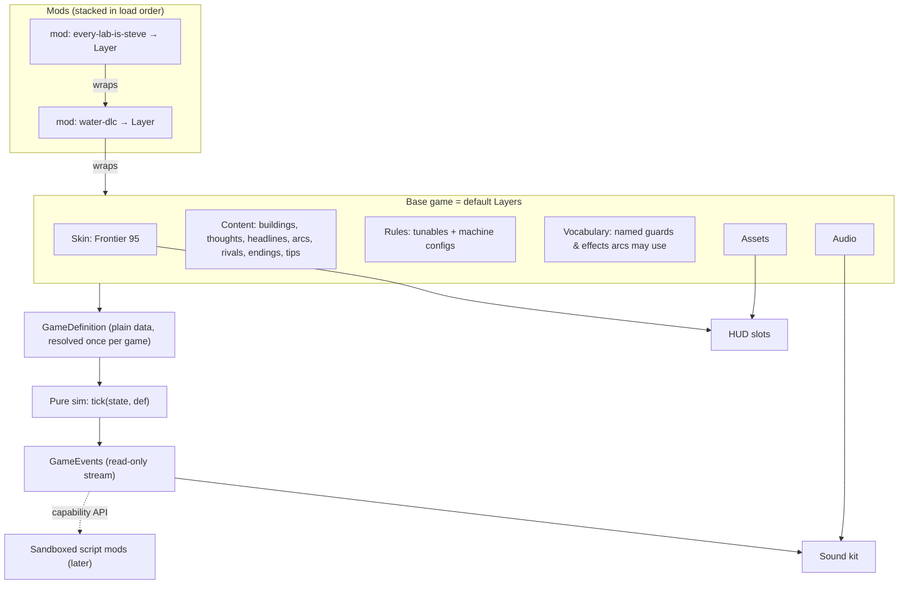

# Effect for modders (no prior Effect needed)

_How Frontier Lab Tycoon plugs mods in, explained in plain words. You don't need any of this to make a data-only mod (see `docs/MODDING.md`), but it helps to know what happens to your mod after you hand it over. The mod-authoring skill uses this page too._

## Five words, one line each

| Word | Plain meaning |
|---|---|
| **Effect** | A TypeScript library. Its programs are *descriptions* of work (like a recipe) that run later. |
| **Service** | A named slot the game asks for, like *"I need the Content"*. It has a name and a shape (a TypeScript type). |
| **Layer** | A recipe that fills one or more slots. *"Here is how to make the Content."* |
| **provide** | Hand a Layer to a program, so its slots get filled. |
| **Schema** | A checked description of some data. It validates JSON and explains mistakes in plain words. |

Two more you'll see in code: **`Effect.gen(function* () { … })`** is how you write a step-by-step recipe, and **`yield*`** inside it means *"get me this (a service or a result), then carry on"*.

## The picture: the game is a stage play

- The game is a **play**. It needs certain **roles** filled: the Skin, the Content, the Rules, the Sounds, and so on. Those roles are **services**.
- The **base game** is the default cast: one **Layer** per role.
- A **mod** is a casting change: *"the Rival Labs will now be played by…"*. It's a Layer that takes over a role, usually by starting from whoever had it before and changing a few lines.
- **Loading several mods** stacks those casting changes in order. The last one to touch a line wins, and the Mod Manager tells you when two mods touched the same line.
- The play itself (the simulation tick) never changes how it runs. It asks for its cast **once, when a game starts**, then plays deterministically: same seed, same mods, same game.

## The service map



| Service | What it holds | Who reads it |
|---|---|---|
| `Skin` | tokens, strings, CSS, fonts, slot components (built-in skins only) | the HUD |
| `Content` | buildings, walker kinds and thoughts, headlines, arcs (JSON statecharts), rivals, endings, assistant tips, names | building the `GameDefinition` |
| `Rules` | tunable numbers (with safe ranges) and patches to built-in machines | building the `GameDefinition` |
| `Vocabulary` | the named guards and effects JSON arcs may use (`stat.gte`, `effect.cash`, …) | validating and running arcs |
| `Assets` | resolves an asset id to a URL (mod assets become `blob:` URLs) | the HUD, 3D models, sound |
| `Audio` | sound recipes and music | the sound kit |
| `GameEvents` | a read-only stream of what happened (release, era change, card opened) | sound, the HUD, script mods later |

`Rng` and the clock are **not** moddable, which keeps games replayable.

## Worked example: a mod that renames every rival lab

### 1. The slot (in the game, already written)

```ts
// src/mods/services/content.ts
import { Context } from "effect"

export interface ContentApi {
  readonly rivals: ReadonlyArray<RivalDef>
  readonly headlines: ReadonlyArray<HeadlineDef>
  // …buildings, thoughts, arcs, endings, tips
}

export class Content extends Context.Service<Content, ContentApi>()("@flt/Content") {}
```

### 2. The base game fills it

```ts
import { Layer } from "effect"
import { RIVALS, HEADLINES /* … */ } from "../../content"

export const baseContent = Layer.succeed(Content, Content.of({ rivals: RIVALS, headlines: HEADLINES /* … */ }))
```

### 3. Your mod, as data (this is all a modder writes)

```json
{
  "apiVersion": 1,
  "id": "every-lab-is-steve",
  "name": "Every Lab Is Named Steve",
  "version": "1.0.0",
  "content": {
    "rivals": {
      "override": [
        { "id": "anthropomorphic", "name": "Steve (Safety-Flavoured)" },
        { "id": "open-ish-ai",     "name": "Steve (Formerly Non-Profit)" },
        { "id": "metameta",        "name": "Steve Superintelligence Labs" }
      ]
    }
  }
}
```

### 4. What the loader does with it

It checks the JSON against the Schema. A typo like `"overide"` gets a friendly error pointing at the exact line. Then it turns the data into a Layer that **starts from the Content below it and changes only what you asked for**:

```ts
import { Effect, Layer } from "effect"

const everyLabIsSteve = Layer.effect(
  Content,
  Effect.gen(function* () {
    const below = yield* Content          // "get me the Content as it was before this mod"
    return Content.of({
      ...below,                             // keep everything else
      rivals: overrideById(below.rivals, mod.content.rivals.override),
    })
  }),
)
```

### 5. Stacking it on the base game

```ts
// "feed the base Content into the mod, and use the mod's result"
const content = Layer.provide(everyLabIsSteve, baseContent)

// Two mods: each one wraps the one below it.
const withTwo = Layer.provide(waterDlc, Layer.provide(everyLabIsSteve, baseContent))
```

The game then asks for `Content` once, builds the `GameDefinition` and starts. The leaderboard now reads *Steve (Formerly Non-Profit)*.

### 6. The same mod written as code (power users only)

With code you can rename **all** rivals without listing them. Built-in and trusted mods can do this today; shared code mods must run in the sandbox (see `docs/MODDING.md` §3).

```ts
const everyLabIsSteve = Layer.effect(Content, Effect.gen(function* () {
  const below = yield* Content
  return Content.of({ ...below, rivals: below.rivals.map((r, i) => ({ ...r, name: `Steve #${i + 1}` })) })
}))
```

## Testing and `flt-mod check`

Tests swap Layers the same way the game does. `flt-mod check` builds *base game + your mod*, runs 365 in-game days headless (no browser; the sim is pure) and reports errors, arc states that can never be reached, and missing assets:

```ts
const program = runHeadless({ days: 365, seed: 42 })
Effect.runPromise(program.pipe(Effect.provide(Layer.provide(yourModLayer, BaseGame.layer))))
```

## Safety, in one sentence

**A Layer is how things plug in, not an escape hatch.** Shared mods are data that the game itself turns into Layers. Code from strangers never runs inside the page; it runs in a sandbox that can only ask for the same things a player can do.

## Try it

1. Change `"Steve (Safety-Flavoured)"` and reload with `?mod=<your file URL>`.
2. Add a headline: `"content": { "headlines": { "add": [{ "id": "steve-01", "text": "All labs merge into one Steve", "tone": "joke" }] } }`.
3. Run `flt-mod check` and read what it says.
