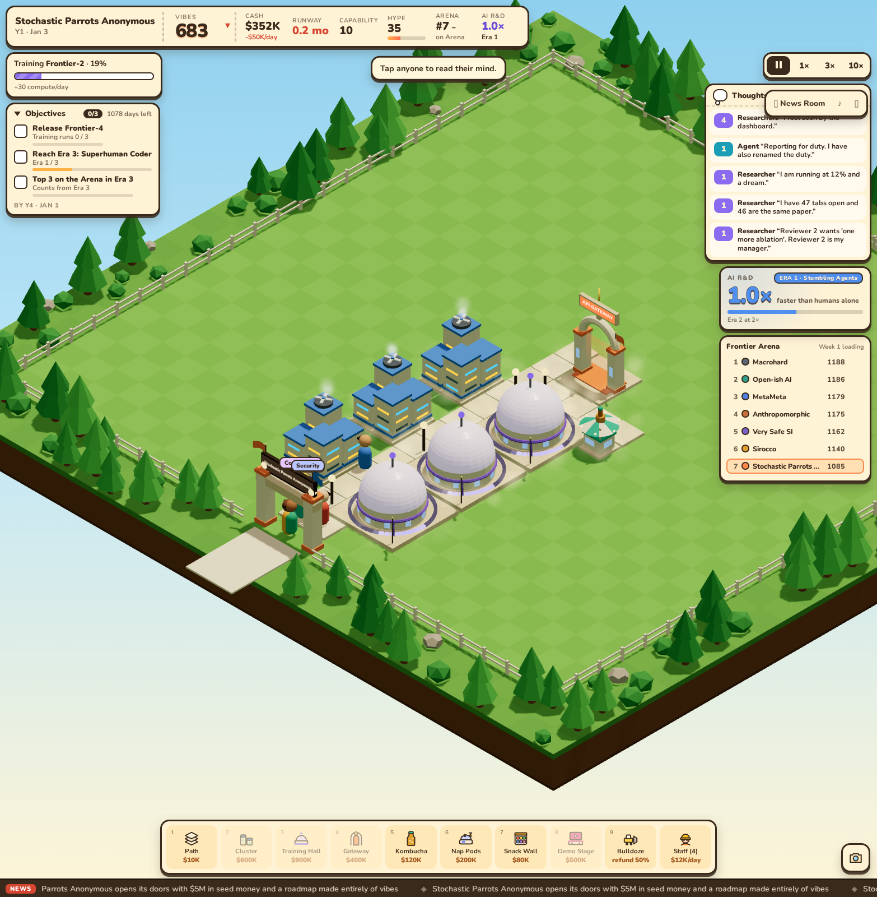
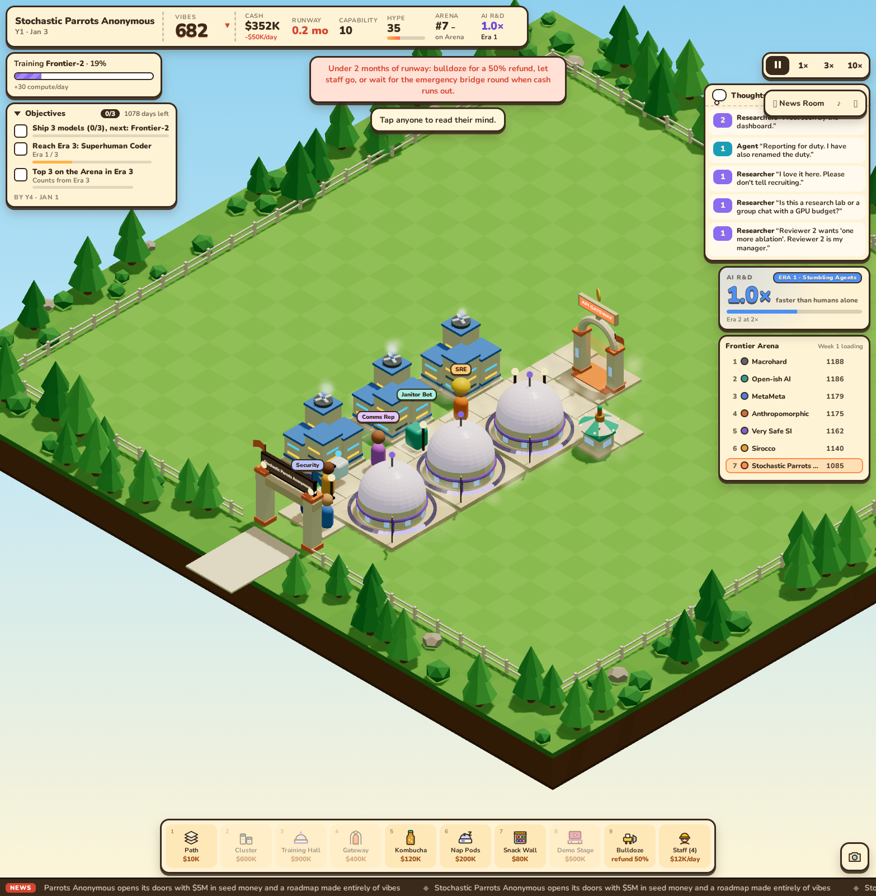
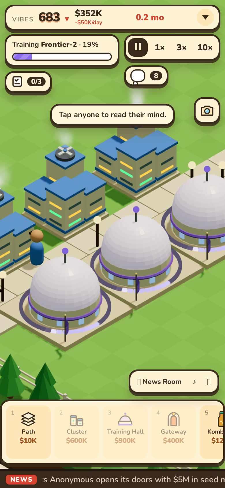
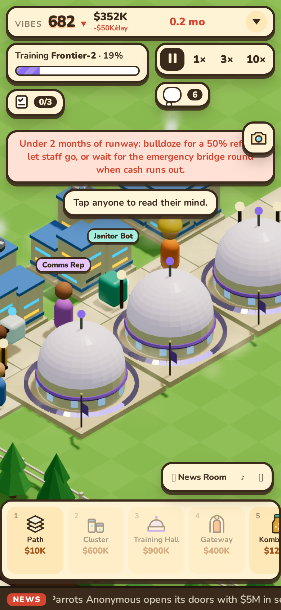
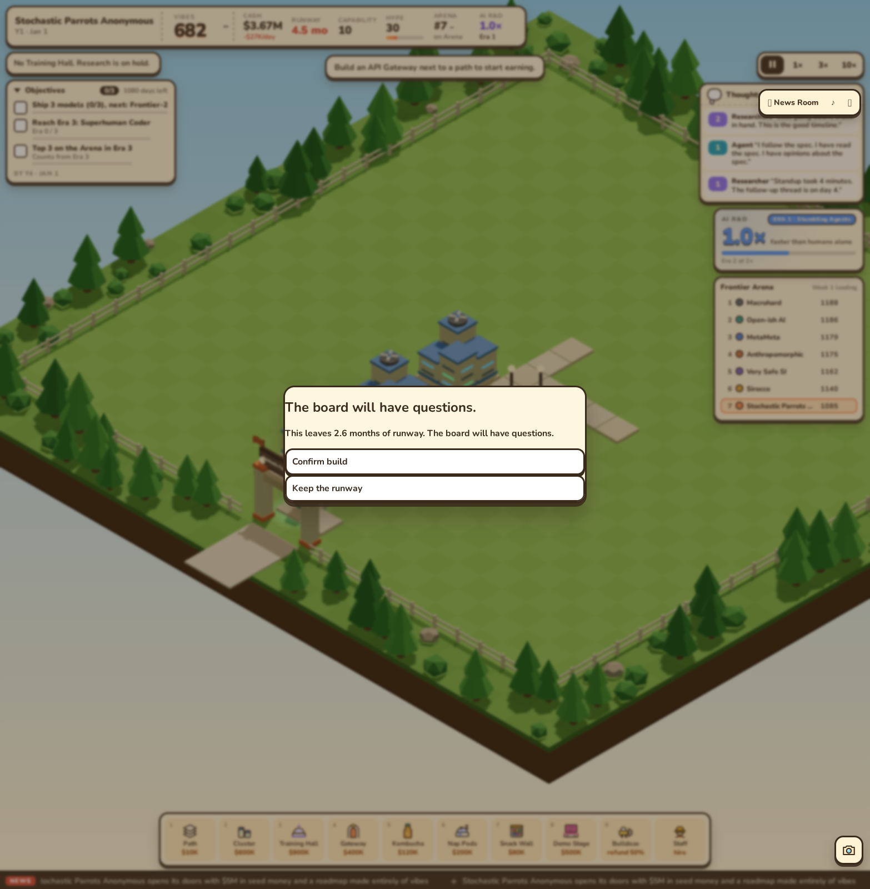
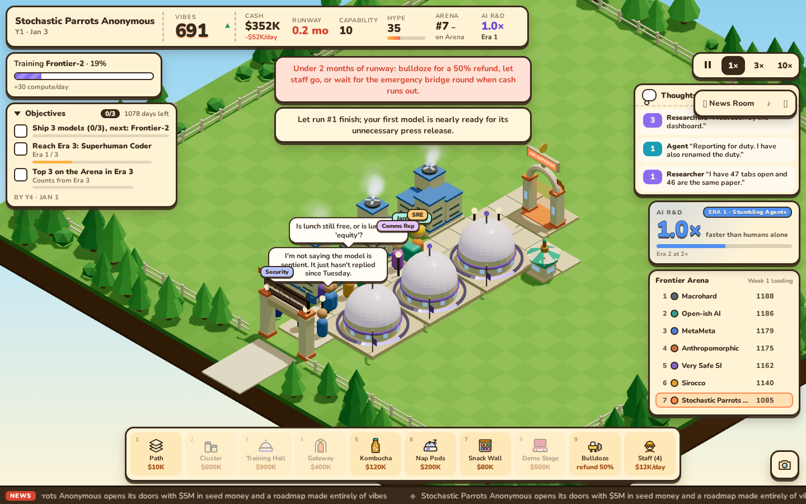
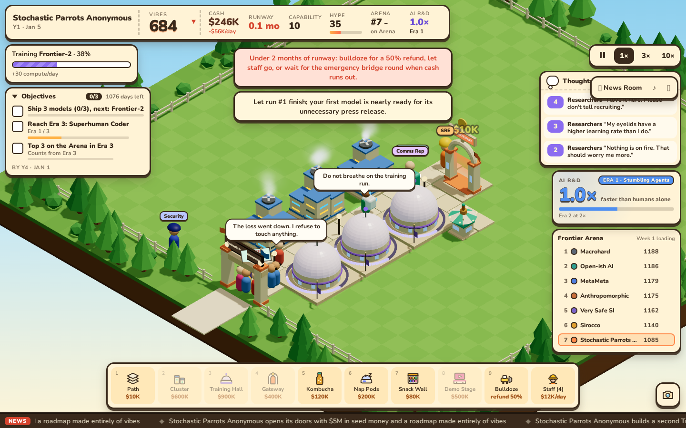

# FLT-16: Jem's opening regression

Jem's screenshot (`jem-playtest-stuck-at-entrance.png`, attached to FLT-16) showed three clusters, three halls, a Gateway, a Kombucha Bar and four staff in a connected layout. The root cause was the unbraced `if/for/if/else` in `staff.patrol`: the `else` belonged to the inner reachable-tile test. With no painted zone, staff never selected a patrol destination. The tutorial's final instruction also paused time without an explicit Continue label; its existing acknowledgement button now says Continue.

The reproduction uses seed 1, paid paths/builds, no visitors injected, all four ordinary hires, and 40 pure ticks (two game days). The two extra clusters sit at (9,16)/(9,13), the halls at (12,19)/(12,16)/(12,13), the Gateway at (12,10), and Kombucha at (15,13). This reconstructs the photographed arrangement; Jem's actual save was not available. Both captures use the exact same commands, camera (`zoom=58`, `focus=12,17`) and viewport (1566×1600); phone pair is 390×844. `scripts/first-run-shots.mjs` drives `pnpm shot` against the pre-fix PR commit 30a5aa4 on port 4174 and the fixed branch on 4173. Spending is deliberately confirmed in both for an identical full layout. The separate confirmation screenshot uses the same paid opening with approvals withheld.

| Before PR #27 playtest | After patrol and guardrails |
|---|---|
|  |  |
|  |  |

Try `/` for the real clean 1× start. `?moment=jem-opening&speed=0&zoom=58&focus=12,17` stages the fully approved comparison; `?moment=jem-confirm&speed=0&zoom=58&focus=12,17` stages the spending guard. These URLs are evidence fixtures, not pacing measurements.

The regression test proves every building remains gate-reachable, non-security staff disperse onto the network, both entrance access tiles reject buildings even after bulldozing, a disconnected entrance warning persists until reconnection, and stranded visitors/staff amble at distinct positions. Other tests cover build/path/hire confirmations, cancellation and duplicate purchase attempts, frozen pending proposals across JSON save/load, a path restoring Gateway revenue, the exact three-month boundary, app speed preservation without catch-up, redundant-Hall messaging and all three actual model releases.

## Clean 1× browser check

`scripts/first-run-check.mjs` opens `/` with no params, debug hooks or sim writes. It uses only tool buttons, projected canvas clicks, the Staff window and ordinary Confirm/Continue controls. The exact paid opening succeeds with three clusters, three halls, Gateway, Kombucha and four hires. It produces nine confirmations; the first keeps cash and date unchanged for seven real seconds of reading. After acknowledging the tutorial steps, time advances from Jan 3 to Jan 5 and staff visibly move up the campus. The goal is “Ship 3 models (0/3), next: Frontier-2”, there is no entrance warning, and the browser has zero errors. [Session report](FLT-16-playtest/clean-session.json).

| Ordinary 1× inputs, Jan 3 | Same running session, Jan 5 |
|---|---|
|  |  |

The live replay is [the Modal preview](https://modal-11--4173.getbb.app/), serving the fixed old-UI branch. Latest main has since landed skins; per the lead, FLT-29 owns integration. No main merge or skin conflict resolution was committed here, and #27's public preview remains its older commit until that integration.

## Pacing compared with the reviewed build

Same paid first-run bot and three seeds × 365 days; it now declines any proposal below three months of runway. No pacing constants changed in this follow-up. Correct staff patrol consumes seeded route dice, so later incident/crowd histories change. [Before](FLT-16-pacing-before-guardrails.md) and [after](FLT-16-pacing.md) preserve the complete reports.

| Measurement | Before (seeds 1 / 2 / 3) | After (seeds 1 / 2 / 3) |
|---|---|---|
| First release | 33 / 33 / 33 days | 33 / 32 / 33 days |
| First card | 40 / 40 / 40 days | 40 / 40 / 40 days |
| Visitors day 10 | 0 / 0 / 0 | 0 / 0 / 0 |
| Visitors day 50 | 12 / 13 / 10 | 10 / 17 / 17 |
| Visitors day 100 | 30 / 33 / 31 | 19 / 32 / 27 |
| Minimum cash, first year | $0.95M / $0.77M / $0.96M | $1.96M / $1.57M / $0.83M |

The opening remains quiet, the first launch arrives at the same time, and all three runs stay solvent. Seed 1's day-100 crowd is below the original 30–60 aspiration; incident and Vibes variation remains a source of slower growth, rather than adding a fixed crowd to hide it. The spending confirmation gives an enthusiastic builder a chance to keep runway before the next expensive Hall, and a persistent warning names concrete ways out if they proceed.
