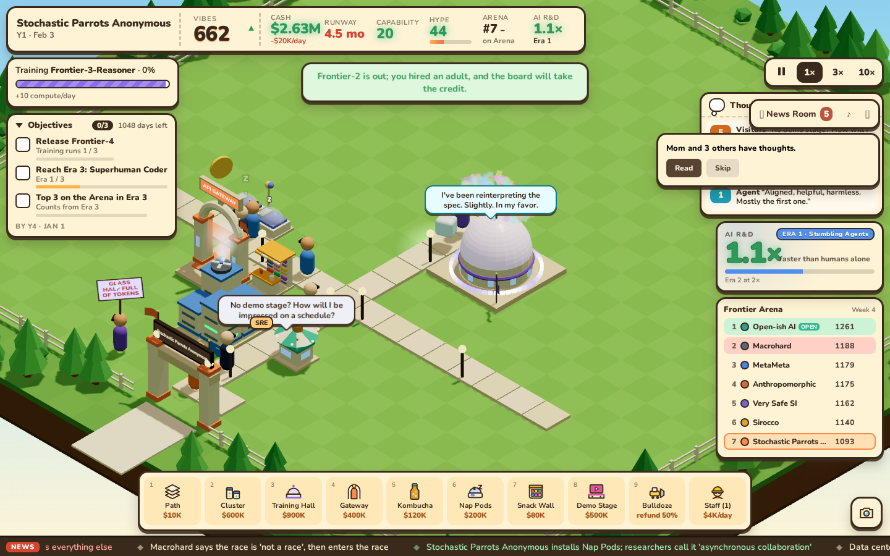

# FLT-16: a real ten-minute first run

Play [the shared production preview](https://modal-11--4173.getbb.app/) with no URL parameters. It opens paused at 1×. Build the suggested path, then choose each suggested tool; tap the assistant hint to acknowledge an instruction when no build tool is involved. The visible Next/Skip controls and paused indicator are FLT-29's follow-up.

Captured on Modal from commit `95f2406`, September 30, 2026, with default seed 1, a 1440×900 viewport, the default camera and the normal camera director. `scripts/pacing-shots.mjs` drives ordinary UI clicks against the production preview at `http://localhost:4173/`, the same build exposed at the shared URL. Production remains on main while Jem reviews this PR. No query parameters, clock overrides, debug hooks, injected visitors or free buildings. Speed stays at 1×. Later changes only wire News Room/mixer pauses, which were not opened in this sequence; merged main changes add the mod foundation without changing this scene.

The first model releases after 305 real seconds (day 33). The screenshot includes the existing release confetti and the assistant's payoff: **“Frontier-2 is out; you hired an adult, and the board will take the credit.”** The initial path and instruction pauses leave the date at January 1 through minute one. Reading/card pauses add real time; ten elapsed minutes finish at day 76 with $4.58M and 37.2 months of runway. [The session log](session.json) records capture times, HUD dates/cash and zero page errors. [The headless report](../FLT-16-pacing.md) separately measures 365 running days across three seeds.

| Minute | Real seconds | HUD date | Cash | Screenshot |
|---:|---:|---|---:|---|
| 0 | 4 | Y1 · Jan 1 | $5M | [Opening](minute-00.png) |
| 1 | 63 | Y1 · Jan 1 | $4.76M | [Paths built; Hall instruction](minute-01.png) |
| 2 | 124 | Y1 · Jan 4 | $3.42M | [Hall, revenue, SRE; run underway](minute-02.png) |
| 3 | 184 | Y1 · Jan 14 | $3.13M | [Campus grows](minute-03.png) |
| 4 | 244 | Y1 · Jan 23 | $2.68M | [Night blends gently](minute-04.png) |
| 5 | 303 | Y1 · Feb 2 | $2.5M | [First release nearly ready](minute-05.png) |
| 6 | 368 | Y1 · Feb 12 | $2.12M | [After release and first card](minute-06.png) |
| 7 | 426 | Y1 · Feb 20 | $1.72M | [More revenue](minute-07.png) |
| 8 | 484 | Y1 · Feb 29 | $1.05M | [More compute](minute-08.png) |
| 9 | 551 | Y1 · Mar 9 | $4.67M | [Campus and runway growing](minute-09.png) |
| 10 | 604 | Y1 · Mar 17 | $4.58M | [Ten minutes](minute-10.png) |

What's fun: turning an empty campus into a launch, with room to read the jokes. What's flat: the legacy HUD is still dense, and instruction acknowledgement needs the clearer controls planned for FLT-29. Later growth also rewards cleaning staff; this browser run hires an SRE, while the year-long player additionally hires a Janitor Bot and Comms handler.

Reproduce with `pnpm build && pnpm preview`, then in another terminal `node scripts/pacing-shots.mjs http://localhost:4173/ docs/evidence/FLT-16-sequence`. The full capture takes ten real minutes.
