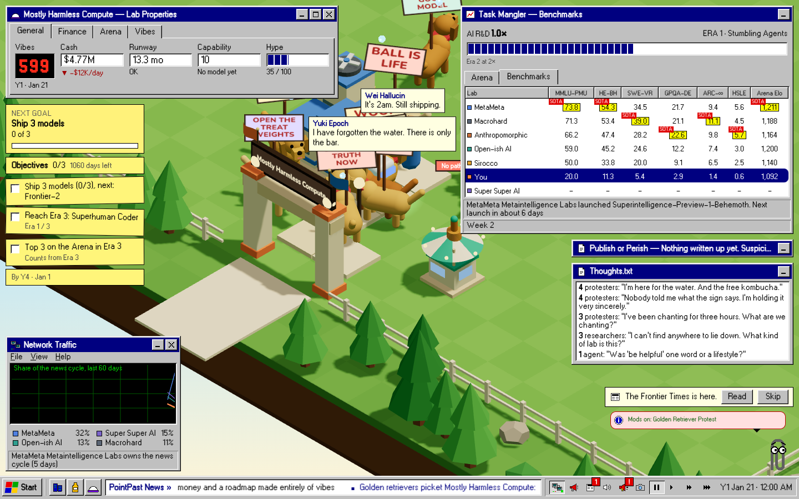

# FLT-75: Koota ECS for the protesters (experiment)

**Verdict: don't adopt Koota for the sim.** Keep this branch as a reference and don't merge it. The one idea worth taking
from it is mod systems over entities. Give mods that idea as a JSON rule with no ECS behind it (see "What the mod API would need").

Baseline is `main` at `d889b59` (after FLT-54 and FLT-70 landed). The branch is `flt-75-koota-experiment`. Koota is pinned
exactly at `0.6.6`, and its agent skill is in `.agents/skills/koota` (linked from `.claude/skills/koota`).

## Why the protesters, not slop

The protesters exercise all six measurements. Slop exercises about two.

- Protesters walk: routes, `px`/`pz` interpolation and the instanced renderer.
- Each one carries an XState flow (the walker machine's `{ value, context }`).
- They are saved as rows.
- They roll dice in a fixed order.
- They are what the golden-retriever mod reskins, so `WagLevel` has somewhere to live.

Slop (`world.slop`) is static puddles with no flow, no movement and no mod hook. It would have made Koota look good by
testing nothing.

## Results

| | `main` (plain Walker objects in `state.walkers`) | Branch (Koota entities) | Read |
|---|---|---|---|
| **Clarity: lines** | `protest.ts` 256; the march and picket logic is one 27-line loop | `protest.ts` 285, plus a 334-line seam (`src/sim/ecs/protesters.ts`); the march and picket are two systems, about 45 lines | Worse. The systems read well, but the seam costs more than the systems save. |
| **Clarity: blast radius** | | 37 source files and 12 test files switched from `state.walkers` to `people(state)` | Walkers are generic, so taking one kind out touches every reader of "everyone". |
| **Mod ergonomics** | No mod can add per-entity state or behaviour | `WagLevel` trait plus a system, added through a `Systems` Layer (66 lines); saved with the dog | It's nice to write, but it's code. The mod API is data-only, so it ships as a bundled companion, not a mod. |
| **Determinism: goldens** | 3 seeds pinned | Unchanged (they read `people()`) | ✅ |
| **Determinism: midgame World** | `7f58d622` / `948ca520` | The same through `legacyWorld()` (protesters folded back into `walkers`) | ✅ byte-identical |
| **Determinism: `flt-mod check`, 365 days** | `golden-retriever-protest` `f0d3550b…`; `evidence/golden-retrievers` `8ec2ce50…` | Raw `3ebeb51e…` / `26d0555f…` (new `protesters` key); legacy `f0d3550b…` / `8ec2ce50…` | ✅ Same World, new shape. The raw hash changes, so it's a save-format bump, not a silent change. |
| **Saves (FLT-65)** | v2 | v3: `WORLD_MIGRATIONS[2]` moves the protesters into `protesters` rows. A frozen v2 fixture (38 protesters, 3 mid-march) loads, plays 30 days and lands on main's `12251259`. v3 round-trips byte for byte. | ✅ One small migration. Mod traits need a save codec each (`ModTrait.save/load`). |
| **Perf: 800-walker tick** (strict, best of 3×200, three runs) | 0.265 / 0.263 / 0.264 ms | 0.315 / 0.316 / 0.310 ms | **+19%** (budget 0.5) |
| **Perf: 800 walkers, factions on** | 0.263 / 0.260 / 0.247 ms | 0.318 / 0.298 / 0.319 ms | **+21%** |
| **Perf: busy lab tick** (FLT-39, stopwatch off) | 0.323 / 0.334 / 0.337 ms | 0.336 / 0.351 / 0.377 ms | +5% (budget 0.65) |
| **Perf: protesters system** (FLT-39 table) | 6.6 µs | 23.1 µs | **3.5×** slower; per-system table below |
| **R3F: frame read** (816 people, 26 protesters) | 4.6 µs | 10.9 µs through `people()` views; 19.1 µs with a fresh Koota query per frame | Slower either way; at this size the cached view list beats a query. |
| **R3F: `useTrait` per protester** | n/a | Stale (0 renders for 14 moves), or n² listener calls if tracked (26 × 24 = 624 a tick) | Wrong tool for 20 Hz movers; `useFrame` stays. |
| **Bundle** | 3392.4 KB min / 971.9 KB gz (all JS) | 3438.7 KB / 986.4 KB | **+46 KB min, +14 KB gz**, all in the eager `index` chunk (1069 → 1115 KB) |
| **Visible change** | | None without the mod: `overview` 0.07%, `phone` 0.27%, `gate` 0.26% of pixels differ (the ticker) | The `wag` scene shows the new bubbles |

Strict means plain `pnpm check` settings: no `CI=1`, so no doubled budgets. All runs were on the same 1-vCPU Modal box, with main and the branch interleaved
(`scripts/flt-75/perf.sh`, logs in [`flt-75-perf/`](flt-75-perf/)). The 4cbc20a-baseline run, before the merge, said the same
(800 walkers +20%, protesters 7.3 → 22 µs).

### The FLT-39 per-system table (busy lab: 800+ walkers, every pack awake, `FLT_PROFILE=1`, 4000 ticks)

| System (µs/tick) | main d889b59, runs 1/2/3 | branch, runs 1/2/3 | median main → branch | p95 median main → branch |
|---|---|---|---|---|
| walkers | 180.2 / 182.4 / 178.1 | 195.1 / 187.0 / 187.6 | 180.2 → 187.6 (+4%) | 255.3 → 270.3 |
| protesters | 6.6 / 6.8 / 6.6 | 23.1 / 23.4 / 22.3 | 6.6 → 23.1 (+250%) | 14.4 → 38.8 |
| staff | 17.8 / 18.5 / 17.2 | 23.7 / 21.2 / 22.0 | 17.8 → 22.0 (+24%) | 39.6 → 45.9 |
| factions | 4.4 / 3.7 / 3.8 | 5.7 / 5.4 / 5.6 | 3.8 → 5.6 (+47%) | 4.0 → 14.6 |
| daily:crowd | 7.6 / 7.4 / 6.8 | 7.8 / 8.0 / 7.9 | 7.4 → 7.9 (+7%) | 93.8 → 100.2 |
| whole tick (stopwatch on) | 321.6 / 320.0 / 315.9 | 372.9 / 354.8 / 356.6 | 320.0 → 356.6 (+11%) | 1298.3 → 1434.9 |

Where the time goes:

- **Every `world.query()` returns a copy** (`dense.slice()`). The tick runs three queries, then sorts one of them.
- **`updateEach` defaults to change detection**, which also spreads every AoS trait (the Route array, the Flow
  object) into a snapshot per entity per tick. Switching to `{ changeDetection: "never" }` took the system from 27.7 to
  22 µs, and that's what's committed.
- **Staff and factions slowed down without being ported.** They read "everyone" through `people()`. That merge is
  rebuilt whenever a walker joins or leaves, and a protester's fields are getters into typed arrays rather than plain
  properties.
- The bottleneck was never the protesters. `walkers` is 180 µs of pathing, needs and XState for 800 people. That
  isn't the tight numeric SoA loop an ECS speeds up.

### Clarity: the same behaviour, before and after

Before (`main`, one loop over everyone; a protester who arrives this tick is skipped by the `continue`):

```ts
for (const w of state.walkers) {
  if (w.kind !== "protester") continue;
  w.px = w.x; w.pz = w.z;
  if (w.route.length > 0) { advance(w); if (w.route.length === 0 && w.machine.value === "leaving") (gone ??= new Set()).add(w.id); continue; }
  if (w.machine.value === "leaving") { (gone ??= new Set()).add(w.id); continue; }
  if (--w.timer > 0) continue;
  w.timer = rng.int(30, 90);
  ...pick a spot, planRoute...
}
```

After (two systems; a `JustArrived` tag reproduces the `continue`, and the picket sorts by Walker id because Koota's
store order is swap-remove order and shared with every other lab in the process):

```ts
marching(g).updateEach(([body, route, flow], e) => {
  body.px = body.x; body.pz = body.z;
  walk(body, route);
  if (route.length > 0) return;
  if (flow.value === "leaving") gone.add(e); else done.push(e);
}, UNTRACKED);
for (const e of done) { e.remove(IsMarching); e.add(JustArrived); }

standing(g).sort(byWalkerId).updateEach(([body, picket, flow], e) => {
  body.px = body.x; body.pz = body.z;
  if (flow.value === "leaving") { gone.add(e); return; }
  if (--picket.timer > 0) return;
  picket.timer = rng.int(30, 90);
  ...pick a spot, setRoute(e, planRoute(...))...
}, UNTRACKED);
for (const e of arrived(g)) e.remove(JustArrived);
```

Each system reads fine alone. The cost is what you have to know to write them:

- A tag stands in for a `continue`.
- `IsMarching` must mirror `route.length`, so `setRoute` exists to keep them in step.
- Dice demand a sort.
- `updateEach` silently copies AoS traits unless you opt out.

Then there's the seam that lets the other 37 files keep working:

- `ProtesterView`, a Walker-shaped class of getters over the stores.
- `Ground`, one lab's crowd.
- An enumerable `state.protesters` getter, so `JSON.stringify`, `structuredClone` and `toEqual` still see plain rows.
- `people()`.
- A `FinalizationRegistry`, because Koota allows 16 worlds and tests make hundreds of labs, so every lab is an entity in
  one process-wide world.

### Mod ergonomics: `WagLevel`

[`src/mods/examples/golden-retriever-wag.ts`](../../src/mods/examples/golden-retriever-wag.ts) is a Koota trait plus
one system, added by a Layer that wraps the new `Systems` service the way a JSON mod's patches wrap `Content`:

```ts
export const WagLevel = trait({ wag: 0 });
export const wagNearKombucha: EcsSystem = {
  id: "wag-near-kombucha",
  after: "protesters",
  traits: [{ key: "wag", save: (e) => e.get(WagLevel)?.wag, load: (e, v) => e.add(WagLevel({ wag: Number(v) })) }],
  run(world, crowd, state) {
    for (const e of world.query(OnLab(crowd.lab), Body, Not(WagLevel))) e.add(WagLevel);
    const bars = state.buildings.filter((b) => b.kind === "kombucha" && !b.broken);
    world.query(OnLab(crowd.lab), Body, WagLevel).sort(byWalkerId).updateEach(([body, level]) => {
      // rises 0.02 a tick within 4 tiles of a bar, falls 0.004 away from one; at 1, a line ("SIT. STAY. SCOBY.")
    });
  },
};
export const GoldenRetrieverWag = Layer.effect(Systems, Effect.gen(function* () {
  const below = yield* Systems;
  return Systems.of({ systems: [...below.systems, wagNearKombucha] });
}));
```

Loading `?mod=/mods/examples/golden-retriever-protest/mod.json` switches the companion on: `src/mods/companions.ts`
maps the mod id to the Layer, and `loadModSession` → `installSystems`. The test
([`golden-retriever-wag.test.ts`](../../src/mods/examples/golden-retriever-wag.test.ts)) covers four things:

- Every dog by the bar reaches full wag; with no bar, nobody wags.
- Tails settle once the bar breaks.
- A run replays byte for byte.
- The wag saves with the dog.



#### What the mod API would need

1. **Code systems are not mods.** Manifests are data and never run code from a URL (FLT-37). So `WagLevel` can
   only ship bundled with the game, keyed by mod id. That makes it a game feature with a mod-shaped switch.
2. **A trait registry with save codecs.** Every trait a mod adds needs a `key`, `save` and `load`, or it vanishes on
   reload. Today an unknown key is dropped when the companion isn't loaded; a real API would carry it opaquely.
3. **Tick slots.** `after: "protesters"` is the only slot. Each new slot is an engine change.
4. **No dice for mods.** Systems get no `Rng`, because a mod drawing from the shared stream would shift every later draw.
   The API would need pre-rolled dice per mod, or a forked stream seeded from the save.
5. **A sort rule.** Any system that writes shared state (thoughts, ids) must iterate in Walker-id order. Mod authors
   will forget.
6. **`flt-mod check` can't see it.** The 365-day replay composes the JSON and not the companion, so its hash doesn't
   cover the wag.

**The cheaper path, with no Koota:** a declarative `proximity` rule in the mod JSON, for example
`{ "stat": "wag", "who": "protester", "near": "kombucha", "within": 4, "rise": 0.02, "fall": 0.004, "at": 1, "say": [...] }`,
run by one generic engine system over plain walkers and saved in a `modStats` bag. It covers the example, stays
data-only, is checked by `flt-mod check`, and needs no new mental model.

### The R3F bridge

Measured by [`src/sim/ecs/bridge.report.test.ts`](../../src/sim/ecs/bridge.report.test.ts) (`FLT75_BRIDGE=1`), on
the busy lab after 300 ticks (816 people, 26 of them protesters). The main column is the same loop run on main.

| Per frame, the read loop of `Walkers.tsx` only | µs |
|---|---:|
| main: `for (w of state.walkers)`, protesters included | 4.6 |
| branch: the other walkers alone | 4.2 |
| branch today: `for (w of people(sim))`, protesters through view getters | 10.9 |
| Koota direct: `state.walkers`, then the protesters' SoA stores (`query.useStores`) | 19.1 |
| Koota `readEach`: `state.walkers`, then a snapshot object per protester | 15.1 |

| `useTrait(entity, Body)` in one `<Protester>` per entity | value |
|---|---:|
| protesters that moved over 20 real ticks | 14 |
| renders those moves caused (the sim writes untracked) | **0 (stale)** |
| renders per tick if the march wrote tracked | 24 |
| listener calls per tick (each of 26 components hears all 24 changes) | **624 (n²)** |
| tracked write of 24 bodies with those listeners | 73.7 µs |
| the same write untracked | 9.8 µs |

`useQuery`/`useTrait` suit UI that changes on discrete events. In koota/react, each `useTrait` adds a world-wide
`onChange` listener that filters for its own entity, so N movers cost N² callbacks plus N React renders a tick.
For 20 Hz movers that's the wrong shape. The `useFrame` + instancing approach stays, and the code is unchanged apart from
`people(sim)`. A Koota-native renderer would read `useStores` in `useFrame`. At 26 entities the per-frame query costs
more than it saves; it would only pay off with thousands of a family, and we don't have them.

## Recommendation

**Don't adopt, not even gradually.** If a family ever qualifies, port it as new systems only, under these conditions:

- **Cost:** +14 KB gz on the eager chunk, and +19% on the 800-walker tick for one small family. Most of that is the
  seam between an ECS family and everything that reads "everyone", and every further family would grow it.
- **Learning curve (us and mod authors):** a third paradigm on top of XState and Effect. That means:
  - SoA, AoS and tag traits; relations
  - queries that copy
  - `updateEach` change-detection modes
  - packed entity ids
  - the 16-world limit, and a world shared across the process
  - store order that is swap-remove order, hence sorting for determinism
  - Koota patching `Number.prototype` (`add`, `remove`, `has`).

  None of it is hard, and all of it is new. Mod authors can't use it anyway, because mods are data.
- **XState interplay:** fine, but there are now two sources of truth for one entity's state.
  - The flow's `{ value, context }` lives in an AoS `Flow` trait.
  - Machines still step through the pure `transition()`.
  - The `IsMarching` and `JustArrived` tags shadow facts the machine or the route already know, and have to be kept in step by hand.

  An ECS wants tags to *be* the state; our machines want the state in `value`.
- **If a family ever qualifies:** it would be something new, presentation-only and numerous, with no dice and no
  flow. For example, the "tokens / data / compute as flows" idea from ROADMAP's open questions: thousands of particles
  moving along paths, in a render-side world that never enters the save. That order would be (1) such a flow, (2) slop
  puddles if they ever move, (3) never walkers or staff.
- **What to take from this branch instead:**
  - the `proximity` JSON rule above, for mod-added per-walker stats
  - the `legacy-check` approach (fold a new shape back to the old one and prove the World is byte-identical), for any future storage change.

## Method

1. Ported the protesters' storage only: XState still drives their flow, and Effect still drives mods and services.
2. Kept main's World provable:
   - `legacyWorld(state)` folds the protesters back into `walkers` by id.
   - The midgame digest, the goldens, the frozen-save play-on and both 365-day `flt-mod check` replays were compared
     with main (`scripts/flt-75/legacy-check.mjs <checkout> <mod.json>`).
   - Re-run after merging `origin/main` at d889b59.
3. Perf: `scripts/flt-75/perf.sh <branch> <main worktree> <out>`, main and branch interleaved, 3 rounds, no `CI`, on one 1-vCPU Modal box. It covers the
   800-walker and 500-walker tests and `FLT_PROFILE=1` busy lab. Raw logs: [`flt-75-perf/`](flt-75-perf/).
4. Bundle: `pnpm build` on both; the sum of vite's reported sizes for `dist/assets/*.js`.
5. Screenshots: `pnpm shots --scenes overview,phone,gate,wag --diff --out docs/img/flt-75`.
   - All 8 captures pass `--verify`.
   - The three unchanged scenes trip the compare check only because their diff panel is nearly all one dark colour,
     which is the "unchanged" case.

Where the spec was silent I picked the funnier option: a dog at full wag forgets the water entirely ("I have forgotten
the water. There is only the bar.").
