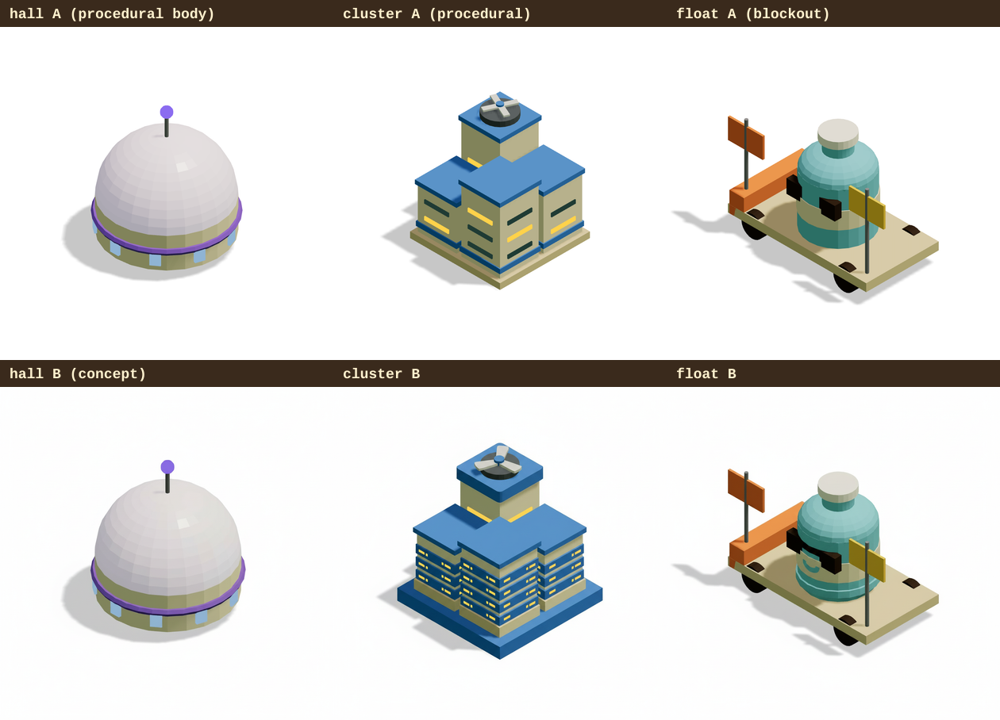
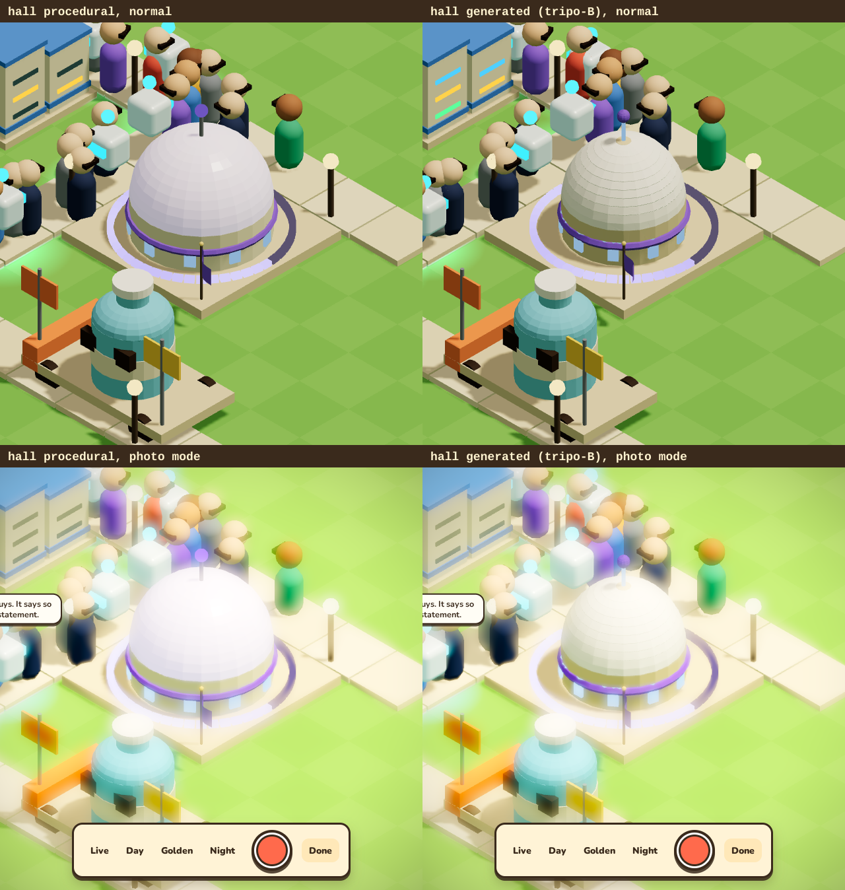
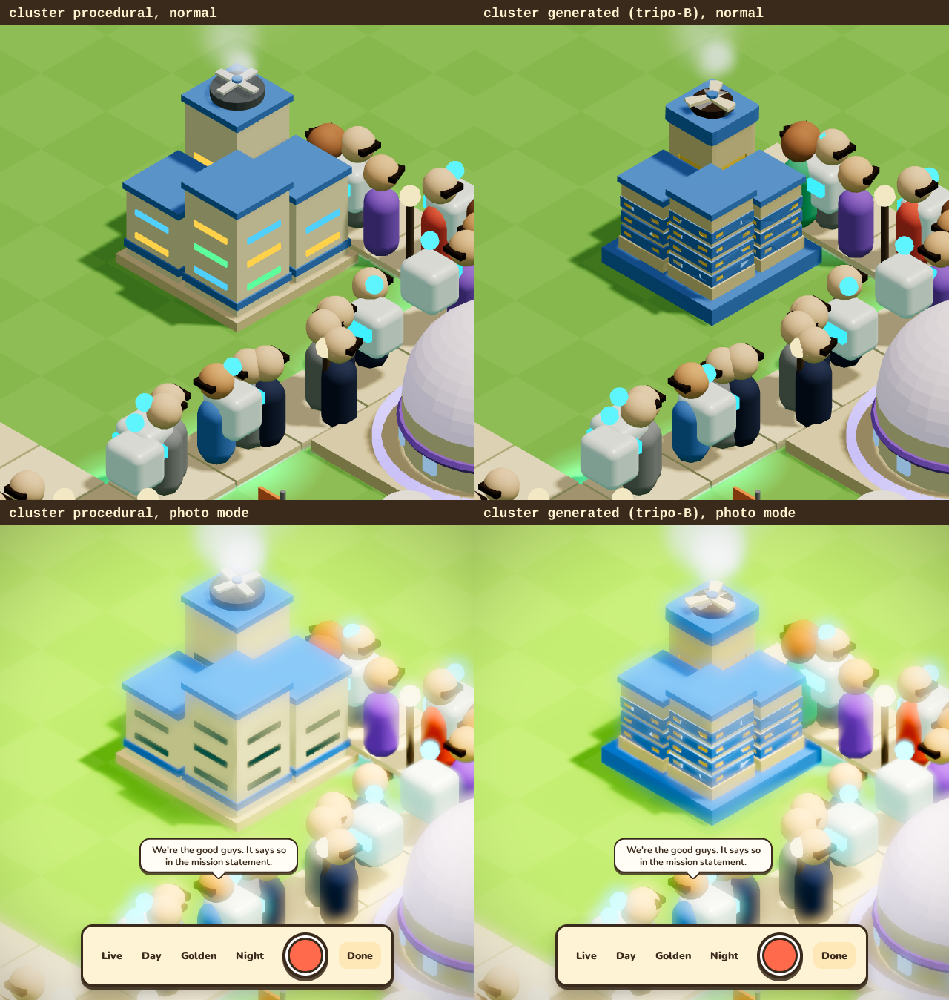
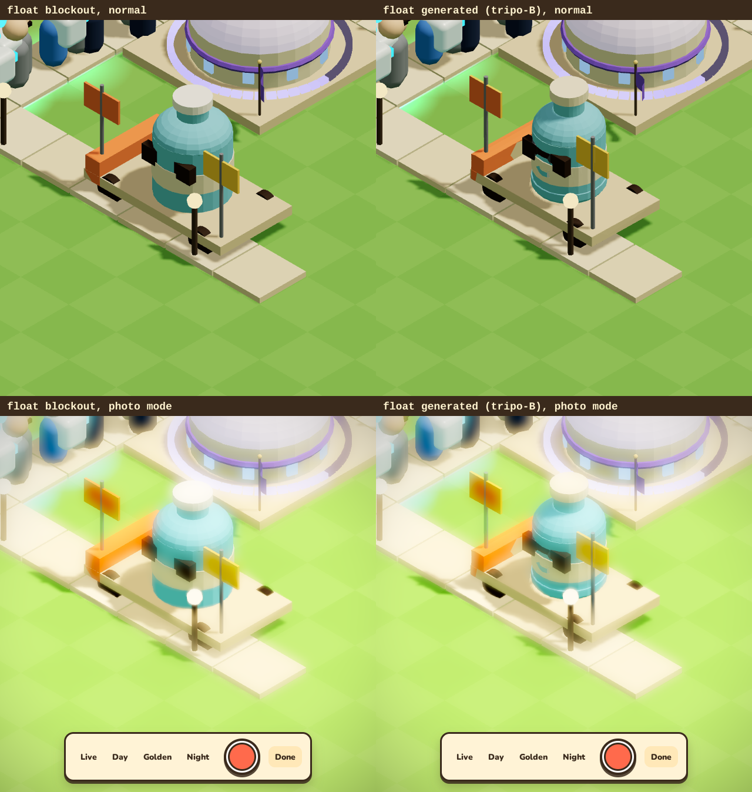
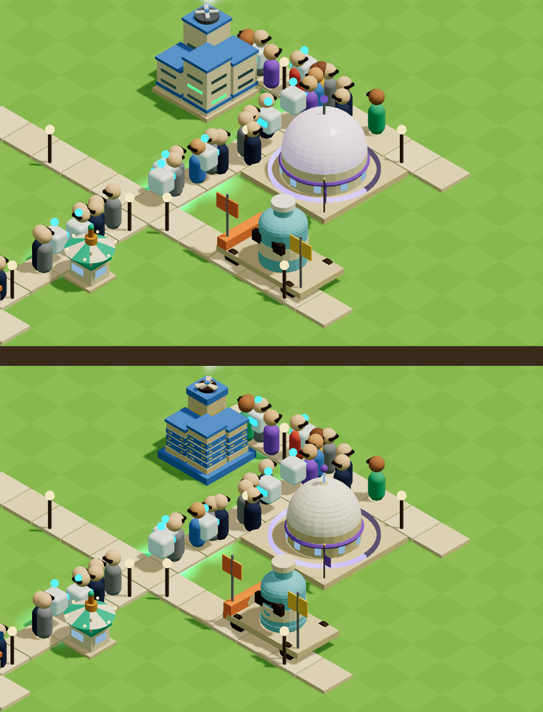
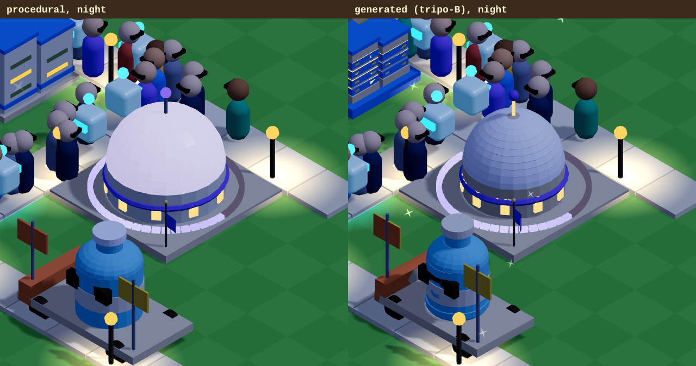

# FLT-13: Fal 3D + Blender cleanup on 3 buildings (experiment)

**Question:** can generated 3D make the campus look *more* like a toy you want to touch, at a cost and weight we'd accept, without breaking the bright low-poly style?
**Answer in one line:** yes for the hero piece and for detail-heavy buildings, at about $0.40 and 120 kB each, but only through a cleanup pipeline (palette snapping is what makes it fit), and it costs frame time on software rendering. Recommendation: **hybrid**. Details at the end.

No PR: this branch (`flt-13-fal3d`) is an experiment. `src/sim/**` is untouched; the only shared-file change is additive (`src/debug.ts` gets `models` and `float` params).

## Method

1. **References.** A = the procedural model rendered on white by the lab page (`?page=lab&kind=hall&bare=1`; the float has no game model yet, so A is a rough blockout, `FloatModel.tsx`). B = a styled concept image from `fal-ai/nano-banana/edit` with the spec's style prompt. The first B ("keep the same camera angle") came back nearly identical to A, so it was rejected (`ref/*-B0-rejected.png`) and redone with a looser prompt. 
2. **Generate.** `scripts/fal3d/generate.mjs`: Tripo H3.1 (`tripo3d/h3.1/image-to-3d`, standard textures, no PBR) and Hunyuan 3D v3.1 rapid (`fal-ai/hunyuan-3d/v3.1/rapid/image-to-3d`) for every subject x reference (12 generations), plus one Trellis 2 wildcard on the float. Note: Hunyuan's `model_glb` field is actually an OBJ + MTL + 4096 px PNG.
3. **Blender (headless 4.5 LTS, the Blender path; no Node fallback was needed).** `scripts/fal3d/clean.py`: import, join, weld; decimate (collapse) to the budget (5k tris hall and float, 3k cluster); colours are **read from the original mesh** by nearest-point lookup for each final face (centroid + 3 points), averaged, then **snapped to the nearest colour in the game palette** (`palette.json`, taken from `materials.ts` and the model files; Lab distance with lightness down-weighted, an auto-exposure gain for shading baked into textures, and 2 majority-vote smoothing passes so it reads as flat toy colours instead of camouflage); flat shaded; faces snapped to the glass colour go to a second material named `glass`; fit to the footprint in tiles, pivot at the ground centre, Y up, base on y = 0.
4. **Compress.** `gltf-transform quantize` then `meshopt --level high`. Files: `public/models/gen/{hall,cluster,float}.glb` (the best of each) and every candidate in `public/models/gen/candidates/`.
5. **Load in R3F.** `?models=gen` (all), `?models=hall,float` (some) or `?models=hall:tripo-B` (a named candidate) swaps procedural for generated per building (`src/render/gen/`). `useGLTF` with the meshopt decoder; generated meshes use the game's toy-plastic material with vertex colours, and the `glass` material is the shared campus window material, so windows light up at night. The Hall keeps its plinth, flag and **procedural progress ring**; `?float=x,z` parks the float on the lawn (render-only, not a sim building).
6. **Measure.** `scripts/fal3d/measure.mjs` (lab page, 640 px, SwiftShader, 120 frames after warm-up), `renderer.info` for calls and triangles, load and parse timed inside the loader. All shots use seed 3, day 8, paused, hour 13, identical camera (`scripts/fal3d/campus-shots.mjs`).

Bugs found on the way (both fixed, both worth knowing): Blender's `image.pixels` is **sRGB-encoded** for 8-bit textures (treating it as linear washed everything to cream), and **colour does not survive a 1.4M to 5k triangle decimation** (it smears), hence the sampling from the original mesh.

## Side by side

Normal view and photo mode, same frame (HUD hidden in normal view so the buildings aren't behind panels):






Night: the generated Hall's windows come from the shared window material and glow like the procedural ones.



All candidates: `img/candidates.png`.

## Results

| Model | Fal cost (est.) | Gen time | Raw tris | Raw size | Clean tris | Blender GLB | Final (meshopt) | Load / parse (ms) | Calls, tris in scene (x1) | Frame ms x1 / x12 | Style (1-5) |
|---|---|---|---|---|---|---|---|---|---|---|---|
| **hall procedural** | n/a | n/a | n/a | n/a | n/a | n/a | n/a | n/a | 21, 2142 | 16.7 / 36.0 | 4 |
| hunyuan B | $0.30 | 75 s | 50k | 15.1 MB | 4600 | 471 kB | 114 kB | 102 / 5 | 8, 5326 | 16.7 / 50.9 | 3 |
| tripo B | $0.40 | 205 s | 1393k | 39.8 MB | 4600 | 471 kB | 116 kB | 102 / 5 | 8, 5326 | 16.7 / 56.2 | 4 |
| hunyuan A | $0.30 | 80 s | 50k | 14.2 MB | 4600 | 471 kB | 116 kB | 102 / 5 | 8, 5326 | 16.7 / 52.2 | 3 |
| tripo A | $0.40 | 232 s | 1443k | 41.2 MB | 4599 | 471 kB | 117 kB | 103 / 5 | 8, 5325 | 16.7 / 52.0 | 4 |
| **cluster procedural** | n/a | n/a | n/a | n/a | n/a | n/a | n/a | n/a | 58, 854 | 16.7 / 29.3 | 4 |
| hunyuan B | $0.30 | 81 s | 50k | 16.3 MB | 2760 | 284 kB | 68 kB | 69 / 4 | 3, 2762 | 16.7 / 29.9 | 2 |
| hunyuan A | $0.30 | 73 s | 50k | 15.3 MB | 2760 | 284 kB | 68 kB | 68 / 4 | 3, 2762 | 16.7 / 32.0 | 3 |
| tripo B | $0.40 | 234 s | 1422k | 41.7 MB | 2760 | 284 kB | 70 kB | 71 / 5 | 3, 2762 | 16.7 / 32.5 | 5 |
| tripo A | $0.40 | 226 s | 1467k | 42.5 MB | 2760 | 283 kB | 72 kB | 69 / 4 | 3, 2762 | 16.7 / 32.5 | 4 |
| **float procedural** | n/a | n/a | n/a | n/a | n/a | n/a | n/a | n/a | 19, 1566 | 16.7 / 25.9 | 3 |
| hunyuan B | $0.30 | 87 s | 50k | 14.5 MB | 4600 | 470 kB | 112 kB | 69 / 5 | 2, 4602 | 16.7 / 40.0 | 3 |
| hunyuan A | $0.30 | 62 s | 50k | 14.8 MB | 4600 | 470 kB | 111 kB | 67 / 5 | 2, 4602 | 16.7 / 39.6 | 4 |
| tripo B | $0.40 | 169 s | 1489k | 42.8 MB | 4600 | 470 kB | 114 kB | 65 / 5 | 2, 4602 | 16.7 / 40.0 | 4 |
| tripo A | $0.40 | 171 s | 1423k | 40.9 MB | 4599 | 470 kB | 114 kB | 64 / 4 | 2, 4601 | 16.7 / 39.6 | 4 |
| trellis B | $0.25 | 117 s | 487k | 16.5 MB | 4814 | 488 kB | 103 kB | 65 / 4 | 2, 4816 | 16.7 / 40.4 | 1 |

Failed or rejected calls:
- 2026-09-29T23:51:05.940Z fal-ai/hunyuan-3d/v3.1/rapid/image-to-3d cluster B/hunyuan: FAILED Gateway Timeout ($0.30 counted)

Total spend, upper-bound estimate: **$4.99** over 20 calls.


Frame time at **1 copy is capped at 16.7 ms (the 60 Hz frame limiter) for every variant**, so it says nothing; the 12-copy column is the one that separates them. SwiftShader is a software rasteriser, so it punishes triangle count and barely notices draw calls. Compare only within the same run.

More copies (best candidate per subject vs procedural):

| 48 copies | Frame (SwiftShader) | Draw calls | Triangles |
|---|---|---|---|
| hall procedural | 91 ms | 851 | 93,386 |
| hall tripo-B | 153 ms | 313 | 245,514 |
| cluster procedural | 75 ms | 2729 | 40,802 |
| cluster tripo-B | 84 ms | 97 | 132,482 |
| float blockout | 61 ms | 829 | 71,778 |
| float tripo-B | 114 ms | 49 | 220,802 |

Reading it: generated models cut draw calls from 2.7x (hall) to 28x (cluster) (each is 2 meshes, where the procedural buildings are 20-60 boxes) but multiply triangles by 2.5x to 3.2x. On this rasteriser that is a net loss: frame time is +56% (hall), +11% (cluster) and +54% (float) at 12 copies, and +68%, +11% and +86% at 48. On a real GPU, draw calls are normally the scarcer resource at these counts, so expect the opposite, but that is not measured here.

Other numbers:
- **Weight:** raw 14-16 MB (Hunyuan, OBJ + PNG) or 40-43 MB (Tripo, 1.4M-tri GLB) to 65-120 kB final. Fine.
- **Load:** 64-103 ms fetch + parse from localhost (parse 4-7 ms including the meshopt decoder), so parsing is not the cost. Real network time is the 65-120 kB.
- **Bundle:** +76.8 kB raw (+22.7 kB gzip) from GLTFLoader and the meshopt decoder (`useGLTF`).
- **Blender time:** about 4 s for a 50k-tri Hunyuan model, 51-56 s for a 1.4M-tri Tripo model (import dominates) on the 1-vCPU box.

## Style fit and findings

- **Tripo H3.1 beats Hunyuan rapid** on the hall and cluster (4 vs 3, 5 vs 3) and ties on the float (4 vs 4), at $0.40 vs $0.30 (estimates) and 3x the wait (170-235 s vs 60-90 s). Hunyuan's textures are noisy and its geometry lumpier.
- **Reference A (the plain render) is about as good as B (the styled concept).** nano-banana/edit stays anchored to its input, so B mostly adds a little detail. Skip the concept-image step and generate straight from a game render.
- **Trellis 2 is a reject** at a 5k budget: its 487k-tri mesh has thin parts that collapse into spikes. (Could work with a remesh step; not tried.)
- **What fits:** silhouettes and small-part detail. The cluster gains rack slots, a blue base and LED strips that the procedural version can't afford; the float finally has a bottle with sunglasses and a label band. The palette snap keeps colours to the game's; without it (first attempt) everything turned cream.
- **What doesn't:** generated models are **static single meshes**. The cluster loses its spinning fan and blinking LEDs, the Hall dome loses its emissive glow and the beacon (the ring, flag and windows at night survive), and every animated building (gateway coin and sign, kombucha bubbles) would need its moving parts split off and kept procedural. The Hall dome reads a little greyer than the lilac-white procedural one.
- **Ledger note:** this API key can't read Fal usage, so prices in the ledger are conservative per-call estimates from Fal's unit prices (Tripo $0.40, Hunyuan $0.30, Trellis $0.25, image $0.0398). One Hunyuan call failed with a gateway timeout and was retried once; both are counted. The dashboard has the exact figure, which should be lower.

## Spend

**$4.99** estimated upper bound over 20 calls (hard stop was $8). See `ledger.csv`.

## Recommendation: hybrid

- **Use generated for hero and scenery pieces** (the parade float, future statues, mascots, event props). This is where procedural can't compete and where animation matters least. At about $0.40 to $0.80 a piece and ~2 minutes it is cheap.
- **Use generated bodies with procedural tops for buildings** (the Hall pattern: generated shell, procedural ring, flag and lights), only where the building's moving parts can be separated.
- **Do not roll out for everything.** Animated buildings lose life, the frame cost is real on software rendering, and the palette and cleanup have to be checked per model (about 15-30 minutes each).
- **Rough cost for the whole set** (Hall, Cluster, Gateway, Kombucha, Fountain, Gate + float and future scenery = 7 pieces): about $3 to $6 of Fal at best-of-2 with Tripo, plus roughly a day of work to split the animated parts, tune the palette and re-check each in photo mode and at night. Do it per piece as each gets its next art pass, not as a big bang.

## Reproduce

```sh
FLT_BLENDER=1 bash .bb-env-setup.sh          # or: bash scripts/fal3d/install-blender.sh
node scripts/fal3d/generate.mjs model hall A tripo     # needs FAL_KEY in the environment
node scripts/fal3d/pipeline.mjs hall-tripo-A           # Blender clean + meshopt into public/models/gen/candidates/
pnpm build && pnpm preview                             # then /?models=gen&float=14,15 or /?page=lab&kind=hall&models=hall:tripo-A
```
