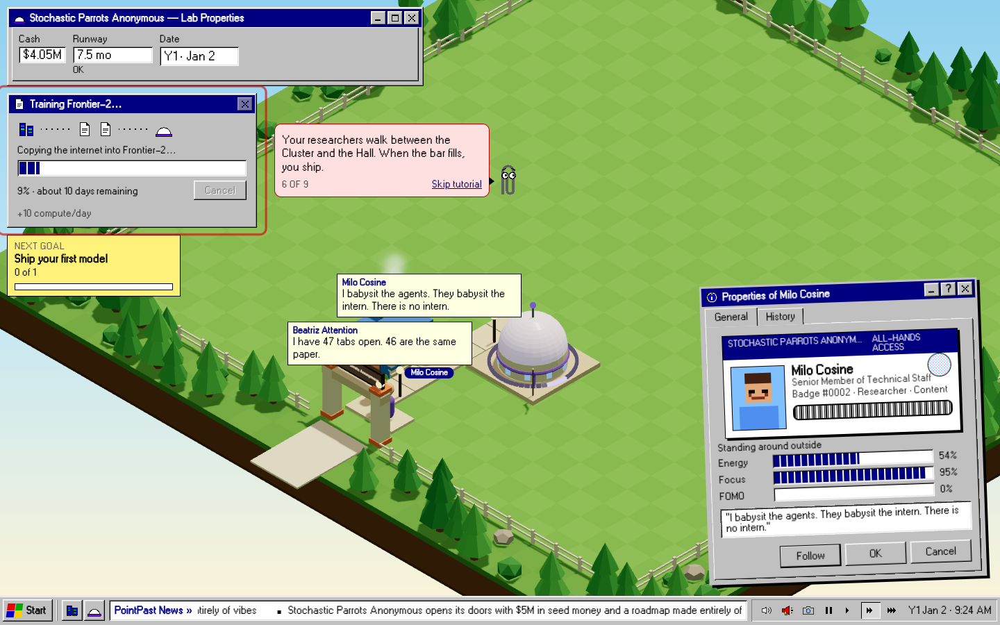

# Journey test: Level 1 → 5

**Failed**. Level 5 reached. http://localhost:4173/, 1440×900, 309.4 s wall, 8.3 fps.

| Level | Game day | Days on the last level (window) | Wall | Cash | Runway | Toasts/min (last level) | Open windows |
|---|---:|---:|---:|---:|---:|---:|---|
| 1 Garage | 0 | – | 0.0 min | $5.00M | 15.2 mo | 0 | Stochastic Parrots Anonymous — Lab Properties; Assistant: it looks like you're building a superintelligence |
| 2 Open for business | 11 | 11 (5–25) | 0.5 min | $3.86M | 6.4 mo | 2.3 | Stochastic Parrots Anonymous — Lab Properties; Training Frontier-3-Reasoner…; Milo Cosine, Senior Member of Technical St |
| 3 Growing team | 30.65 | 19.6 (5–40) | 1.9 min | $2.43M | ∞ | 0 | Stochastic Parrots Anonymous — Lab Properties; Training Frontier-3-Reasoner…; Milo Cosine, Senior Member of Technical St |
| 4 The Race | 50.2 | 19.6 (5–40) | 3.3 min | $1.61M | ∞ | 0.7 | Stochastic Parrots Anonymous — Lab Properties; Training Frontier-4-Reasoner-Ultra-Nano-Preview…; Milo Cosine, Senior Mem |
| 5 Scrutiny | 84.15 | 34 (5–45) | 5.2 min | $1.54M | ∞ | 1.6 | Stochastic Parrots Anonymous — Lab Properties; Training Frontier-5-Omni-Lite-Preview-0320…; Milo Cosine, Senior Member o |

Final: {"gameDay":84.15,"level":5,"cash":1535603.5097295942,"runway":null,"income":156384,"researchers":10,"vibes":504,"rank":1,"models":3,"buildings":13}

## Failures (1)

Run 1 of 2 on the same build. Run 2 ([run2-passed.md](run2-passed.md)) passed with 0 failures. The coach's "peek" step follows a moving researcher, and the policy's click opens that researcher's Properties. For one poll, before `coachMindRead` reaches the 5 Hz snapshot, the two can touch. By the time the still is taken, the coach has moved on (step 6 of 9).

- **overlap** (level 1, game day 1.5): The coach and "Milo Cosine, Senior Member of Technical Staff" overlap by 30×89 px ("Assistant: it looks like you're building a superintelligence" on top)

## Cards answered (0)
none

## Flat moments: a real minute at 1× with nothing new (0)
none

## Windows that held time on their own (0)
none

## Toasts from the policy's own clicks (7, not counted as a storm)
- 2 things happened while you were busy. Top of the pile: The Kombucha Bar's culture has escaped onto the paths. It is alive and it is sticky. (×1)
- Sam 'Pager' Uptime joined the rotation and immediately got paged. (×1)
- MOP-1 'Sir Sloppington' clocked in. The slop has been notified. (×1)
- Needs a path next to it (×1)
- MOP-2 'Squeegee' clocked in. The slop has been notified. (×1)
- Another Training Hall won't train faster without more compute; add clusters before more lecture halls. (×1)
- Frontier-4-Reasoner-Ultra-Nano-Preview is out! Launch week: +$854K (×1)

## Purchases (13); confirms (0)
day 16.1 kombucha · day 16.4 gateway · day 16.7 kombucha · day 17 cluster · day 32.9 staff:sre · day 33.35 staff:janitor · day 33.8 snack · day 34.15 staff:janitor · day 34.9 nap · day 35.3 cluster · day 39.55 hall · day 57.55 cluster · day 82.55 gateway

